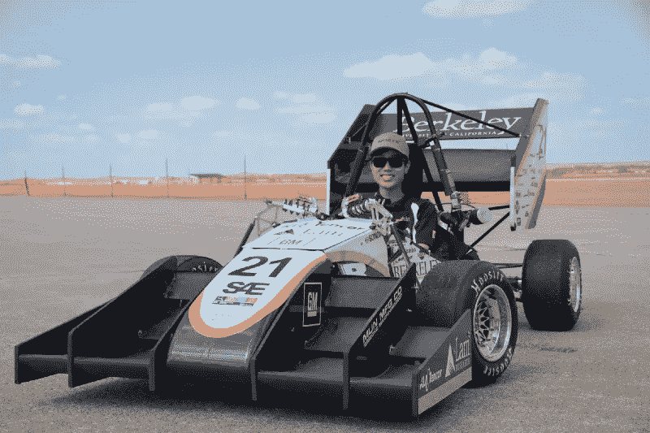
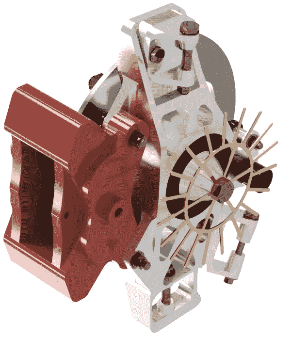
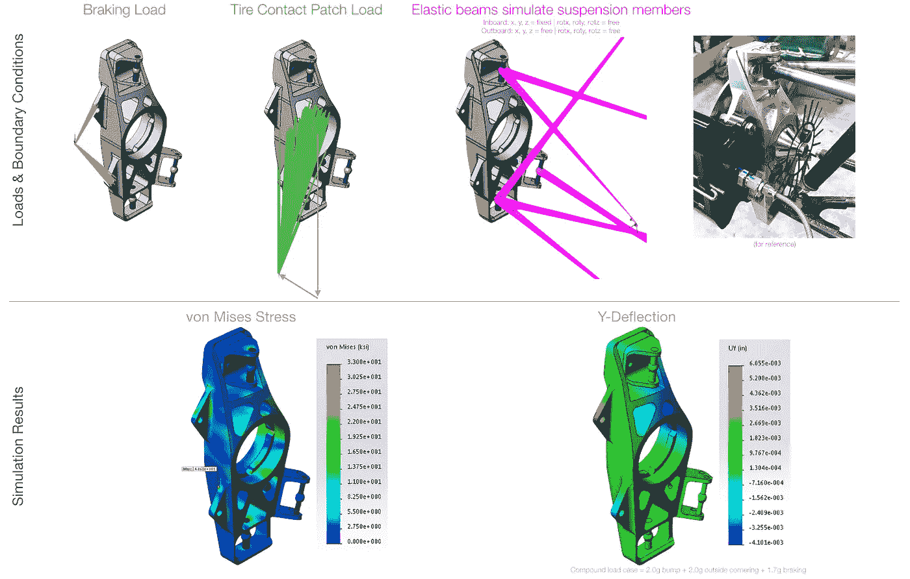
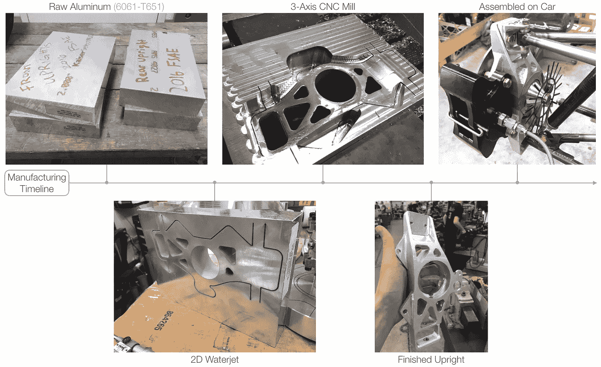
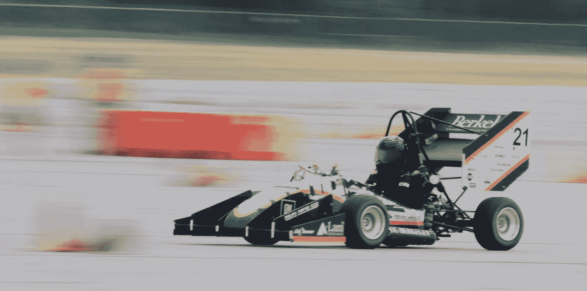
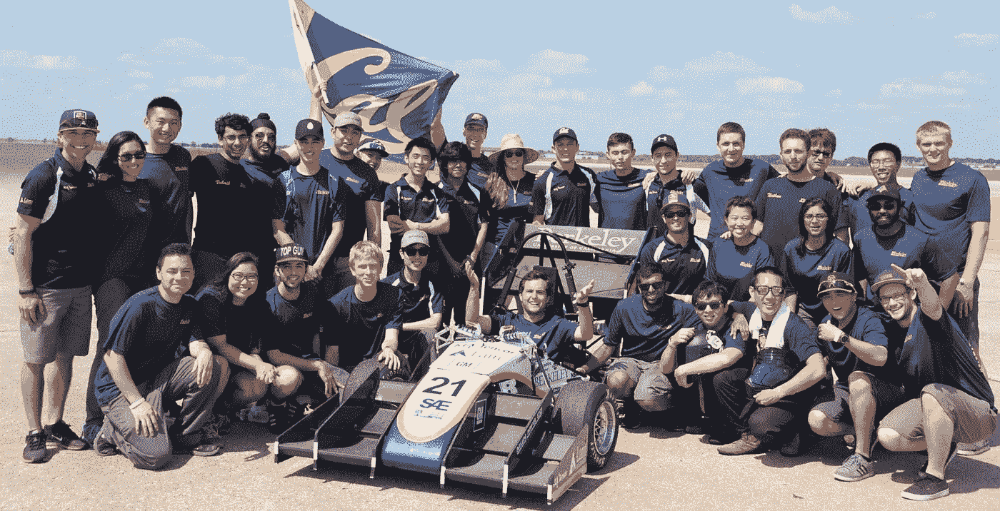

# 设计竞赛获奖赛车的 5 个步骤(SAE 方程式)

> 原文：<https://medium.com/swlh/5-steps-to-design-a-competition-winning-racecar-formula-sae-aa8db4e95821>

赛车真的很酷。但是我如何设计方程式赛车呢？

人们问我如何设计一辆赛车，如何在他们的大学组建一支 FSAE 方程式车队。这篇文章的目标是帮助那些人开始他们的 FSAE 冒险。

作为一点背景，我是加州大学伯克利分校方程式 SAE 团队的悬架设计工程师，工作了两年多。我在 2015 年和 2016 年的赛车中扮演了一个角色。2016 年，该团队在 70 场方程式 SAE 林肯比赛中排名第 11。

Me in the Berkeley Formula SAE Team’s 2016 racecar at Formula SAE Lincoln. Lincoln, NE. Jun. 2016.

有一个非常棒的 29 分钟视频，是 FSAE 的设计评审 Claude Rouelle 给 FSAE 团队提建议。如果你愿意，可以听一听。然后回来这里做总结，我的解说，还有很酷的图片！

# 1.了解规则

阅读规则很重要。在 fsaeonline.com 下载官方规则集[。(这些规则专门针对北美的 SAE 方程式赛车。如果你打算参加另一项比赛，如方程式 SAE 电动，方程式学生德国等。，请务必阅读正确的规则集。)留出一个下午来读规则。如果你不确定某事的意思，谷歌一下！有人可能已经问过同样的问题了。](https://www.fsaeonline.com/cdsweb/gen/DocumentResources.aspx)

# 2.脑猝病

**你的第一个目标是打造一辆 A 级车和一辆 C 级车**。随着车队一年比一年进步，你会制造出越来越好的赛车。最终你会有一个 A 队和一辆 A 车。

C 队不可能做出 A 车。

**打造 A 队，头脑风暴完美团队的特质**。在创建列表时，考虑以下事项:

*   冲突将如何解决？
*   你希望从对方身上学到什么？
*   项目将如何管理？
*   等等…

一旦你弄清楚了完美的团队是什么样子，让每个团队成员保证尽最大努力表达所有的特征。

> 一切皆有可能

**打造 A 车，头脑风暴完美车的特点**。这应该是大约三个小时的头脑风暴。带着一切皆有可能的想法参加头脑风暴会议。写下每件事，不管它看起来有多困难或疯狂。

一旦你有了这个完美赛车特征的列表，回到这个列表(不同的一天),按优先顺序排列这个列表。高优先级意味着该功能是必备功能。可能影响优先级的因素包括可行性、成本以及对竞争点的影响。在[概念和模拟阶段](#cd22)优先级可能会改变。

# 3.知道正确的操作顺序

就像数学有运算顺序一样，设计赛车也有运算顺序:概念、仿真、设计、制造、装配。

## 3.1.& 3.2.概念和模拟阶段

许多团队在夏季或初秋完成概念和模拟阶段。你想在九月前完成目标。

> 米利肯的赛车车辆动力学被广泛认为是 FSAE 圣经

在概念和模拟过程中，找出你想要你的车有什么:

*   你用什么发动机？
*   什么尺寸的轮子？
*   轮胎？
*   齿轮传动？
*   停职？
*   Aero 包？
*   等等…

没有“完美”的部分组合，但有些特征比其他特征更受欢迎是有数量原因的。要了解原因，请阅读米利肯的 [**赛车车辆动力学**](https://amzn.to/3mKeHHZ) 。RCVD 被广泛认为是 FSAE 圣经。另一个必读书是卡罗尔·史密斯的 [**Tune to Win:赛车开发和调校的艺术与科学**](https://amzn.to/3BweU7O) 。

使用单圈模拟器(一种帮助你计算在假想赛道上的单圈时间的工具)来测量不同车辆规格的影响。你有很多可以改变的变量。所以耐心点，这可能需要一两个月的时间。

模拟的顺序:

*   **围绕给定赛道的简单单体模拟**。模拟过程中这一步的目标是计算出车辆总重的起点。
*   **轮胎**。这是一个巨大的难题:你用什么轮胎化合物？前束和外倾角会发生什么？轮胎压力？滑动角度？**由此你可以确定你的质量分布、动力需求、车辆运动学，以及你是否需要下压力**。您的团队必须绝对是美利肯 [FSAE 轮胎测试联盟(TTC)](http://www.millikenresearch.com/fsaettc.html) 的一部分。TTC 拥有您对车辆规格做出明智决定所需的所有数据。(作为一个潜在的有益的起点，许多车队倾向于使用 Hoosier R25B 轮胎胶料。)

Optimum G 以折扣价向学生团体提供 OptimumKinetics。[点击](http://www.optimumg.com/software/optimumkinematics/students/) 了解更多关于 OptimumKinetics 学生许可证的信息。

概念和模拟的最终目标是一系列车辆规格:

*   车辆重量(和重量分布，质心)，
*   轴距和轮距，
*   功率单元(以及功率和扭矩目标)，
*   下压力目标(对于各种空气动力学部件，如果你决定使用空气动力学套件)，
*   等等…

你必须有一份完整的车辆规格清单。只有这样，你才能开始设计汽车。

## 3.3.设计阶段

Render of the Berkeley Formula SAE Team’s 2016 racecar’s front upright. Berkeley, CA. Dec. 2015.

一旦团队在车辆规格列表上达成一致，设计就可以开始了！

使用 3D 计算机辅助设计(CAD)来设计汽车。这大概需要三个月的时间。设计的结束会让你在 12 月着陆。

大多数大学将向学生提供 CAD 程序许可证。如果由于某种原因，你的大学没有(或者免费学生许可证只提供有限的功能)，你可以向大多数 CAD 软件制造商申请许可证。在你的电子邮件中，一定要提到你代表你的大学的 FSAE 团队，你的团队需要 X 数量的许可证。通常，他们会给你许可证，作为交换，他们会在你的赛车上印上他们公司的标志。比如 SolidWorks，只要提交一个简单的表单就可以轻松获得。[点击此处获取更多信息](https://files.solidworks.com/pdf/EDU_Student_Sponsorship_Datasheet_ENG.pdf)。

我选择的 CAD 程序是 NX。SolidWorks 和 CATIA 也很受 FSAE 团队的欢迎。

至少，所有的机械零件都应该用 CAD 建模。你想要一辆可靠的赛车。为此，使用有限元分析(FEA)模拟零件，以确保零件不会断裂。从具有较大安全系数的坚固部件开始。随着团队多年来获得更多的经验，使用你最好的工程判断来降低安全系数。

Setup and results of a finite element analysis of the front upright. Berkeley, CA. Nov. 2015.

别忘了疲劳和模态分析。对于某些零件来说，理解刚度也很重要。

一定要用老式的手工计算来支持你的模拟。有限元分析结果可能在骗你。

如果你的团队决定运行 aero 软件包，一定要运行计算流体动力学(CFD)模拟。机翼只有在产生巨大的下压力时才有用。

我选择的有限元分析和计算流体力学程序是 ANSYS。

还要确保可制造性设计和装配设计(DFM 和 DFA)。你必须能够实际制造和组装你的零件。我无法告诉你有多少次我设计了一个零件，意识到它不可能制造，不得不重新设计它。

## 3.4.& 3.5.制造和装配阶段

Manufacturing of the front uprights. Berkeley, CA. Feb. 2016.

现在赛车已经设计好了，你需要制造所有的零件。制造和组装大约需要三个月，也就是三月份。

为所有零件绘制详细的工程图。当你设计零件的时候，制造零件的方法应该已经在你的脑海里了。确保您使用的公差是您确信可以达到的。但也要确保公差符合零件和组件的功能。您可能需要进行一些公差分析或尺寸变化分析。

一些多部件零件，如 A 型臂或底盘，可能需要焊接夹具或夹具。一定要考虑到这些，因为坏的夹具会导致不合格的零件。

一旦零件做好了，它们被放在一起，你应该有一个类似赛车的东西！

# 4.测试，测试，测试

**你需要驾驶你的赛车，很多**。一旦你的赛车组装完成，车队就应该开始运行赛车了。一路开着车直到比赛开始。

> 一个拥有世界级车手和破烂赛车的车队会比一个拥有破烂车手和世界级赛车的车队排名更高

**车手培训是比赛中获得积分的最大因素**。一个拥有世界级车手和破烂赛车的车队会比一个拥有破烂车手和世界级赛车的车队排名更高。

**提高车手技术的最好方法是让他们尽可能多的坐在赛车上**。他们不仅会提高驾驶技术，而且(更重要的是)会更加熟悉赛车的操控。这提高了驾驶员的信心，并最终提高了驾驶员的表现。

**不要为了跑赛车而跑赛车，为了争取车手席位时间**。当你驾驶汽车时，进行测试来验证你的设计决策。例如，如果你的团队正在运行空气动力学套件，进行一些实验来测量机翼实际产生的下压力，并与你的 CFD 模拟进行比较。

还有，设置锥形赛道，让车在不同的配置下跑，看看哪个配置最快。例如，改变弹簧系数和阻尼系数是调整赛车的既便宜又简单的方法。

我想再次强调，车手训练是在比赛中获得积分(和完成耐力)的最重要的因素。其次是赛车调校。最后才是一切。

作为旁注，你可以在汽车运行前通过去卡丁车场地或通过玩类似[RF factor 2](https://store.steampowered.com/app/365960/rFactor_2/)的真实赛车模拟器游戏来进行驾驶员培训。加州大学伯克利分校公式 SAE 团队在 2016 年使用了这两种方法，效果很好。现在虚拟现实游戏更加普遍，赛车模拟器变得更加有用。

# 5.竞争

The car during the autocross event at Formula SAE Lincoln. Lincoln, NE. Jun. 2016.

所以你有一辆赛车，它已经准备好去比赛了。那真的很刺激！

团队经常忽略的一件事是竞赛后勤。为一切做好计划:

*   你如何运送赛车去比赛？
*   巨型工具箱呢？
*   你有汽车的备用零件吗？
*   备胎？
*   备用雨胎？
*   你是如何参加比赛的？
*   你会睡在哪里？
*   你会睡觉吗？
*   你从哪里得到食物和水？(请不要忘记补水！)
*   等等…

为技术检查准备好修理许多东西。

对于设计活动，来参加比赛，准备好你所有的设计决策和测试单页纸，组织在一个活页夹里。包括您所有的数据可视化(图形和绘图)和工程图。排练你的谈话要点是非常有用的。

**如果你的车队从三月份开始驾驶赛车，你应该对动态项目**(加速、刹车垫、自动越野和耐力)没有问题。但是，不要变得自满和懒惰。意想不到的事情发生了…出乎意料。

> 请记住，FSAE 是一个团队的努力

最后，支持你的司机。他们承受着不撞毁赛车的巨大压力。请记住，FSAE 是一个团队的努力。

Berkeley Formula SAE Team photo at Formula SAE Lincoln. Lincoln, NE. Jun. 2016.

# 结论/TL；速度三角形定位法(dead reckoning)

设计 SAE 方程式赛车的步骤如下:

*   阅读规则。
*   弄清楚什么是完美的团队。弄清楚什么是完美的汽车。列清单。
*   使用一个圈模拟器来定义车辆规格，但先阅读 RCVD 和调谐赢。一切都围绕着轮胎。轮胎非常重要。
*   设计一辆可靠的汽车(即零件不会损坏)。随着车队一年比一年积累更多的经验，设计出越来越好的赛车。
*   制造和组装您的汽车。
*   尽可能多地运行汽车，以获得测试数据和驾驶员培训。

当然，享受旅程吧！FSAE 将教会你很多关于工程、项目管理以及与跨职能团队成员合作的知识。

# 延伸阅读？

有兴趣看看我在硅谷工作的“典型”一天是什么样的吗？

 [## 硅谷工程师的一天

### 在硅谷，有相当多的产品设计工程师。我们是设计消费者的机械工程师…

medium.com](/@matthewjcheung/day-in-the-life-of-a-silicon-valley-engineer-36df4fbecf77) 

此外，请查看我的 5 显示器桌面设置:

 [## 硅谷工程师的疯狂办公桌

### 为什么需要 5 台显示器？！

medium.com](/@matthewjcheung/the-crazy-desk-setup-of-a-silicon-valley-engineer-a7f3ec464597) 

# 脚注

[1]: **免责声明/披露**:我与 Milliken 或 Carroll Smith 没有任何关系。阅读他们的文献只是一个建议。我相信这两本书都提供了如何制造快速赛车的重要信息。如果你使用这些链接，我可以做一个委员会。《RCVD》和《必胜》也可以在大学图书馆找到。

[2]: **免责声明**:我与 Optimum G 没有任何关系。使用 OptimumKinetics 仅仅是一个建议，因为一些顶级的表演团队使用这个软件。我的团队(UC Berkeley Formula SAE 团队)没有使用这个软件，因为我们开发了自己的定制软件。

[3]: **披露**:我与 Steam 或 Studio 397 没有任何关系。使用赛车模拟器只是一个建议。