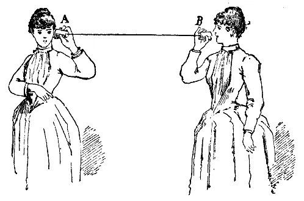

# 我从 6 次远程设计冲刺中学到的 5 件事

> 原文：<https://medium.com/swlh/5-things-i-learned-from-6-months-of-remote-design-sprints-8947fb806e10>

This is from Project Runeberg book called The key to science In swedish., Public Domain, [https://commons.wikimedia.org/w/index.php?curid=472708](https://commons.wikimedia.org/w/index.php?curid=472708)

最近关于远程设计冲刺的讨论越来越多，从 Ross Chapman 的这篇文章到 T2 Sabrina goer lich 和 T4 Robert Skrobe 组织的全球设计冲刺活动，越来越多的人认为远程冲刺是一个时机已经成熟的想法。远程冲刺以较低的成本将团队聚集在一起，将通常可能不联系的人联系起来，甚至为学习和成长提供机会…