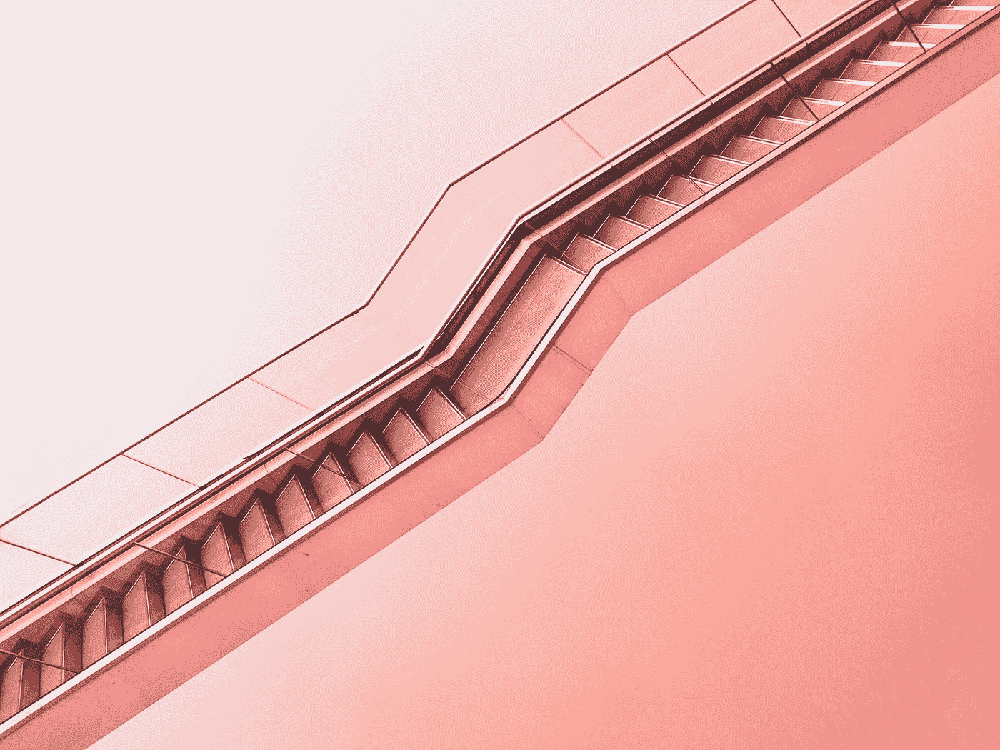

# 作为一名设计师，我十年来学到的 5 件事

> 原文：<https://medium.com/swlh/5-things-i-learned-in-a-decade-as-a-designer-8096e2b41704>

Photo by [Max Ostrozhinskiy](https://unsplash.com/@maxon?utm_source=medium&utm_medium=referral) on [Unsplash](https://unsplash.com?utm_source=medium&utm_medium=referral)

# 一点背景知识

大约两个月后，我将第一次成为一名父亲。这让我想到了所有我想教我的孩子的事情，所有我觉得我必须自己弄清楚的事情。但这也让我看到了这一点:我作为设计专业人士的第一个十年已经过去了。我学到了很多。