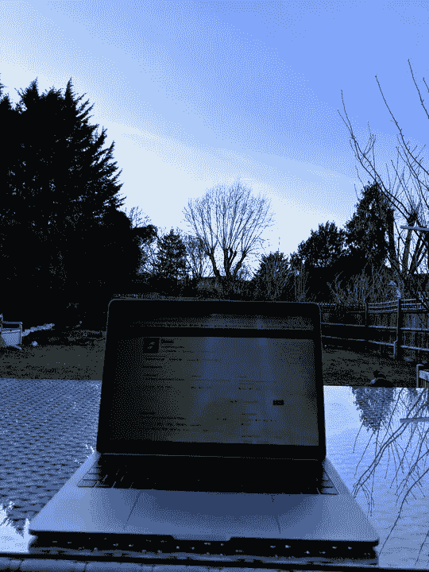
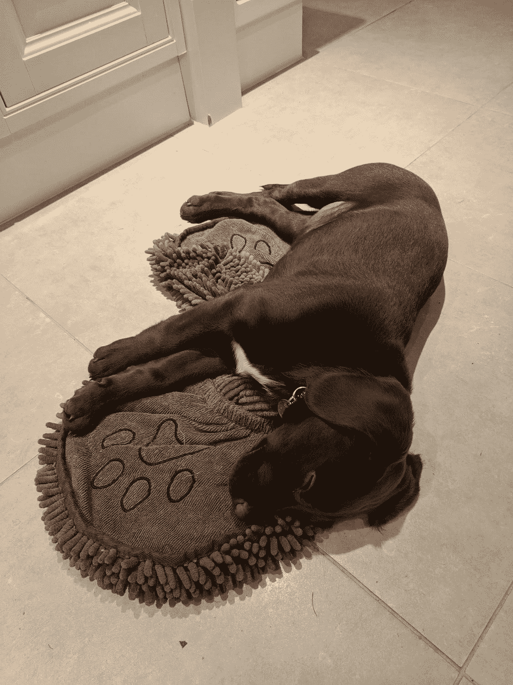

# 我从远程工作中学到的 5 件事

> 原文：<https://medium.com/swlh/5-things-ive-learned-from-working-remotely-e7f31b103b26>

# 在伦敦的办公室里做了十多年“正常”的工作后，我开始远程办公。当我告诉人们我的新安排时，标准的反应是扬起眉毛，或者类似于“我打赌你会厌倦的”之类的话。像任何新的情况一样，我需要一些调整才能适应——但是一年后，我有一些笔记要分享:

**1。远程办公≠孤独。**

我最大的担心，或者说是赋予我的最大担心，是我会孤独。从一个经过数千名伦敦同事和数百名办公室同事的通勤地点到一个人的家庭办公室——我——是一件大事。但实际上，我并不孤独——我有了一份新工作，所以有很多新朋友要认识和结识。当然，他们没有坐在我旁边，但他们只是在一个松散的频道，即时消息或谷歌视频通话的另一端。

当然，我确实失去了工作的社交方面——尽管如此，即使是最好的企业沟通工具也永远无法取代传统的“和同事喝一杯”,那是伦敦为数不多的几个阳光明媚的夜晚之一。但是我发现，当我从“工作社交”中回来的时候，我能够投入到我的个人生活中，去看望老朋友。我与家里的朋友和工作中的朋友交往的时间比例已经从 50:50 上升到了 100:0。

所以——一点也不孤独。相反，我有时怀念的是生活的忙碌。除了我的家人，我完全有可能一整天都见不到其他人。所以有时你会发现我在当地超市的小岛上徘徊，完全满足于体验 5 分钟忙碌而平凡的生活。我是英国人，所以当然我实际上不会和我附近的陌生人说话，但知道生活在我身边是令人欣慰的。

**2。网飞改变了通勤方式。**

在我的“办公室”生活中，我有一个简单的惯例——可能是数百万通勤者共有的。

*   早上去上班——读报，查收邮件，尽可能多喝咖啡。
*   晚上回家——看《网飞》(不会有太多暴力或裸体的电影[,因为我是那 22%会对我的公开网上娱乐感到尴尬的人之一](https://www.wired.com/story/netflix-streaming-in-public/))。

这就是网飞每天 45 分钟，一年 48 周，一周 5 天。这相当于一年 180 个小时的网飞——或者换句话说，我可以连续看 25 遍《权力的游戏》第八季。虽然我看电视的时间少了并不一定是件坏事，但我确实怀念过去通勤的那一面。

**3。会议是生产力的死亡，所以取消会议吧！**

聚集在工作场所的人数与这些人参加的无意义会议的数量直接相关。也许这是规模法则&沟通，或者也许这是人类社交和与他人聚会的基本本能——但是公司越大，会议就越多。而会议*孕育了*更多的会议。我已经记不清有多少次我在结束一个会议时听到这样一句话:“好吧，让我们把这件事做完，下周再见”。啊啊啊！很容易花一周一半以上的时间无所事事，只是和人们谈论你应该做的工作，但因为你在开会而不能做！

但是遥远的生活——没有会议。很少见面。交流通过信使、电子邮件和偶尔的视频电话进行，但总的来说，我一周工作时间的 90%都是在笔记本电脑前做实际工作。所以，我用更少的时间做了更多的事。

因此，会议的减少对我来说意味着生产率的大幅提升。

**4。分心无处不在。**

真实故事——一天，我在家坐下来工作，我注意到墙上有些磨损和痕迹。每次我想工作的时候，我的目光都会回到墙上。所以我做了任何一个理智的怪人都会做的事情——我去了当地的 DIY 商店，买了一些油漆，重新粉刷了房间。它占用了我一天的大部分时间，所以我直到下午 5 点才开始工作，直到午夜才结束。

无论是冰箱、错误的 DIY 工作、遛狗还是整理房子，当你远程工作时，总会有其他事情可做。因此，取得成就的关键(我花了很长时间才意识到这一点)是自律。我给自己设定了工作日每个小时的目标——如果达到了，我就休息一下。

**5。通勤糟透了。**

除了网飞，通勤真的不太好。至少在伦敦，火车繁忙、昂贵、不可靠，而且大多令人不快。地铁更糟糕。从来没有人坐在北线，终止于魔登，并认为“是的，这正是我现在想去的地方”。

当你有一份很好的工作要做时，通勤是你必须忍受的事情(可悲的是，即使你没有一份很好的工作要做)。但是如果你可以完全避免通勤——那是一种幸福的生活。

— —

*免责声明:我是*[*status . im*](https://status.im/)*的人力运营总监，这是一个完全远程的开源组织，旨在建立一种新的网络交易、浏览和交流方式。我认为大多数公司/组织都没有充分利用远程工作，但我不认为这是解决所有问题的方法。事实上，我不认为这场辩论应该是“传统办公室”还是“远程工作”——我认为这场辩论应该是在对组织和个人都有效的所有选项之间找到平衡。*