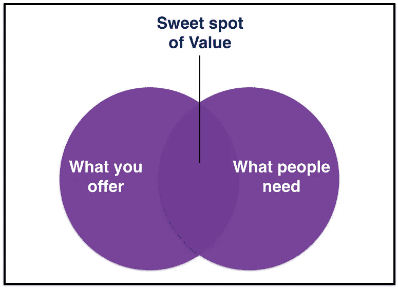

# 真正的思想领袖一定会避免的 5 件事

> 原文：<https://medium.com/swlh/5-things-that-authentic-thought-leaders-avoid-without-fail-117f6e440a9d>

[Rawpixel](https://www.pexels.com/photo/three-people-discussing-inside-the-conference-room-1061574/)

思想领导给个人和组织带来巨大的好处。

它帮助个人树立行业专家的声誉，与其他行业领导者和权威机构建立更牢固的关系，并为其组织带来更短的销售周期和更长的客户终身价值。

但在追求这一梦寐以求的头衔时，许多人做了与思想领袖的风气背道而驰的事情。所有这些都意味着他们不仅仅是没有达到他们努力争取的位置；他们也会在自己的领域失去尊重。

如果你想追求思想领导力，以下是你必须不惜一切代价避免的五件事:

## 1.在真空中交谈

许多人认为，对他们来说重要的事情对他们的听众来说也很重要，分享关于这些话题的想法会让他们成为思想领袖。但是思想领导并不是期望你的听众关心对你重要的事情。是反过来的。

您的客户、合作伙伴和同行都有自己的紧迫问题和挑战。他们在寻找答案，寻找有答案的人。

真正的思想领袖定义并分享与听众相关的清晰信息。当他们解决听众的[最迫切的问题](/swlh/3-common-questions-your-customers-ask-and-what-they-really-mean-by-them-135389044d1f)时，他们成功地让人们认同他们的观点，从而为长期的思想领导奠定基础。

## 2.自我推销

人们最常犯的错误是认为自我推销是思想领导的同义词。*“我们是行业领导者。想要我们解决你的问题吗？与我们联系。不想和我们联系？去别处找你的答案吧！”*

在这一切中，他们错过了思想领导力最关键的方面:[价值](/swlh/the-most-promising-way-to-make-your-startup-scale-f8f7bae389ab)。价值是人们需要什么和你提供什么的交集。

在思想领导中，价值意味着让你的听众能够解决他们自己的问题，而没有隐藏的商业议程。这意味着自由地分享可操作的观点，你的听众可以在适用于他们的话题上应用这些观点。

真正的思想领袖不太关注自己的形象，而更关注为他们的观众增加价值。因此，他们建立了一个值得信赖的个人品牌，这远比自我推销更有效。

## 3.盲目地分享内容

我们今天淹没在内容的洪流中。超过 90%的内容获得个位数的参与度。安·汉德利,[营销利润](https://www.marketingprofs.com/)的创始人，称这是一种“信息肥胖”的状态在追求“思想领导”的过程中，人们正在增加这种信息肥胖。

思想领导力不在于数量，而在于质量。这不是简单地陈述事实或重复内容，而是告诉你的观众为什么他们应该关心。

真正的思想领袖与他们的听众分享独特的见解，通常来自个人经历。这些见解激励他们的观众采取有利于后者的行动。

## 4.宣称自己是思想领袖

一次又一次，我听到人们说，“我已经是一个思想领袖了，我只需要展示给别人看。”

他们认为拥有独特的观点使他们成为思想领袖。但是仅仅有独特的观点是不够的。如果不能引起你的观众的共鸣，你的观点就像一个人蹲在健身房里一样毫无用处。

你不能称自己为思想领袖，就像一个员工不能称自己是组织里最好的一样。思想领导力是你的听众赋予你的一个头衔，就像一个组织奖励一个季度表现优异的员工一样。

参与是你的见解对你的听众有多大用处的有效标志。在短期内，这是你的想法得到多少参与。从长远来看，这是你的观点如何影响你的社区的行为。

## 5.没有说到做到

许多人对他们的观众应该做什么给出了明智的建议，但自己却不知道如何应用。当他们的想法受到挑战时，这些人也会进入否认模式。

*领导人再也不能说，“照我说的做，不要照我做的做。”他们的行动胜于他们的言语。就像这样，思想领袖再也不能分享理想主义的思想，并期望其他人在自己没有实践这些思想的情况下跟随他们。*

这样的人冒着被称为“骗子”的风险，从而损害了他们自己的诚信。德勤创新公司的总经理克雷格·穆拉斯基写道:

> “如果一家公司公开的思想领导力与其提供的产品不一致，那么它不仅会浪费时间，还会有疏远客户的风险。”

真正的思想领袖用个人经历和实践来展示专业知识。他们听起来不像那些把自己放在基座上的人。相反，他们的观点表明他们是理解世界并能帮助世界进化的人类。

# 总结

就像每一个变成流行语的商业术语一样，思想领导力如今已经被误解了。这就是为什么它也赢得了一个坏名声，但不是因为这个概念本身有缺陷。

思想领导不能带来快速的胜利。需要花很大的力气去建造。但如果做得好，它会给领导者和观众带来惊人的长期回报。

思想领袖推动对话，而不仅仅是参与者。通过他们的观点，思想领袖使他们的组织能够超越“我也是”的产品讨论，在战略层面吸引买家。这些观点也使他们的观众能够解决他们自己的问题，并成为社区的一部分。

*最初出现在*[*【Entrepreneur.com】*](https://www.entrepreneur.com/article/329926)

## 这篇文章发表在 [The Startup](https://medium.com/swlh) 上，这是 Medium 最大的创业刊物，拥有+435，678 名读者。

## 订阅接收[我们的头条新闻](https://growthsupply.com/the-startup-newsletter/)。

