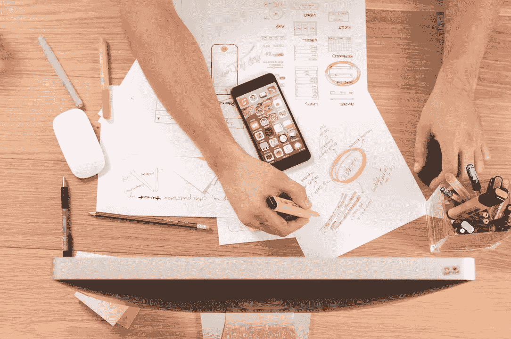

# 提高工作效率的 5 个技巧

> 原文：<https://medium.com/swlh/5-tips-to-be-effective-at-work-c97239be78da>

## 你有没有感觉到一天中没有足够的时间来完成所有的事情，因此你不得不夜以继日地工作？你是否觉得你总是落后于你的工作，你的任务永远不会结束？你并不孤单，我们都经历过。而且已经分神了！

此外，过度劳累可能会变成一个令人不快的螺旋，你会突然想在 Instagram 上滚动半个小时，或者只是看着窗外，梦想着在外面，手里拿着一杯好咖啡晒日光浴。然后，一切从头开始。

无论哪种方式，与其投入额外的时间，你可以在工作中变得更有效率。从遵循我们在 Bonanza 尝试过的五条建议开始。

# 1.正确开始你的一天！

这里，我们不一定指好的浓咖啡——尽管这也有帮助。坐到你的办公桌前(或者咖啡馆的沙发上)，写下你当天的任务。这将帮助你理清思路，白天不会分心。如果你和你的同事或老板分享，会增加额外的动力。

# 2.不要害怕寻求帮助

你应该提出新的想法或商业建议，但你觉得自己是一个从来没有创造力或从来没有任何伟大想法的人？求助！和你的同事坐在一起进行十分钟的头脑风暴。(超链接)你会惊讶于你能在几分钟内收集到多少想法——我们知道，我们已经尝试过了！

# 3.模式:请勿打扰！

你的朋友给你发了一些他们度假的照片？你看到了一个非常适合做晚餐的食谱，或者你想立刻收养一只小狗？然后你有 20 封未回复的邮件，当然，它们都非常重要…让你的手机处于飞行模式两个小时，不要让任何事情分散你的注意力。

# 4.休息一下！

富有成效固然好，但这并不意味着你必须连续工作八小时。从桌边站起来，走 10-15 分钟的路，喝喝茶——同时忘记你的手机和其他电子设备！

# 5.了解你自己！

你喜欢清晨没有人在办公室，也没有人问你周末过得怎么样，你的孩子或者你的狗怎么样？午饭后你通常会有很多精力和一些新想法吗？了解你的高峰时间，将你最重要的工作与你最有效率的时间相匹配。