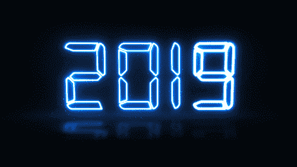

# 选择正确职业的 5 个终极步骤

> 原文：<https://medium.com/swlh/5-ultimate-steps-for-choosing-the-right-career-384ac5c21136>

## # 1——不要限制自己

Photo by [Nathan McBride](https://unsplash.com/@nathan_mcb?utm_source=medium&utm_medium=referral) on [Unsplash](https://unsplash.com?utm_source=medium&utm_medium=referral)

我最近看到了几个关于如何找到最佳职业道路的视频和博客帖子。他们都专注于一件事:可持续发展。这些人真诚地分享小费。因为他们想帮助别人。令人钦佩。
虽然可持续发展很有价值，但我不禁觉得他们忽略了你在职业生涯中应该关注的最重要的事情。

**Watch** ‘5 Ultimate Steps For Choosing The Right Career’ on my Youtube channel — [**Sign of Life**](https://www.youtube.com/channel/UC4211nC0IOB0FS6eGWM7x7g)

# 这是你一生中最重要的决定

让我先把心里的话说出来——我讨厌“职业”这个词。
好了，我说对了。嗯，实际上，让我说得更准确些——我不喜欢它所代表的东西。毫无疑问，这是一个不受欢迎的观点，你们中的一些人甚至可能无法尊重它。但至少试着听我说完。

> 在一个人一生中的重要时期从事的职业，有进步的机会。

我们完全接受每个人都需要有自己的事业。
**有什么不好？首先，年轻人感到压力极大，因为社会期望他们尽早选择职业道路。他们等得越久，压力就越大。他们越痛苦，就越有可能做出妥协来结束这一切。
*“你需要选择你这一生要做什么，”他们的父母说。不免与同龄人攀比(*杰奎琳的儿子要当医生了！和独立带来的财务困难是迫使年轻人匆忙做出决定的另外两个关键因素。****

毕竟，这是一个人一生中最重要的决定。无论你选择哪种职业，你都会花大部分时间去做。青少年也感受到了这种负担。他们的父母和老师都告诉他们，没有好成绩，他们永远也进不了好大学，因此他们的职业选择非常有限。在青少年的生命中，有一个特定的时刻，他们的创造力和想象力开始慢慢消失。我们都经历过被迫成为“现实主义者”的阶段。

# 事业？都 2019 年了！

我们喜欢挥舞着“2019 年到了！”每一次出现一个应该离开这个现代世界的老派行为，就打一个旗。然而，与此同时，我们却忽视了自己传统的生活方式。

说真的，在你的一生中选择并坚持一个职业是有意义的吗？
难道只是因为我们在寻求自决吗？
说“我是医生”或“我是作家”确实感觉不错。它让你的生活有了目标感。但它也非常有限。你只是个作家吗？你只是个医生吗？

两百年前，人们的职业是他们的父亲曾经做的。他会教他们如何在这方面出类拔萃。这项技能代代相传。它有一个非常明确的目的——生存。然后大学建立了，那些能够负担得起的人能够获得一个不同于他们父母的职业。

**现在是时候再次挥舞*“这是 2019”*的旗帜了。就像我们不再依赖父亲的职业一样，我们也不再需要一辈子只从事一种职业。**

# 但是很难有别的想法

如果你已经选择了职业道路，那么**你已经投资了。你的学生贷款是为了提醒你那些年的学习。你最近的加薪告诉你你已经走了多远。你能让你所有的努力付诸东流吗？**

在她的书《我希望我 20 岁时就知道的事情》中，[蒂娜·齐莉格](https://medium.com/u/f0ff034d3bf9?source=post_page-----384ac5c21136--------------------------------)说，我们倾向于说服自己，如果我们把生命中的大部分时间投入到某件事情上(无论是工作还是感情)，即使我们感到痛苦，那也一定是值得的。许多人对目前的职业感到不满足。他们在数着时间，直到一天结束。他们只是等着回家做自己真正喜欢的事。没有人敢问自己:**我该不该换职业？相反，我们愿意相信我们的工作场所有问题。工资不够高。也许是工作时间过长，或者是糟糕的老板和无聊的同事。**

我们不接受改变职业的想法，主要有两个原因:首先，这意味着从头再来。投入时间和金钱。其次，这是耻辱。你承认你一开始就选错了，这在社会眼里就是失败。

# 一生只有一个职业没问题

只要你对它保持热情。只要你没有限制自己成长和改变的能力。在你的一生中有一个主要职业并没有错。但是从事多种职业也没什么不好。我们都是个体，没有一个单一的概念适用于所有人。

这些年来，我有很多朋友告诉我他们的大学申请，但当我问他们打算学什么时，他们说:“我还不知道。”
对大多数人来说，当然对他们来说没什么大不了的。
毕竟大学是必须的。既然没有讨论的余地，你最好先申请，后选择，对吗？

**我觉得这令人震惊。这正是人们做出仓促决定，却在 20 多年后的某一天醒来，感到失落和痛苦的原因之一。他们称之为中年危机。这很容易避免。**

所以，事不宜迟，以下是你选择**你的**最佳职业道路需要遵循的五个步骤:

# 1.不要限制自己

取消问题*“你是做什么的？”这意味着任何人都可以用一个标题来概括自己的一生。事实上，停止做任何会限制你自信的事情。很久以前，一个人的姓氏也是他们的职业。但自那以后，世界已经变了。(幸运的是)
不要把自己锁在一个名为*“软件开发人员”*的盒子里，因为那样你将永远也不会想到成为一名诗人、记者或时装设计师。你想要多少标签都可以。实际上，你根本不需要盒子。
**你可以改。你只需要向自己解释。***

# 2.定义你的激情

工作占据了我们大部分的时间。所以我们最好确保我们对我们所做的事情感到非常兴奋。丰厚的薪水和福利看起来令人兴奋，但这只能持续几个月。每天醒来都需要兴奋。当你开始一天的工作时，你一定很渴望，以至于你不会数着分分秒秒直到工作结束。
听起来不错吧？只有当你知道你的激情是什么时，它才会发生。而且比听起来简单多了。内心深处，你知道是什么在驱动你。一个很好的经验法则——想想你做的(或曾经做的)非常有趣的事情，时间在你不知不觉中流逝。那些让你不小心不吃一顿饭或者彻夜不眠的事情。

# 3.你梦想的工作日是什么样的？

当你知道你的激情是什么时，你就可以定义你理想的一天工作。
**允许自己想象。你每天喜欢做什么？不要关注为什么你理想中的一天不现实，或者为什么不可能从中赚到钱。那只是你奶奶在你脑子里说话。尽管她有良好的意愿，但她不是你。相反，写下你的幻想。你理想中的工作日会是什么样子。明确你要做的实际工作，你想要的灵活性，你要一起工作的人(如果有的话)，以及你要实现的目标。**

# 4.走吧。

没必要妥协。你不需要因为你父亲是屠夫就成为屠夫。如果你知道自己理想的工作日是什么样的，那么你就对自己想要追求的东西有了清晰的认识。如果你不确定是否存在这种类型的工作，那么首先尝试咨询在该领域工作的人。你也可以问问 Quora 或脸书上的人，通过这种方式获得一些见解。你理想中的职业概念很有可能真的存在。
**但是如果没有呢？好吧，那你就是第一个这么做的人。以[名副其实](https://www.youtube.com/watch?v=S1tFT4smd6E)为例。一个对制作视频和科学充满热情的人。很长一段时间，他都找不到追求激情的方法，但他没有放弃。最终，当他创建了 VERITAS ium——一个结合了他两种爱好的 youtube 频道时，他创造了自己的工作。这是企业家精神的真正精髓——定义你的理想职业，并让它成为现实。**

# 5.改变永远不会太迟

无论你是在过去的五年里在一家律师事务所做私人助理，还是最近决定加入医学研究，改变永远不会太迟。理解这一步和前面所有的步骤一样重要。有时我们意识到自己做了一个错误的决定。有时候激情会消退。这没什么丢人的。任何专业投资者都知道，你不想抓住一项糟糕的投资不放。在某些时候，你必须接受你的损失。生活大同小异。持续增长需要变革和新的投资。

最后，我想强调从事你真正热爱的事情的重要性。显然，这是过充实生活的最好方式。但是还有更多。对自己所做的事情充满热情的人推动着世界前进。很简单——如果你对自己的工作没有激情，你也不会有动力去做。没有目标的人永远无法超越。我们需要一个充满创业者、医生、政治家、工程师、律师、会计师、网络开发者、设计师、作家和音乐家的世界。从事开创性工作，用新思想、概念和发明推动世界前进的人。

所以，在我们选择道路之前，我们不要忘记一件重要的事情——现在是 2019 年。

> 你理想的职业是什么？你已经在追求了吗？我很乐意收到你的来信。在下面的评论里分享你的答案，大家一起讨论吧！

## 阅读/观看更多内容:

 [## 如何实现你所有的梦想

### 这是唯一被证实的方法！

medium.com](/swlh/how-to-accomplish-all-of-your-dreams-4e53132902cf)  [## 我是如何找到最令人惊奇和意想不到的快乐源泉的

### 它就在我眼皮底下，也在你眼皮底下！

medium.com](/swlh/how-i-found-the-most-amazing-and-unexpected-source-of-happiness-87b83fee7a7a) 

## 这篇文章发表在 [The Startup](https://medium.com/swlh) 上，这是 Medium 最大的创业刊物，拥有+418，678 名读者。

## 订阅接收[我们的头条](http://growthsupply.com/the-startup-newsletter/)。

