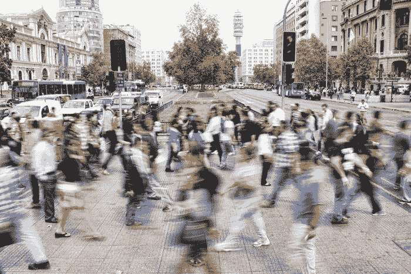

# 让自己忙碌起来对健康有益的 5 种方式

> 原文：<https://medium.com/swlh/5-ways-busy-good-39d0e4c745a1>

为什么无所事事真的不好

Image by [@mauromora](https://unsplash.com/@mauromora?source=post_page---------------------------), Unsplash

你可能已经被告知，总是忙碌一点也不好。给自己的时间呢，还是给家人朋友的时间呢？那我的爱好呢？我们都应该有时间放松一下，什么都不想，让生活就这样过去。