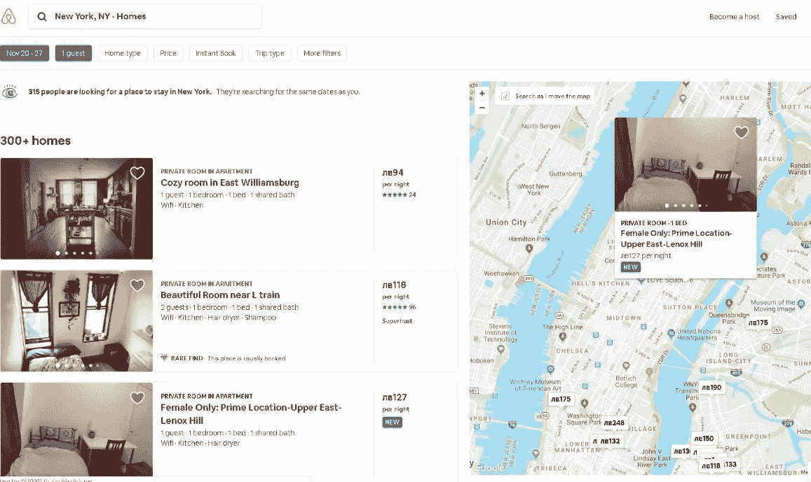
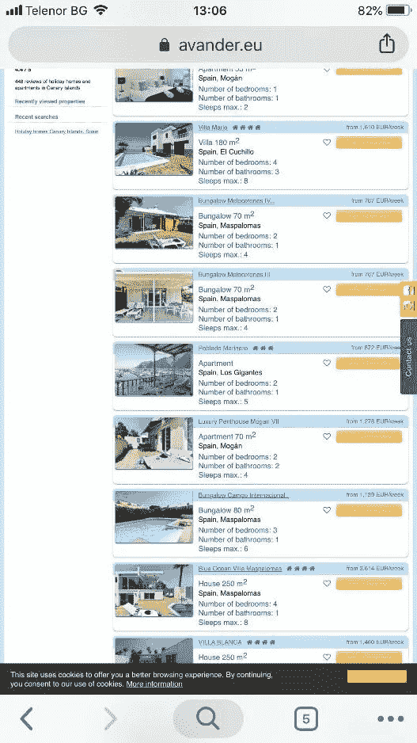
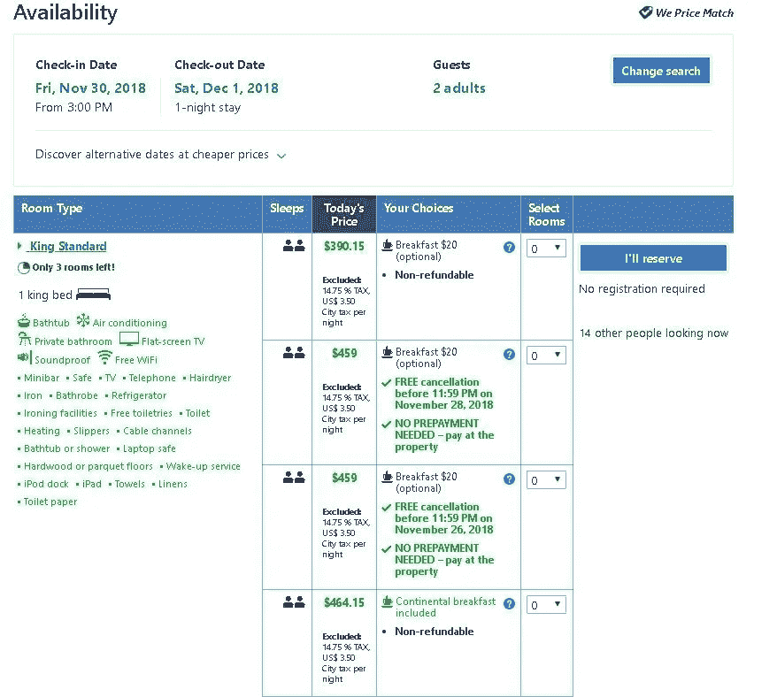

# 毁掉旅游门户网站 UX 的 5 种方法

> 原文：<https://medium.com/swlh/5-ways-to-ruin-the-ux-of-a-travel-portal-1ad93db772da>

完美的在线旅游门户体验需要什么？对旅行和旅游服务感兴趣的人越来越多地转向数字解决方案。从寻找信息到预订他们梦想中的假期，潜在客户希望获得快速、无缝和直观的体验。

旅游网站的 [UX 很大程度上取决于其性质和所提供的服务类型。会有几十个，甚至几百个套餐、酒店、度假选择。潜在客户会希望快速浏览它们，获得足够的信息，并通过几个简单的步骤预订他们想要的服务。](https://www.iflexion.com/portfolio/advanced-community-and-travel-portal)

不幸的是，一些旅游门户网站被设计成完全摧毁 UX，这可能会对业务本身产生深远的负面影响。以下是一些最严重的错误，它们导致 UX 贫穷的原因，以及潜在的补救措施。

# 信息过载

通常，旅游门户网站和应用程序都有大量的信息和优惠供游客选择。如果这些没有被有效地组织起来，并且缺少过滤选项，就会出现所谓的信息过载。

[赋予灵感:旅游研究的未来](https://www.phocuswright.com/Free-Travel-Research/Empowering-Inspiration-The-Future-of-Travel-Search)是一份详尽的报告，强调了旅游购物者在网上购物时遇到的最大挫折。

美国 47%的消费者和俄罗斯等市场 78%的消费者对网上购物感到沮丧。这种挫败感的主要原因是信息过载。

联合航空公司的在线平台提供了一个极好的例子，说明结构不良的信息会如何淹没访问者。从酒店到航班，每种类型的预订都有一个单独的下拉菜单。很明显，大多数人都想预订航班。有这么多可用的选项不仅会令人困惑，还会引起用户的不满。

**解决方案:**从一开始就突出显示的搜索表单，以及在特定位置标记优惠的地图，可以简化浏览所有可能性的过程。Airbnb 可以在其地图上搜索预订选项，使游客能够放大偏好的区域。此外，住宿选项可以提前筛选(费用、可用性、等级、整个公寓、房间等。).

# 不注重移动体验

问题的一部分源于之前的 UX 问题——拥有太多的信息，并且在确保良好的层次结构或易于访问方面失败。

通过移动设备寻找服务和购物的人数一直在增长。如果没有一个方便有效的智能手机滚动的旅游门户，这些人就会被拒之门外。

我们以 Avander 网站为例。该网站的桌面版对于旅游业来说是相当标准的。问题是手机版网站看起来一模一样。这些条目很小，难以阅读，甚至更难滚动浏览。

**解决方案:**理解在小屏幕上浏览有其特殊性，并适应观众的需求。增加图标和文本的大小，使你的门户网站真正响应。一个突出的搜索栏也将需要从一开始就限制选项。将观众导向特定服务类别的图标是另一个很好的例子。Kayak 移动网站是一个很好的例子来说明应该如何做事情。

# 搜索引擎能力差

搜索引擎和它的过滤器构成了一个有效的旅游门户的核心和灵魂。如果返回的结果是不相关的或者基于错误的标准，用户很可能会很快被激怒，并放弃购物车。

UX 的这一方面非常重要，以至于 [Frommer](https://www.frommers.com/slideshows/848046-the-10-best-and-worst-airfare-search-sites) 根据报价的相关性和搜索体验的质量建立了一个完整的旅游门户排名。

根据这个排名，世界上最大的旅游平台之一 Priceline 获得了令人惊讶的低分。

在 Frommer 测试中，Priceline 在确定从一个国际目的地到另一个目的地的最便宜的航班和住宿选择方面惨败。事实上，在 25 次搜索中，它设法显示了 7 次*最差的*票价。

**解决方案:**投入足够的时间进行搜索，选择合适的过滤器和标准。通常，典型的输入选项(旅行日期、旅行者数量和目的地)不足以向潜在客户提供他们想要的信息。过滤器应基于可用服务或套餐的性质(旅行类型、预算、首选附加服务等)。).

# 缺乏透明的预订流程

交易各个方面的透明度也很重要，尤其是当人们打算当场花钱购买你的服务时。UX 可以通过简单明了的预订/支付流程来确保这种透明度。

如果旅行者在时间或预算方面有非常严格的限制，就不应该有额外的费用。网站不应显示或推荐潜在客户力所不及的产品。

Booking.com 是在透明度方面做得比较好的网站之一。每个条目都准确地显示了报价中包含的内容，以及哪些服务需要额外付费。潜在客户可以通过这种方式得出准确的最终估价。

**解决方案:**预订和支付透明可以通过多种方式实现。在结账前应该有一个醒目的提示，提醒顾客应该检查所有的费用。如果有免费的额外服务，可以通过图标突出显示。最后，在付款之前，应该对总价格进行最终确认，并让客户有机会挑选感兴趣的附加产品。

# 不适合用户的网站

许多旅游门户网站为国际观众提供服务。在这种情况下缺乏个性化会是一个问题，因为访问者会感到困惑。

在一项调查中， [53%的受访者](https://www.tnooz.com/article/eight-reasons-why-travel-websites-fail-the-consumer-and-lose-a-booking/)表示，他们对以本国货币以外的货币提供的假期感到沮丧。是的，人们可以选择自己兑换货币。然而，如果这种设置隐藏在导航层之下，没有人会去打扰。

[广场酒店](https://www.fairmont.com/the-plaza-new-york/)有一个网站就是这个问题的典型例子。价格以美元显示，即使您更改了设置，新的偏好设置也会在结账时丢失，信息将再次恢复为美元。

**解决方案:**网站访问者的 IP 地址可以用来判断他们最喜欢哪种语言或货币。Hotels.com 检测货币的基础上的位置，但它也可以选择你自己的货币偏好从列表中。这同样适用于位于推荐服务列表顶部的地理相关推荐。

# 摘要

在网上寻找旅游选择时，很多事情都可能出错——这就是为什么深思熟虑的 UX 旅游预订门户的设计和测试变得至关重要。让您的在线解决方案透明且易于使用，有助于客户做出正确选择，下次使用哪个平台。

## 这篇文章发表在 [The Startup](https://medium.com/swlh) 上，这是 Medium 最大的创业刊物，拥有+431，678 名读者。

## 在这里订阅接收[我们的头条新闻](https://growthsupply.com/the-startup-newsletter/)。

