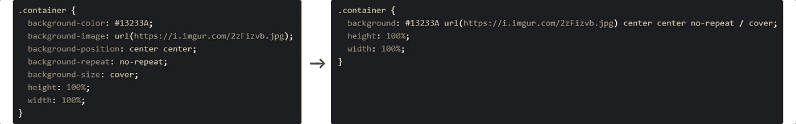

# 6 个初学 HTML/CSS 的技巧和指南，让你的生活更轻松。

> 原文：<https://medium.com/swlh/6-beginner-html-css-tips-guidelines-to-make-your-life-easier-ffa826143152>

## 这是*而不是*一份备忘单，这是*而不是*一份“问题清单”；这是关于利用工具和资源来浪费👏较少的👏时间👏。

CSS Shorthand

如果你刚刚开始学习 HTML/CSS，你可能已经遇到了一些不为人知的编程烦恼，比如需要…