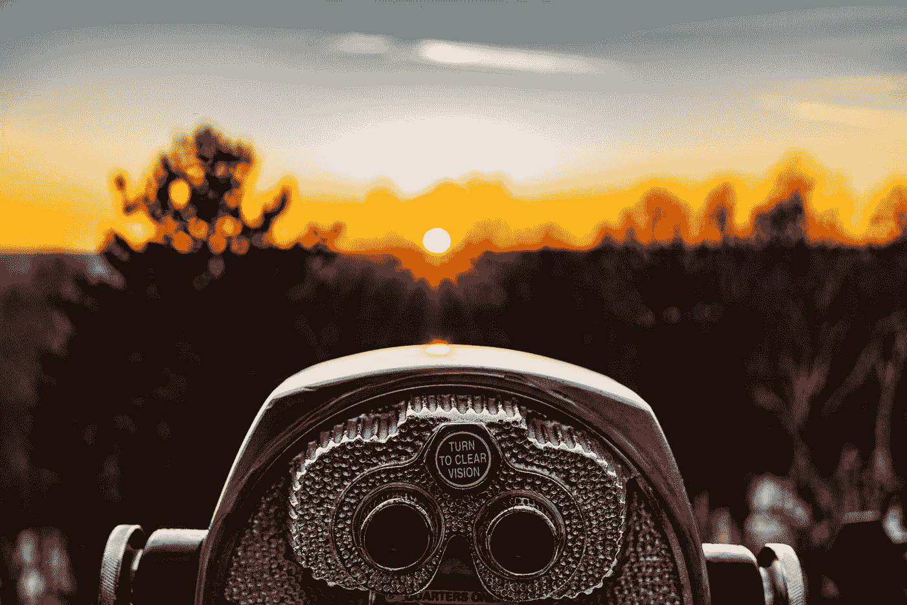

# 我遵循的克服困难时期的 6 个简单步骤

> 原文：<https://medium.com/swlh/6-easy-steps-to-move-on-with-your-life-after-hard-times-678ce254ebec>

## 认识你自己

## 我从来没有像今天这样开心过

Photo by [Matt Noble](https://unsplash.com/@mcnoble?utm_source=medium&utm_medium=referral) on [Unsplash](https://unsplash.com?utm_source=medium&utm_medium=referral)

为了过上更快乐的生活，自省是最难的事情之一。越快越好，因为路途遥远。我挖掘得越多，得到的惊喜就越多——有好有坏。

## 我从某处开始