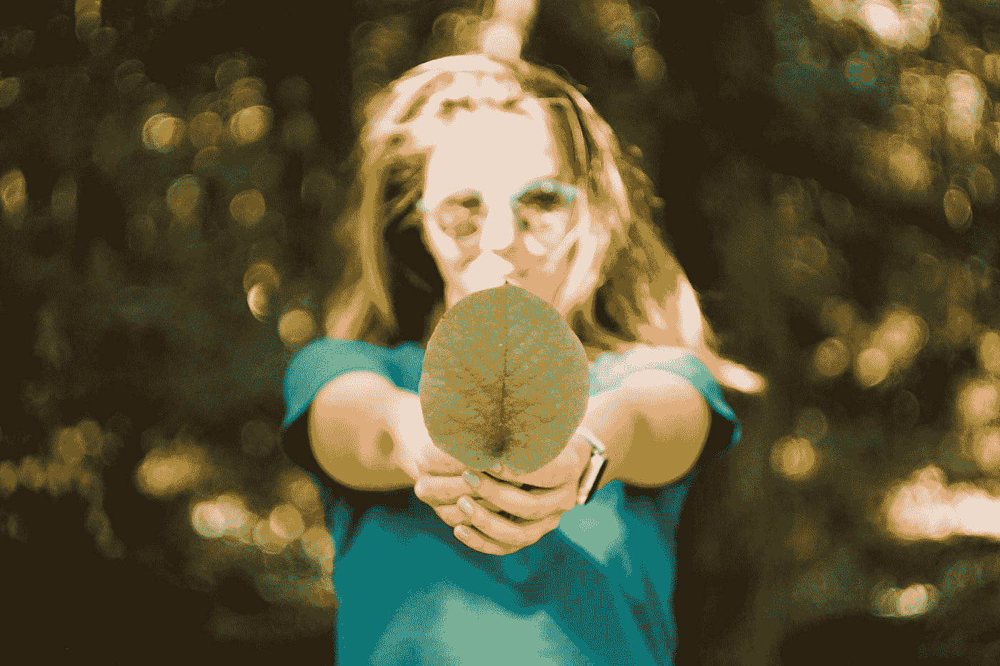

# 为了一个更健康的世界，你可以做出 6 个毫不费力的改变

> 原文：<https://medium.com/swlh/6-effortless-changes-you-can-make-for-a-healthier-world-95035cd34ce5>

## *坐在沙发上，保护环境*

Photo by [Mert Guller](https://unsplash.com/@mertguller?utm_source=medium&utm_medium=referral) on [Unsplash](https://unsplash.com?utm_source=medium&utm_medium=referral)

如果你最近一直在听新闻，你会看到一些真正可怕的报道，关于我们所知的[文明将在 2050 年](https://docs.wixstatic.com/ugd/148cb0_a1406e0143ac4c469196d3003bc1e687.pdf)终结。生存危机可能会重创我们，让我们想知道普通人能做些什么。