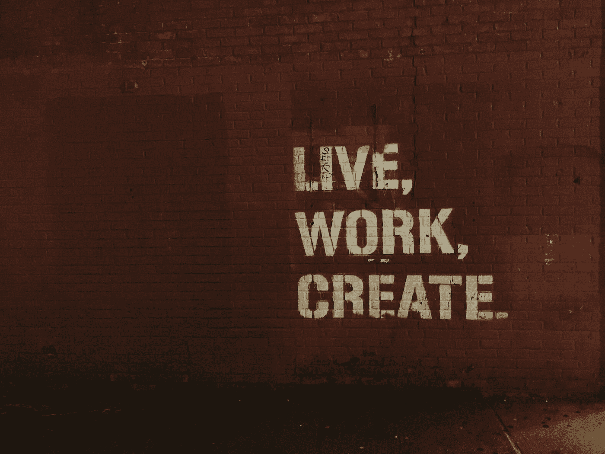

# 任何以内容为导向的营销策略的 6 个基本特征

> 原文：<https://medium.com/swlh/6-essential-characteristics-of-any-content-led-marketing-strategy-6a080bd05f8b>

Photo by [Jon Tyson](https://unsplash.com/@jontyson?utm_source=medium&utm_medium=referral) on [Unsplash](https://unsplash.com?utm_source=medium&utm_medium=referral)

伟大的内容让营销世界运转。无论你是在创建引人注目的电子邮件营销活动、引人入胜的博客文章、 [**酷酷的 YouTube 视频**](https://blog.icontact.com/six-reasons-need-invest-youtube) 还是重要的播客，如果你的内容没有击中目标，你的活动都会失败。

每一条内容都应该告诉你的订阅者、追随者、读者…