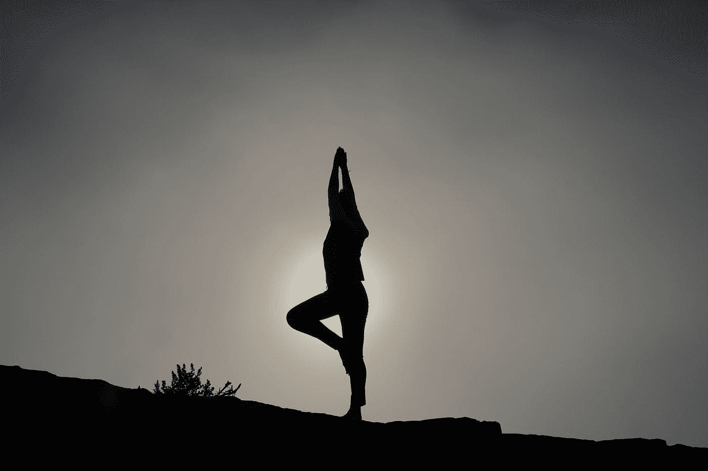

# 6 条原则将帮助你与自己和平相处

> 原文：<https://medium.com/swlh/6-principles-that-will-help-you-to-be-in-peace-with-yourself-20050522b46e>

Photo by [Patrick Hendry](https://unsplash.com/@worldsbetweenlines?utm_source=medium&utm_medium=referral) on [Unsplash](https://unsplash.com?utm_source=medium&utm_medium=referral)

在过去的几周里，我花了很多时间思考和反思我自己，我的生活和我的目标。

这主要是因为最近我生活中的一些事情发生了变化。

我完成了大学学业，现在完全专注于自己的事业。