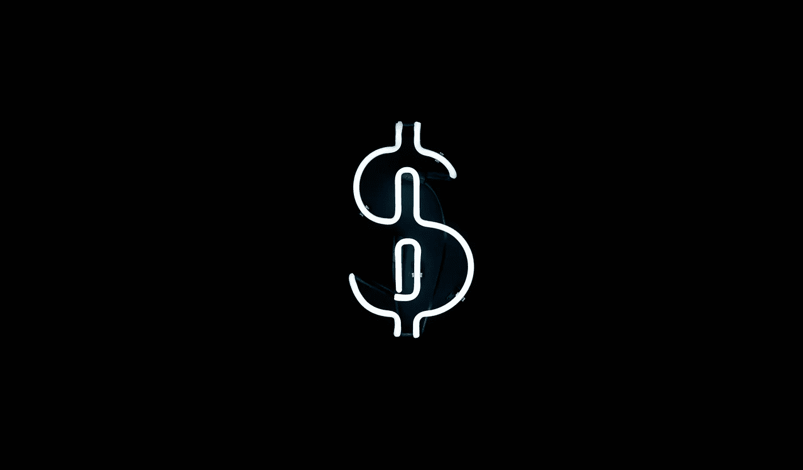

# 你的生意没有达到 6 位数的 6 个原因

> 原文：<https://medium.com/swlh/6-reasons-your-business-hasnt-hit-6-figures-ea2a83171d20>

## 学会销售你的客户乐意支付的价格和服务。

Photo by [Jimi Filipovski](https://unsplash.com/photos/8koEuSiR1zM?utm_source=unsplash&utm_medium=referral&utm_content=creditCopyText) on [Unsplash](https://unsplash.com/search/photos/money?utm_source=unsplash&utm_medium=referral&utm_content=creditCopyText)

## 1.你认为时间就是金钱

我以前说过——时间不是金钱。时间是穷人用来换钱的东西。

> 创造力就是金钱。你一天只有 X 的创造能量。谨慎使用。

不要把你的创造性精力浪费在平凡的数据录入、你不喜欢的事情、你可以外包的事情上。

计算哪 20%的客户/服务产生了你 80%的利润。把其他的都删掉。

永远不要按“每小时”收费这不是防止范围蔓延的方法。这就是你如何为自己创造范围蔓延。

想想看——你在给自己一个理由，在时钟滴答作响的时候四处闲逛。你的潜意识会确保不必要的任务变得必要。

你的客户会担心你是否会挤占时间。

按项目收费——继续阅读，学习如何计算你的客户永远不会拒绝的费用。

## 2.你不能自动化

为了让您的创造性精力集中在对您的业务至关重要的任务上，您需要自动化其他一切。

首先，弄清楚什么对你的企业和你来说是重要的。

*   你想做什么？写作、设计、销售等。
*   是什么让钱进来的？
*   你想做什么来赚钱？

做你喜欢的同时也能赚钱的事情。其他都外包。

你需要有才华的自由职业者。如果他们不能比你做得更好，不要浪费你的时间去雇人做一项工作。

例如，如果你要付钱给某人来管理你的电子邮件营销，确保他们比你更擅长电子邮件营销。

## 3.你没有特定的目标市场

我最近写了关于[我如何通过主持我的第一个工作室](/swlh/how-to-make-over-1k-hosting-your-first-workshop-ab0a319c8114)赚了超过 1000 美元。我通过向一个超级定义的市场卖票来做到这一点。

我没有试图向任何自由职业者出售门票，而是向自由作家出售门票。为什么？因为高目标的建议比模糊的建议收费更高。

*这里是你作为一个作家如何做到这一点*和*这里是大多数自由职业者如何做到这一点。*

如果你向企业出售设计和开发服务，为自己开拓一个超级利基市场。成为金融科技或兽医等行业最好的设计/开发机构。

> 选择一个你感兴趣的领域。

## 4.你不了解你的目标市场的需求

如果你要把网页设计卖给兽医，那么你需要了解他们需要什么。对于设计师或代理商来说，这可能意味着:

*   了解他们如何从网络上赚钱。是通过网上订票等方式吗？
*   了解他们的大部分利润来自哪里，以及这将如何影响你的设计。
*   了解兽医树立品牌的最佳方式。这个特殊的兽医是如何脱颖而出的呢？

如果你是一名作家，那么你会想知道你的目标市场的典型“声音”，他们的典型项目需求(电子书、文章、新闻故事等)。你应该成为创造这些东西的绝对专家。

## 5.你没有把你的服务的价值表述为金钱

你需要知道你给客户赚了多少钱。而不是你给他们带来了多少流量。而不是你如何提高点击率。不是你用友好而专业的语气写得有多好。

> 了解你为客户创造的平均金额。

这样，你就可以卖钱了:

*你每给我 1 美元，我就给你 10 美元。*

让你的客户放心把钱交给你。收取你的服务产生的利润的 10%左右，你永远不会缺少客户。

## 6.你不认为自己是利润的创造者

任何服务企业的目标都是帮助其他企业(或人)赚更多的钱。(例外:向消费者出售不直接影响他们钱包的服务)。

*   作家写故事，推动网络流量。网络流量=收入。
*   营销人员优化转换漏斗。转化就是金钱。
*   设计师建立品牌和用户路径，将观众转化为买家。
*   开发人员构建网站和应用程序，通过安全、加密的方式存储信用卡信息。
*   会计和数字打交道，帮助省钱=利润。

出售给企业的每一项服务都关乎 T4 利润。弄清楚你的企业如何帮助其他企业增加利润，并在销售时清楚地表达出来。

一旦你明白了你平均为公司节省/创造的利润的金额，就开始收取一定比例的费用。

想象一下，走进你的下一个会议或下一个电话，然后说:

我会让你的利润每月增加 1 万美元。我的费用是每月 1000 美元。

如果你能证明你的表现一直保持在那个水平，你认为你会失去那笔交易吗？

## 这篇文章发表在 [The Startup](https://medium.com/swlh) 上，这是 Medium 最大的创业刊物，拥有+412，714 名读者。

## 在这里订阅接收[我们的头条新闻](http://growthsupply.com/the-startup-newsletter/)。

