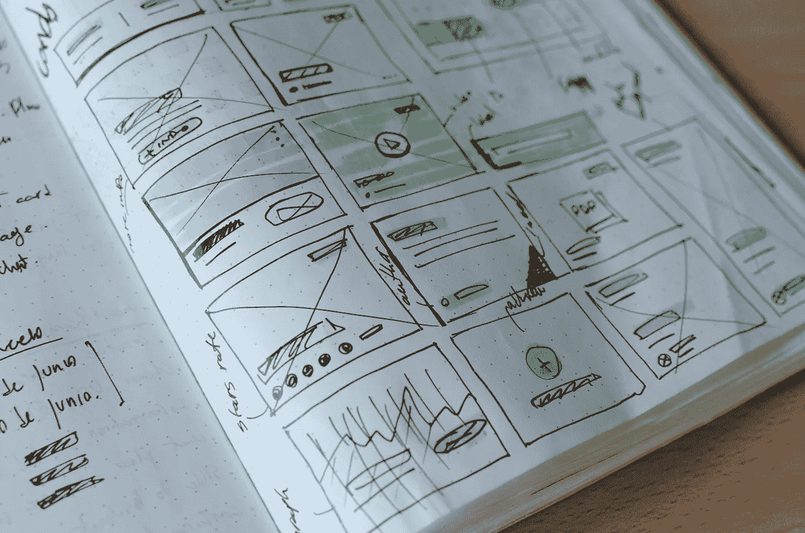

# 你的网站需要帮助的 6 个迹象

> 原文：<https://medium.com/swlh/6-signs-your-website-needs-help-a189d80ef048>

Photo by [José Alejandro Cuffia](https://unsplash.com/photos/_4815u_ACqQ?utm_source=unsplash&utm_medium=referral&utm_content=creditCopyText) on [Unsplash](https://unsplash.com/?utm_source=unsplash&utm_medium=referral&utm_content=creditCopyText)

你的网站是你品牌最明显的表现之一。这是人们第一次听说你时去的地方，第一印象对确保他们得到他们需要的东西至关重要。如果你的网站给了他们错误的印象，他们很可能会带着错误的想法离开——并且永远不会回来。

确保你的网站对正确的人说正确的事情，对你的…