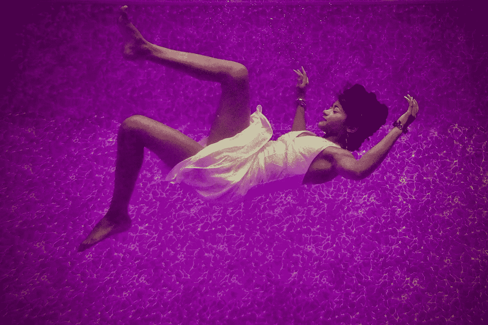

# 6 睡眠麻痹原因可能会让你大吃一惊

> 原文：<https://medium.com/swlh/6-sleep-paralysis-cause-that-might-surprise-you-1ae34cf076ea>

## 作为一个从 6 岁开始就经历睡眠瘫痪的人，我可以有把握地说，这有时会造成很大的创伤。

Photo by [Bruce Christianson](https://unsplash.com/@photologic?utm_source=medium&utm_medium=referral) on [Unsplash](https://unsplash.com?utm_source=medium&utm_medium=referral)

睡眠瘫痪是一种医学状况，你在半夜醒来，部分瘫痪。当你的眼部和呼吸肌工作正常时，其余的…