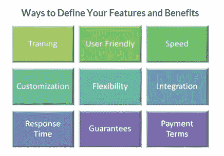

# 从竞争中脱颖而出的 6 个步骤

> 原文：<https://medium.com/swlh/6-steps-to-standing-out-from-the-competition-4217b32ff202>

Stand out from the competition

住在风景优美的特拉华河附近，我可以在沿着通往著名水道的乡村道路行驶时，数清无数 18 世纪的乡村客栈和酒馆。考虑到这是一个历史爱好者和游客的热点，许多这些地方自豪地声称，“乔治·华盛顿睡在这里。”

除了黑巴斯酒店和餐厅。

在美国独立战争期间，现在被称为黑鲈鱼的经营者是一名保守党人。当华盛顿将军停下来休息时，他被告知离开。这个传奇故事成了这家旅馆的营销口头禅:*乔治·华盛顿没有睡在这里——但是你当然可以睡在这里！*

现在 Black Bass 可以理直气壮地吹嘘它的国家注册处、五星级餐厅和一流的客户，但位于 River Road 附近的许多其他酒店也可以做出同样的声明。让黑鲈鱼在竞争中脱颖而出的是他们在*独特的销售经验*。

## 定义您独特的销售体验

在市场中，尤其是当您的解决方案提供相似的功能和优势时，将自己与竞争对手区分开来是必不可少的。你已经知道你的产品或服务的特点以及它们给你的购买者带来的价值，但是你能采取什么步骤来确保你的购买者也看到这些价值呢？

## 区别于竞争对手的 6 个步骤

**1。建立一个有说服力的销售主张。**你可能已经定义了买家期望的解决方案的最低特征。现在，与您的销售、客户服务、营销和产品团队会面，研究您的产品或服务的独特之处。你能提供什么你的竞争对手没有的东西？您的解决方案有哪些方面超出了购买者的需求，但仍能为他们增加价值？你们提供现场培训吗？提供专门的客户服务代表吗？和你的团队一起分享你的想法，并列出清单。

**2。定义所有功能和优势**。你的解决方案比它最初的目的更有价值。你的买家有多少种方式可以利用你的解决方案？如果你能确保买家意识到对他们来说最重要的好处，你的解决方案的感知价值就会增加。尽可能多地寻找机会，展示您的解决方案将如何帮助他们体验这些高风险的好处。您的解决方案有哪些优势是您的竞争对手无法或不愿复制的？

Features and Benefits

**3。收集内部和外部的竞争情报。**除了你已知的竞争对手，记住你的竞争对手也可能是你的买方组织中的一个部门。有时，您的买家可能不确定他们是否需要购买解决方案。了解这些知识将有助于您应对买家在使用您的解决方案时可能产生的任何疑虑，并有助于您让他们了解您的解决方案的优势。

**4。找到买家的具体需求。**记住每个买家都有特定的需求，了解他们将有助于你找到这个独特的卖点。比如，想想你上一次买车的时候，你有过的要求。你可能因为省油而买了这辆车，但是你的邻居可能因为这辆车适合五口之家而买了同样的车。同样的车，不同的购买理由。花时间和你的买家在一起，听听他们如何描述他们的问题领域。这些棘手问题代表着您填补空白的机会。(这就是为什么实施托管服务计划可以帮助您赢得更多。您的优势在于研究每个买家/客户，以便在下一个续订周期和竞争对手到来之前，为行动计划做好充分准备。)

**5。在销售陈述和演示中陈述你的情况。**培训您的销售团队，让他们在销售演示中阐述您的主要优势。根据买家的具体需求定制您的演示文稿，并向他们展示您的解决方案如何让他们受益，这将为说服买家相信您是他们的战略选择铺平道路。最清晰的演示最具冲击力。现在是摊牌的时候了，向他们展示你的实力。

**6。保持沟通渠道畅通。**即使完成交易后，也要保持联系。我们以前听说过:客户对我们客户的服务和支持的反馈并不总是正面的。你可能认为这在区分你自己方面并不重要，但提供顶级支持可能是一次性合同和持久关系的区别。培训支持人员友好、积极和诚实。给他们成功所需的工具、信息和资源。失望的客户可能会转向竞争对手，因为他们对立即得到他们需要的结果感到沮丧。体验驱动感知。最好的经历会让他们不断回来。购买者将找到一种方法来采购解决方案，使他们的工作和组织的任务变得简单。

如果你做足功课并制定行动计划，从竞争中脱颖而出是可能的。寻找那些隐藏的机会，你的解决方案可以帮助购买者，给他们一个独特的体验，他们还没有探索。然后，最大限度地利用这些机会。