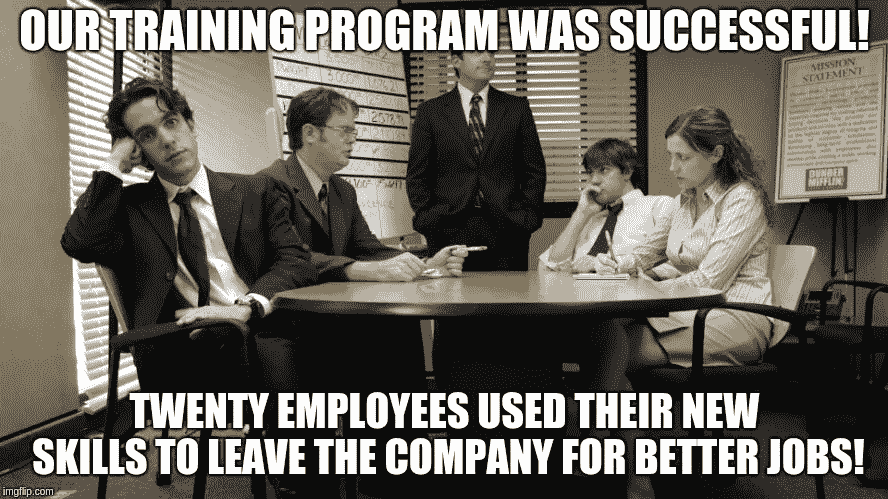

# 在线企业 LMS 被证明是员工培训和业务绩效优化的重要工具的 6 种方式？

> 原文：<https://medium.com/swlh/6-ways-online-corporate-lms-proves-to-be-an-essential-tool-for-employee-training-and-business-b40e6adafab8>

在这个全球竞争、技术驱动的开放经济中，企业需要通过在最短的时间内开发出有竞争力的产品来确保优势。员工培训和发展是实现这一目标的关键因素。企业培训确保你的员工与你的商业目标一致。可行的企业培训和发展计划有助于留住合适的员工，提高流程效率，并最终增加企业的财务增长。随着对顶尖人才的争夺变得越来越激烈，识别业务影响、分析技能差距和分层适当的培训方法变得比以往任何时候都更加重要。面对组织发展，企业学习现在已经成为企业的主要内容之一。

但是这个世界已经从独立的幻灯片和培训光盘向前迈进了。如果你还停留在那些上面，我的问题是为什么？让我在这里帮你一把——阅读这篇文章，了解为什么企业员工培训是当务之急，以及你如何通过合适的企业培训平台来帮助你的企业！

**1。随时随地学习**

这种残酷的竞争意味着员工总是试图超越他人，总是忙个不停。在这种情况下，传统的企业培训可能很难适应每个人繁忙的日程安排。随着在线培训的出现，这变得更加方便和灵活，当您不在现场时，培训不必停止。无论您去哪里，都要随身携带您的训练！在为您的员工开发或选择 LMS 时，请确保您实现了一个现代化且响应迅速的用户界面，以便您的员工可以从任何设备访问和研究材料，而不必为此下载特定的应用程序或放大和缩小材料。

**2。按需个性化学习**

从广告、娱乐、食物食谱、应用程序等开始，人类生活的几乎所有方面都变得个性化了。那么，企业培训为什么要落后呢？个性化培训的基本作用是，利用学习者的能力和兴趣，为他/她提供课程和模块，以制定个性化的培训计划，从而最大限度地提高个人和职业收益。让我举一个例子，Jack 有领导才能，但需要提高才能成为团队领导者，因此，可以专门为他设计一门课程，帮助他实现目标，然后再传给像 Jack 这样的人。

**3。降低 L & D 成本**

一个有效的在线培训计划可以成倍地提高企业绩效和员工士气。但是，这不需要深入挖掘你公司的棺材。在线企业培训预算合理，比线下培训花费更少。对于离线培训，成本包括寻找提供培训的物理基础设施、雇佣全职教师、技术成本等。如果你的办公室分散在世界各地，电子培训意味着从员工和培训师的角度来看，都要花费大量的差旅费。通过在线培训，学习者可以随时随地通过自己的设备学习课程。此外，他们可以抛弃标准的传统教学方式，可以根据需要多次浏览材料和视频。在电子培训中，你必须处理的一个巨大的成本是 LMS 开发。您也可以节省成本——外包 it 或选择软件即服务 LMS 或自托管 LMS。您的 LMS 将对学习质量负责，并将帮助您的公司在竞争中保持领先地位。因此，虽然降低培训成本至关重要，但也不应该过度。

**4。单点在线培训体验**

在线培训可以是同步的，也可以是异步的。前者包括所有学员同时登录和讲师传授实时信息。后者是学员和教员在方便时登录，根据他们自己的时间表分别传授和吸收知识和反馈。这创造了一个自定进度的学习环境。通过在线培训，您的员工可以选择最适合他们需求的方法。这也使他们更加负责，更加清楚培训的截止日期和时间表。这也提高了知识的保留，主要是因为他们可以完全控制学习的速度，并且在需要的时候也有机会重温培训材料。

**5。进度和绩效跟踪**

评估你的培训效果有助于了解培训是否成功，以及它是否符合学习者的需求和目标；它向学习者传授了什么技能，他们成功地保留了多大比例的知识。一个有效的 LMS 必须有工具来衡量进展，并提供建设性的反馈和评估，以便在学习中达到自我反思的目的，并实时衡量员工个人的进展。一个能够更深入挖掘数据和收集见解的 LMS 可以进一步增强你的培训计划的有效性。

**6。整合社会学习经验**

通俗地说，社会学习就是通过观察和协作来学习。通过创建学习社区并鼓励他们参与社区中的讨论，这确实是培训员工的有效方式。公司加入社会学习的一个最大优势是社会学习促进了学习者的参与和团队合作。学习一个概念，然后提供一个平台来分享这个概念:小组讨论、在线论坛、角色建模等是在你的公司空间中整合社会学习的一些方法。现代工作场所总是随着技术的进步和将各种社会经验融入企业培训而不断发展。将社会学习纳入你的工作场所也将鼓励你的员工对他们的个人学习负责，并增强企业文化和促进工作场所的协作。

**-……临别赠言::-**

在线员工培训可以帮助员工提高工作效率，专注于需要改进的领域，拓展技能并坚持公司标准。此外，它让您有机会更有效地跟踪单个员工的进展，并准备定制的个性化课程，帮助他们成为更有效的公司资产。考虑推出一个测试在线培训认证课程，看看员工的反应，并确定是否值得投资。如果一切顺利，你可能会考虑[一个成熟的在线培训认证项目](https://www.binaryfolks.com/portfolio/education?utm_source=Medium_startup&utm_medium=social&utm_campaign=content_marketing_jan_2018)。

*最初发布于:*[*binary 乡亲*](https://www.binaryfolks.com/blog/6-ways-online-corporate-lms-proves-to-be-an-essential-tool-for-employee-training-and-business-performance-optimization)

## 这篇文章发表在 [The Startup](https://medium.com/swlh) 上，这是 Medium 最大的创业刊物，拥有+405，714 名读者。

## 在此订阅接收[我们的头条新闻](http://growthsupply.com/the-startup-newsletter/)。

