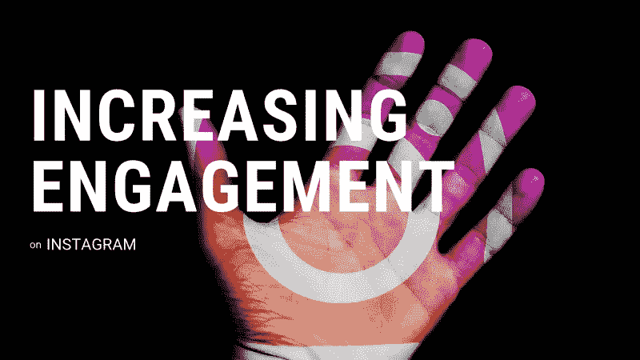

# 提高你在 Instagram 上的参与度的 6 种方法

> 原文：<https://medium.com/swlh/6-ways-to-increase-your-engagement-rate-on-instagram-61e8421e438>

Engagement is more important than audience size. Change my mind.

三年前，所有的焦点都集中在影响者的受众规模上——他们在 Instagram 上有多少“粉丝”。品牌和营销人员都认为，追随者越多，花的每一块钱就赚得越多，或者他们是这么认为的。

随着营销人员在影响者营销的复杂丛林中导航，一个新的重要指标出现了:参与度…