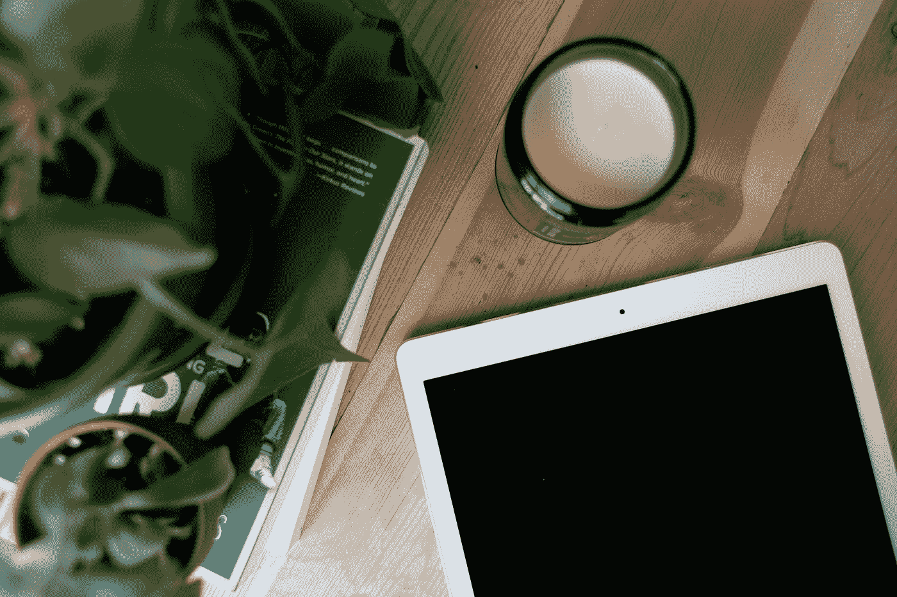

# 在你的 iPad 上学习编码的 7 个很棒的应用程序

> 原文：<https://medium.com/swlh/7-awesome-apps-for-learning-to-code-on-your-ipad-a9a5c2ecf5c2>

## 努力挤出时间来学习生活中发生的一切？出门在外时随身携带！

Photo by [Amanda Vick](https://unsplash.com/@amandavickcreative?utm_source=medium&utm_medium=referral) on [Unsplash](https://unsplash.com?utm_source=medium&utm_medium=referral)

我是地地道道的千禧一代。我所做的一切，从银行业务到列购物清单，都是电子化的。我顺纸而数字化 [*所有的东西*](http://hyperboleandahalf.blogspot.com/2010/06/this-is-why-ill-never-be-adult.html) 。