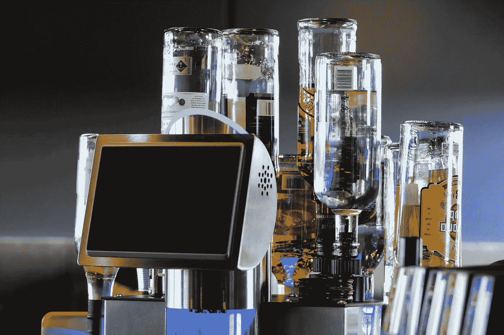

# 2019 年值得关注的 7 大全球食品科技趋势

> 原文：<https://medium.com/swlh/7-global-food-tech-trends-to-watch-in-2019-7a965383d105>

Image by [Bruno Glätsch](https://pixabay.com/users/Bru-nO-1161770/?utm_source=link-attribution&utm_medium=referral&utm_campaign=image&utm_content=3489366) from [Pixabay](https://pixabay.com/?utm_source=link-attribution&utm_medium=referral&utm_campaign=image&utm_content=3489366)

全球食品市场一片火热。去年是食品科技初创公司的黄金年。[根据 PitchBook 的数据，2018 年该领域的风险投资创下了十年来的最高纪录，独角兽 DoorDash 和 Instacart 等食品初创公司的价值为 44 亿美元](https://pitchbook.com/news/articles/recipe-for-growth-vcs-are-more-interested-in-food-tech-than-ever)。

改变对食品技术兴趣的驱动力包括气候变化、数字化机遇以及关注健康的消费者。气候变化的现实及其全球影响正在催生渴望做出改变的创新创业公司。随着技术的快速发展，数字化机遇——在传统的低技术、复杂行业中——为全球链打开了各种应用。对健康期望的增加也导致了消费者饮食的变化，促进了素食主义和纯素食主义的兴起。根据 2017 年 Mintel 全球食品和饮料趋势报告，与 5 年前相比，2016 年推出的纯素食食品和饮料数量[增长了 257%。](https://www.cnbc.com/2016/12/30/trends-for-2017-show-wellness-and-foods-link-to-grow.html)

食品和饮料行业正在发生变化——这是显而易见的。让我们深入研究 2019 年的食品技术趋势，这些趋势将我们推向更营养、更透明和更高的技术利用率。

# 改变食品和农业的顶级食品技术趋势

## 1.植物性和无动物性

专注于动物产品替代品的改良技术继续增长并获得新的投资。加利福尼亚州的野火灾难和[许多欧洲国家的农作物减产](https://climate.nasa.gov/news/2806/prolonged-hot-dry-conditions-affect-european-crop-prices/)让人们更加关注气候变化，这与温室气体的高排放导致的畜牧业和肉类消费直接相关。Impossible Foods 最近推出了其素食汉堡的 2.0 版本，该汉堡在 CES 2019 上获得了顶级技术类别的冠军。随着价格的下降和感官质量的提高，这些产品将在所有消费群体中获得更多的欢迎。

## 2.服务机器人和餐厅数字化

虽然价格昂贵，但食品服务机器人将在 2019 年上路，新的电子餐厅如 Spyce T1 和 T2 Eatsa T3 也将上路。服务机器人和电子餐厅将网上订购的便利、餐食的个性化、健康营养食材的获取以及在柜台上获得食物的速度结合在一起，正在建立新的标准。 [CafeX](https://cafexapp.com/) 的机器人手臂被训练准备完美的卡布奇诺，[汉堡翻转机器人](https://caliburger.com/)是烧烤大师。接下来会是什么？

## 3.无塑料

去年是 CPG 领域的一个转折点，国际法规发生了许多重要变化，协议也得以签署。我们从欧盟禁止使用一次性塑料[看到了这一点，比如吸管、餐具、盘子和搅拌器。由于空气污染率高，中国限制从其他国家进口和加工残渣。此外，达能和可口可乐等 CPG 巨头以及全球重要的塑料垃圾产生者在](https://www.nytimes.com/2018/10/25/world/europe/european-parliament-plastic-ban.html)[我们的海洋全球大会](https://ourocean2018.org/)期间齐聚一堂，签署了一项雄心勃勃的协议，以大幅减少塑料的产生和处理。具有优化功能的可生物降解、无塑料解决方案正在受到青睐。有许多公司和创业公司引领包装创新的潮流。查看[我上一篇关于包装创新的文章](https://www.rocketspace.com/corporate-innovation/topic/packaging-innovation)以及该领域领先的初创公司和企业名单。

## 4.大食、透明和共同价值观

大型食品行业仍在试图找出如何重新赢得客户的信任，与他们的价值观更加一致，以及更加透明。小品牌和新电子商务渠道的繁荣将继续对大公司的市场份额产生负面影响；为了保持竞争力，他们必须更好地了解利基市场和改变齿轮的速度。可追溯性使能器，如区块链技术，将继续扩大，并在食品和农业中获得新的采用者，因为它们能够实现快速数据集成和产品质量和原产地的识别。提供解决方案的有趣创业公司有 [Ripe.io](http://www.ripe.io/) 、 [TE-FOOD](https://tefoodint.com/) 、[出处](https://www.provenance.org/)。

## 5.功能饮料热潮

康普茶等低糖、植物性、功能性饮料将在 2019 年继续繁荣。[仅康普茶市场一项，2017 年就增长了近 41%，达到 5.34 亿美元](https://www.bevindustry.com/articles/90063-kombucha-market-up-41-percent?v=preview)，预计到 2020 年将达到 18 亿美元。Euromonitor International 的高级饮料分析师 Howard Telford 对目前功能性饮料进入餐饮领域的趋势进行了评论，他说,[“消费者正转向将饮料视为一种预防性营养场合。人们对功能感兴趣，他们不是问‘这个瓶子里是什么’，而是问‘这个瓶子能为我做什么？’](https://www.fooddive.com/news/why-kombucha-sales-are-up-41/438398/)2018 年，益生菌饮料和健康饮料领域的高发布数量凸显了饮用的便利性如何满足对健康和营养的追求。大麻、蘑菇、MCT 油、新纤维、天然提取物和益生菌等新成分将继续推动创新饮料的产生。看看[补救有机物](https://www.remedyorganics.com/)、[鲸豚红茶菌](https://whalebirdkombucha.com/)和[马尔克有机物](http://malkorganics.com/)就知道了。

## 6.个性化和特殊的饮食

数字化和机器人化增加了食品个性化的能力，这是及时的，因为新饮食和低成本家庭测试健康诊断的传播导致需求迅速增长，如 [FoodMarble](https://foodmarble.com/) 和 [Habit](https://habit.com/) 。全球范围内食物过敏和不耐受的增加也将推动这一趋势。解决方案包括膳食计划，如 [Platejoy](https://www.platejoy.com/) ，它提供针对特定饮食和烹饪习惯定制的膳食计划，并将营养数据与健康跟踪设备相结合。另一个例子是 [Sunbasket](https://sunbasket.com/) ，这是一个专注于特殊饮食和有机成分的膳食套件。个人用餐的完全个性化仍然是一个挑战，但需求将推动创新在 2019 年继续。

## 7.健康电子食品

随着消费者继续寻找更方便的购物方式，在线食品和电子商务平台将继续增长并获得新的采纳者。成功的食品杂货递送服务，如 Instacart、Good Eggs 和 Imperfect Produce 都是不断扩大的市场的例证。在食品服务方面， [Grubhub](https://www.grubhub.com/) 和 [Uber Eats](https://www.ubereats.com/) 交付解决方案也将继续增长，而专注于目标群体、特殊饮食和营养数据洞察的新的优化平台可能会在 2019 年占据有趣的空间。

# 加速食品技术趋势

现在，比以往任何时候都更需要团结起来改变我们的食物系统和消费，创业公司和企业。这些趋势没有减缓的迹象。

*原载于 2019 年 4 月 3 日 https://www.rocketspace.com**的* [*。*](https://www.rocketspace.com/corporate-innovation/7-global-food-tech-trends-to-watch-in-2019)