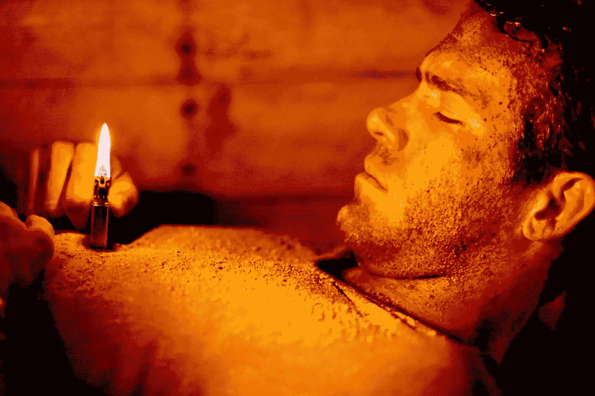

# 如果你曾跌入谷底，可以遵循 7 条苛刻的职业建议

> 原文：<https://medium.com/swlh/7-harsh-pieces-of-career-advice-to-follow-if-you-ever-hit-rock-bottom-acb99e310d5d>

## 这是一个宝石加上一些可爱的小狗过山车。

Image Credit: Lionsgate.com / Buried Movie

一个好的建议通常是软弱和感性的，这就是它不起作用的原因。大多数建议并不是以一种打你脸，告诉你*“醒醒吧，桑尼·吉姆”的方式给出的*