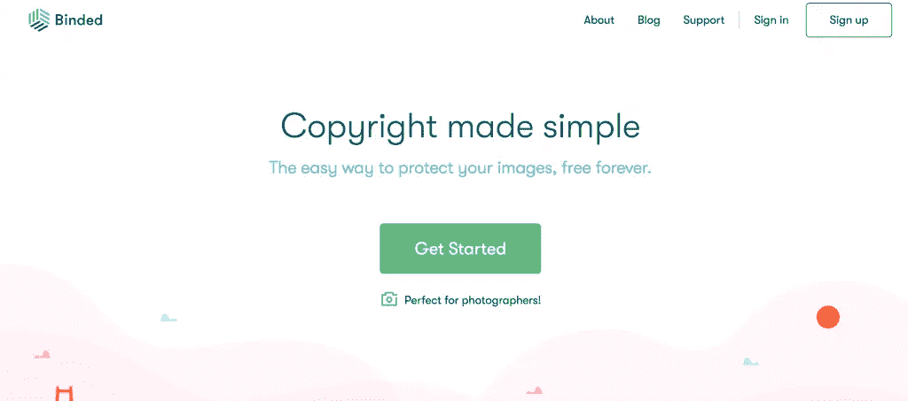

# 7 初创公司的法律资源和工具

> 原文：<https://medium.com/swlh/7-legal-resources-and-tools-for-startups-81fa05ceb46e>

创业最困难的部分之一是把所有相关的法律事务处理好。客户合同、财产租赁和员工雇佣合同都是你需要考虑的事情。

所有的背景法律工作可能很难理解，在创业初期可能是一个重大障碍。正因为如此，我们决定创建一个由七种法律资源和工具组成的列表，这些资源和工具可以让你的创业远离法律难题。

# [火箭律师](https://www.rocketlawyer.com/)

[Rocket Lawyer](https://startupstash.com/legal/rocket-lawyer/) 是一家基于订阅的在线法律技术公司，目前位于加利福尼亚州的旧金山。Rocket Lawyer 提供的服务是为单身人士和中小型企业量身定制的，既有效又负担得起。

首先，他们提供一系列在线服务。如果您有订阅，您将获得一系列关于法律的信息性文章，能够通过完成在线表格在线创建法律文件，您只需填写空白，您将拥有一个定制的法律文件，随时可用，具有法律效力。

如果你不太习惯自己做这件事，Rocket Lawyer 还为他们的客户提供法律专业人士的专家小组服务。这些律师将能够回答询问，并为其他广泛的法律任务提供帮助，包括文件审查。

最后，他们还提供使用他们的合法健康评分服务。这项服务有助于评估您的业务是否存在任何潜在的漏洞，这些漏洞可能会导致未来的法律问题。你将得到 1 到 100 分的分数，根据你的分数，你将得到如何改进和更好地保护你的创业公司的指导。

关于价格，强烈建议您订阅。这是因为作为一个非会员，你将支付每份文件 39.99 美元，你将支付更多的其他服务，这是不完全符合成本效益的。然而，如果你每月支付 39.99 美元的订阅费，你将免费获得他们的大部分服务，并在其他服务上有很大的折扣。

火箭律师有助于让你的创业获得法律援助更容易和更实惠。还可以获得七天免费试用，自己看看吧。

# [seed 律师](https://seedlawyers.com/)

[SeedLawyers](https://startupstash.com/resource/seedlawyers/) 是一家法律技术公司，总部位于纽约。作为一家公司，他们的使命是帮助处于早期阶段的初创公司，通过外行人容易理解的模式为他们提供法律援助，并提供灵活性和保持清晰的定价结构，以便没有隐性成本需要担心。

应该注意的是，他们本身不是律师事务所，你的律师-客户关系将与独立律师。

SeedLawyers 提供各种各样的服务，包括“咨询律师”,在那里你可以与你所在行业的独立律师取得联系，你也可以安排与他们通话。

此外，他们深入到许多不同的领域，这意味着无论你的问题是什么，他们都能够提供帮助。他们目前在广告中宣传知识产权法方面的帮助，为你的初创公司筹集资金，为你的团队提供就业法，你和其他企业之间的协议，为你的联合创始人提供内部法律协议等等。他们拥有你的初创公司在现代商业环境中应该需要的一切。

每月支付 49.99 美元，你将可以无限制地与他们的合作律师交谈，可以问尽可能多的法律问题，访问大量的法律文件和每天 24 小时提供的客户服务。

# [摇动](http://www.shakelaw.com/shake-apps/)

Shake 是一家合法的科技创业公司，目前位于纽约。他们目前提供的主要产品是他们的应用程序“Forms by LegalShield”。目前，该应用可在 IOS、Android 和基于网络的设备上使用。他们的使命是简化法律文件，让普通企业主或自由职业者更容易理解。

Shake 的主要目标市场是自由职业者和小公司，他们可能需要法律援助，但无法负担更多正式法律援助的费用。

该应用程序允许用户从他们的设备上生成、签署和发送具有法律约束力的文件。在该应用程序中，有一个法律文档模板库，这些模板以易于理解的方式编写。要创建他们的文档，用户需要填写一份问卷，问卷将自动填充他们的文档。

目前，Shake 支持的模板涉及独立承包商、保密协议、买卖、租赁商品和提供个人贷款。

目前，该应用程序可以免费使用有限的功能，但是，要获得更多优质功能和模板的完整访问权限，您必须支付会员费。会员费每月不到 20 美元。

# [劳吉克斯](https://www.lawgeex.com/)

LawGeex 是一家革命性的法律技术公司，总部设在以色列特拉维夫和纽约。他们的目标是让审查合同的过程更容易，更省时，这样你的法律团队就可以把他们的注意力转移到你的初创公司更紧迫的事情上。

他们使用复杂的人工智能资产，自动审查和处理所有通过你的业务的合同。人工智能对法律领域中使用的语言有着复杂的理解，并且对语言使用的上下文也有理解。

然后，该系统可以识别是否有任何合同条款缺失，以及合同的任何部分是否不合规。然后，它会提供改进建议，只需点击一下鼠标即可实施。然后，使用 LawGeex 处理的合同会自动导出到一个 Word 文档中，并带有任何更改的注释。

一旦这些都完成了，你就可以把合同发送给预定的接收人了。它使这一过程更加迅速和有效。

您可以访问他们的网站来请求演示，这样您就可以亲自了解他们的系统是如何工作的。

# [被捆绑](https://binded.com/)

Binded 提供了一个很好的工具来保护你的创业公司的知识产权。总部设在加利福尼亚州旧金山的他们的服务可以用来保护图像，如标志，和其他重要的视觉公司媒体。

他们正在寻求使公司资产的版权保护比现在更容易和负担得起。

它的工作原理是利用区块链技术来保护你的图像。首先，你上传你的图片到你自己的个人版权库，这可以从你的电脑，手机或者通过与其他应用程序如 Instagram 的集成来上传。然后，每当你上传内容到你的金库，它就会以“数字指纹”的形式永久保存在区块链平台上。

Binded 会给你一个版权证书，作为你版权的证明。这将有助于保护你的创业免受任何人侵犯你的版权。

这一过程的简单性和快速性使它成为你创业的有用工具。如果你花在解决版权问题上的时间少得多，那么你就可以把更多的时间和注意力放在创业公司的顺利运营上，这样你就可以成长得更快。

Binded 也是免费服务。

# [克里基](https://www.clerky.com/)

Clerky 是一家美国法律技术公司，总部设在加利福尼亚州伯林盖姆。他们主要向初创公司推销自己，称他们为初创公司安全完成法律文书工作提供了最简单的方式。

他们有一个律师助理和律师团队，他们是各自领域的专家，能够回答你的任何问题。

他们为你的创业公司提供一系列不同的法律文件。他们可以处理你的公司，让你开始运作，而不是跑文书工作，他们可以提供有关你的联合创始人，知识产权和公司章程的内部法律文件。

他们还提供与团队雇佣相关的法律文件，包括雇佣合同、聘书和员工股票期权文件。他们还能够提供保密协议，以便您可以保护您公司的知识产权。

Clerky 还提供文件，可以帮助您从投资者那里获得种子资金，包括证券合规文件、融资清单和董事会同意书。

克莱基广告各种不同的价格，都可以在他们的网站上找到。

# [商标现在](https://www.trademarknow.com/)

TrademarkNow 是一家位于纽约的法律技术公司，专门从事知识产权法律。他们提供各种服务，旨在节省知识产权律师的时间，从而节省你的创业资金。

Namecheck 是他们的服务之一，可以让你快速、全面地搜索多个地区的相似商标。它还将对商标中可能出现的任何风险因素进行全面分析。它还将为您提供有关商标如何使用、其所有者以及诉讼速度的信息。

他们的 Namewatch 服务提供了跟踪对你的创业有潜在威胁的应用程序的能力。他们的跟踪工具还与他们平台上的其他工具相集成，以帮助您获得全面的风险报告。您还可以了解竞争对手何时注册了新商标，这将有助于您跟上市场的新发展。

他们提供的一项服务包括根据他们庞大的数据库搜索徽标，这将允许您检查您的徽标是否在许多地区有任何冲突。您的搜索结果和任何冲突将被制作成一个图库，可以导出为多种不同的格式。

他们在订阅的基础上运作，并不在网上宣传他们的价格，因此，你需要从他们那里得到量身定制的报价。

这些工具可以帮助你的知识产权律师花更少的时间做跑腿的工作，花更多的时间做对你的创业重要的事情。

*原载于 2019 年 3 月 8 日*[*【startupstash.com】*](https://startupstash.com/legal-resources-and-tools-for-startups)*。*

## 这篇文章发表在 [The Startup](https://medium.com/swlh) 上，这是 Medium 最大的创业刊物，拥有+432，678 读者。

## 在这里订阅接收[我们的头条新闻](https://growthsupply.com/the-startup-newsletter/)。

