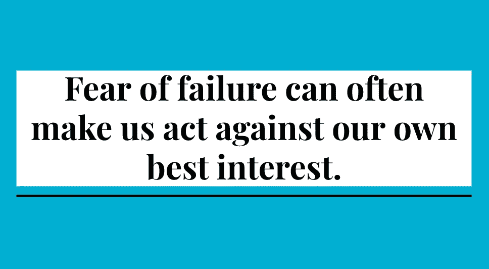

# 创建公司文化的 7 堂课

> 原文：<https://medium.com/swlh/7-lessons-for-creating-company-culture-eb6b15a1068f>

*在 5 年多的时间里，我从管理 300 名员工中学到了什么*

Rule #1 — Imagery Author’s Own

第一课——对失败的恐惧常常会让我们违背自己的最佳利益。整件事都很可怕。如果你不害怕，那么你可能没什么可失去的，如果你没什么可失去的，我会告诉你你做得不对。每天都应该让你害怕一点——但是如果你曾经做过一个决定，那就是害怕…