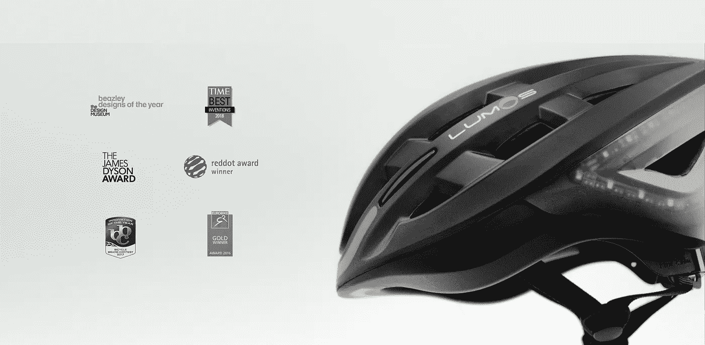
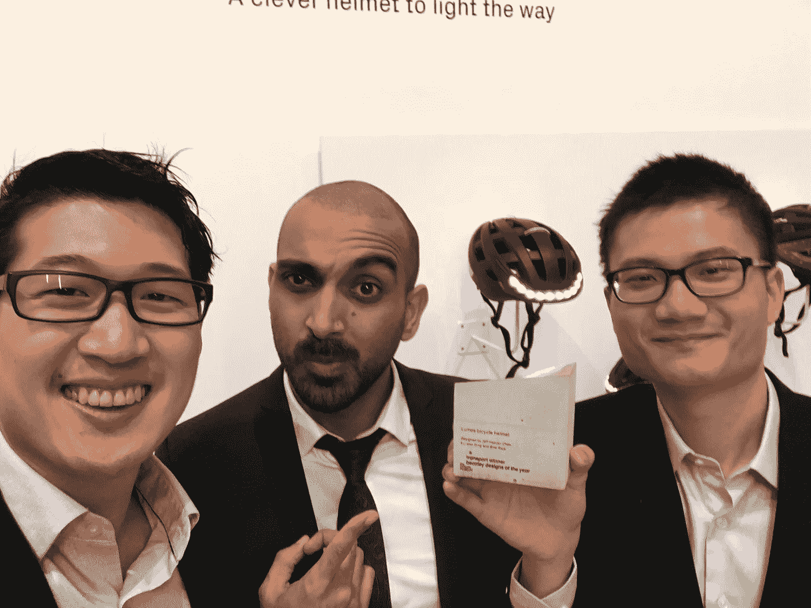
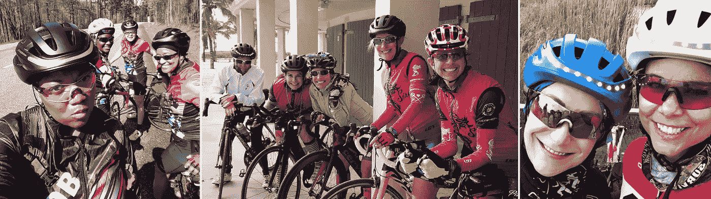
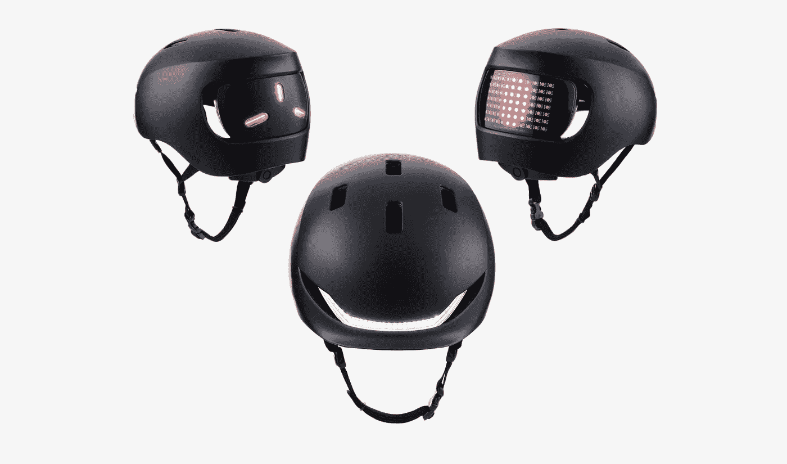
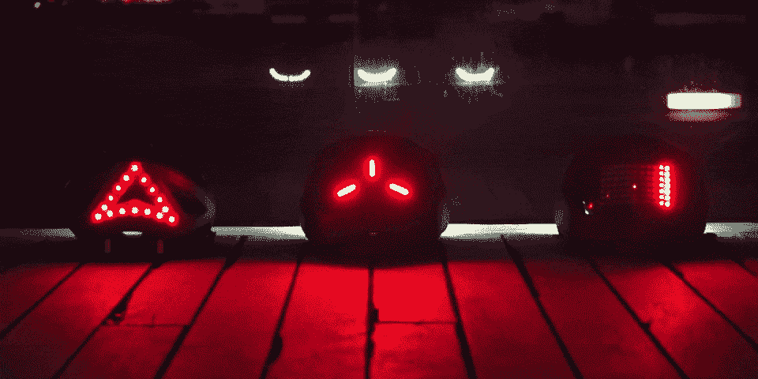
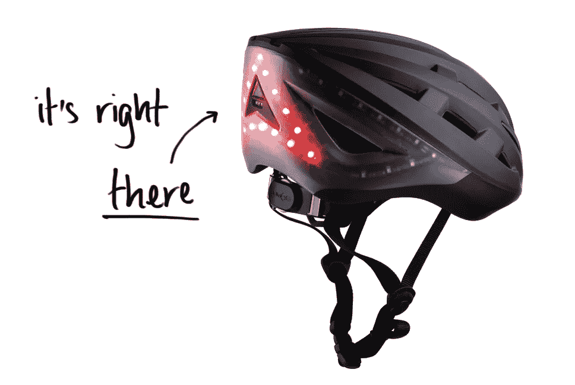
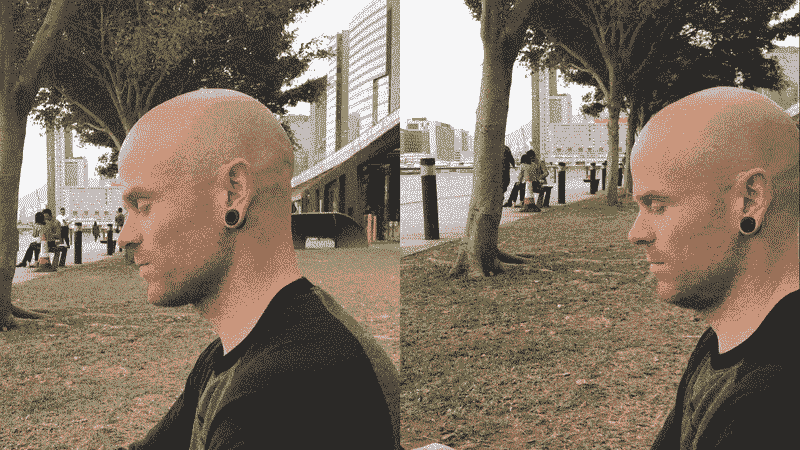
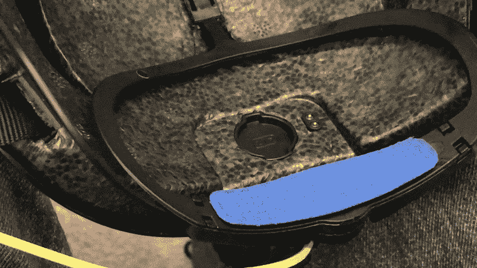
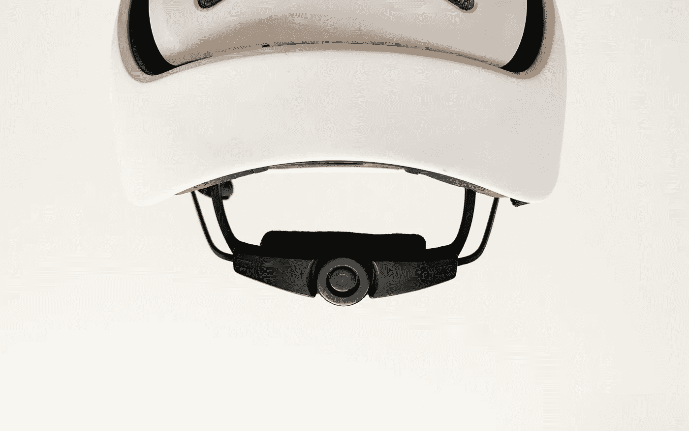
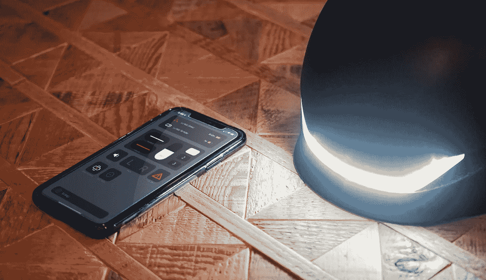

# 我从制作获奖的 Lumos 头盔中学到的 7 个教训

> 原文：<https://medium.com/swlh/7-lessons-i-learned-from-building-the-award-winning-lumos-helmet-ec138d3cc163>

嗨，首先，让我自我介绍一下。我叫 Bilal，我是 Lumos 的设计主管，也是最初 Lumos 头盔的工业设计师。

That’s us collecting one of our awards at the Design Museum in London

对我们来说，在 Kickstarter 上发布第一款集成 led 转向灯的头盔是一个不可思议的时刻。事实上，我们决定以这个平台的名字命名这个头盔，这个平台帮助我们的小创业公司带来了今天成千上万人喜欢的头盔。

它不是完美的产品，事实上从来都不是。但这并不意味着我们不能靠得更近，这也是驱使我尽可能创造最好产品的原因。我从我们的错误中学到了很多，并发誓下次会做得更好。嗯，我们即将推出全新的头盔，并有机会纠正一些错误。不要让它简约别致的设计欺骗了你——这是一个彻头彻尾的 Lumos 头盔，所有的技术和用户友好的功能都在那里。他们只是更不显眼。所以让我们开始吧，这里是我从构建 Kickstart 中学到的 7 件事，以及我在开发 Lumos Street 和 Lumos Matrix 时如何考虑这些经验教训。

# 1.不是每个人都想要公路风格的头盔

这是我们已经知道的事情，因为我们的内部团队在发布哪种风格上也存在分歧。最后，我们决定选择公路风格的头盔，并主要关注自行车通勤者。然而，对都市风格头盔的需求已经势不可挡，我们中的一些人也有同样的感受。随着人们越来越倾向于使用更小、更环保的交通工具，对电动滑板车和滑板头盔的需求也越来越大。考虑到这一点，我们必须把它作为我们的下一个产品。

# 2.灯光永远不会太亮

尽管 Lumos Kickstart 是目前市场上最显眼的头盔，但我们的社区一直在不懈地要求我们提供更亮的灯光，以便从太空中可以看到它们。

Okay, maybe not space, but from very far away

所以我们必须努力找到一种方法来满足用户的需求。Lumos Street 和 Lumos Matrix 上的前灯现在比最初的 Lumos Kickstart 上的至少亮了一倍。我们仍然建议用明亮的手电筒照亮前面的路，但是你肯定会从前面被看到。

From left: Street, Kickstart, Matrix

至于后面…好吧，你自己看吧。

From Left: Kickstart, Street, Matrix

# 3.电源按钮在哪里？

我很高兴我把电源按钮整合到 Kickstart 头盔的设计中。

然而，我们从一些人那里听说，当戴上头盔时，它的位置可能会有点尴尬，但最终，它只是“需要一点时间来适应”。

无论如何，我决定完全消除这个摩擦点，并实现了一个非常容易找到和按下的电源按钮。

If I didn’t know better, I’d say she’s turning that helmet on with the power of her mind

# 4.我们能得到大一号的吗？

对于所有要求我们提供更大尺码的顾客，我们很抱歉还不能满足他们的要求。我们逐渐了解到，头部的大小和形状与我们最初想象的大不相同。制造一个适合大脑袋的头盔将意味着我们不得不从头开始重新制造头盔。

幸好有了 Lumos Street 和 Lumos Matrix，我们可以满足其中的一些要求，因为我们已经创建了一个头盔，可以容纳比 Lumos Kickstart 略大的头部。我知道这只是部分解决方案，但我希望这能让更多迄今为止无法体验带 Lumos 头盔骑行好处的人能够体验到这一点。

Thank you random large-headed dude for demonstrating

# 5.遥控器放在哪里？

我真的真的很想用 Kickstart 实现它。但是当我发现的时候，我们已经在工具化了。我不想做的是推迟我们的首次产品发布。我们的社区再次确认了这一功能的必要性，所以它在这里！我可能会对这个功能有进一步的小惊喜，我们正在测试中，所以请继续关注一些令人惊讶的更新。

The new remote holder sits inside the helmet — It’s mag(net)ic!

# 6.长发往哪里走？

这一次我失手了。我们最初团队的成员都没有长头发，所以这个问题真的没有引起我的注意。谁需要头发呢？

Begrudgingly must include this dumb photo of myself to prove my point. W for West London, I guess?!

多年来，我们一直从我们非常固执己见的社区获得反馈，并发现拥有一个让长发穿过的端口对一些人来说是天赐之物。

So here it is! The Lumos Hairport — wide enough to route any amount of hair through

我们仍然没有留长发的员工，但我们已经做了一系列测试，这是一个头发多的用户非常欣赏的功能。为 Lumos Street 和 Lumos Matrix 新设计的 fit 系统现在标配了 Lumos Hairport，因此如果您需要，它就在那里。

# 7.伴侣 app 首先应该是一个好伴侣

就像初创公司一样，为了让我们的应用程序对用户更有用，我们在没有太多关注的情况下尝试了很多东西，这让我们成为了受害者。但是我们让可能性分散了我们的注意力，让我们无法首先创建一个可靠的配套应用程序。我们一直在收到对灯光进行更深入控制的请求，以及对应用程序提供更多有用信息的请求，因此我们决定剥离应用程序，回归基础，最终使其成为更好的整体用户体验。

I can’t show much right now as we’re still in the testing phase, but will have a dedicated post about it soon!

这些年来，主要由于我们社区的反馈，我们一直在对 Lumos Kickstart 进行增量更新，减轻了我们早期犯的一些错误。但随着我们新的城市头盔的开发，我试图确保这些不会重复，以便我们可以立即推出更精致的产品。希望这将显示当你尝试它的时候。

# 加入等候名单

Lumos Street 和 Lumos Matrix 头盔都将很快成为预购产品。我们希望你和我们一样对它的发布感到兴奋。如果你还没有这样做的话，那就报名加入等待名单，确保你能成为第一批得到这些美丽的东西的人。

 [## 街道+矩阵预购发布

单击此处注册有关 Lumos Street 和 Lumos Matrix 预购发布的更新，并了解我们令人难以置信的早期折扣](http://eepurl.com/ghuw6b) 

## 这篇文章发表在 [The Startup](https://medium.com/swlh) 上，这是 Medium 最大的创业刊物，有+432，678 人关注。

## 订阅接收[我们的头条](https://growthsupply.com/the-startup-newsletter/)。

