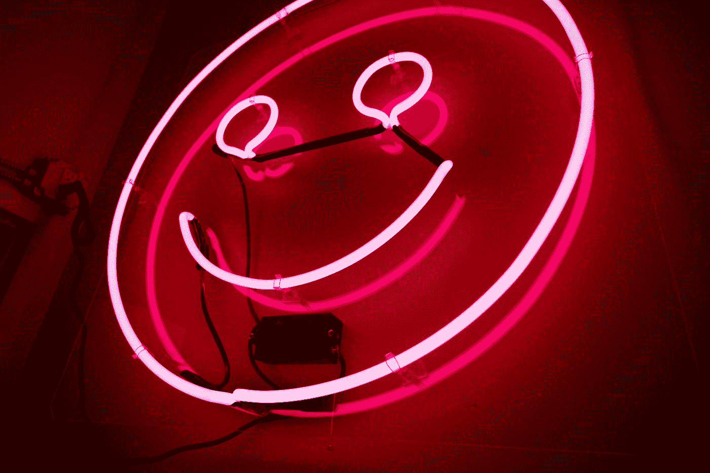

# 7 种科学支持的快乐方式

> 原文：<https://medium.com/swlh/7-science-backed-ways-to-be-happy-right-now-bb79561c902b>

Photo by [Jason Leung](https://unsplash.com/@ninjason?utm_source=medium&utm_medium=referral) on [Unsplash](https://unsplash.com?utm_source=medium&utm_medium=referral)

让我们从一些坏消息开始。

我们从小被教导的幸福模式实际上是完全落后的。我们认为我们努力工作是为了获得巨大的成功，然后我们就开心了。我就是这样长大的！我父母就是这么教我的。

我们认为涂鸦是这样的: