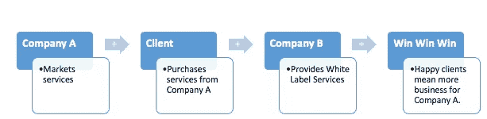
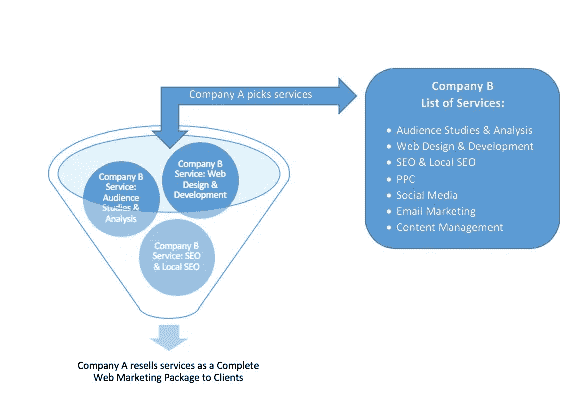

# 您的机构需要白标合作伙伴的 7 个迹象

> 原文：<https://medium.com/swlh/7-signs-your-agency-needs-a-white-label-partner-4fb1ed95457e>

## 白标营销合作伙伴是让你的公司更上一层楼的好方法。

白标合作伙伴关系可以减少您的业务支出，扩大您的投资组合，并建立您公司的声誉。事实上，投资白标合伙企业就是投资你公司的未来。

今天，我们将帮助您了解什么是白标合作伙伴关系，以及它如何帮助您的企业发展。

# 什么是白标营销合作伙伴关系？

分包和外包工作并不是一个新的商业概念。白标营销服务类似于传统的分包合同，但有一点小小的不同:**白标营销合作伙伴不会因其提供的服务而获得任何荣誉。**

白标营销服务允许一家公司以自己的品牌重新包装和销售另一家公司的服务。客户根本不知道白标营销合作伙伴的努力。

# 白色标签合作如何运作

在我们讨论为什么你需要一个白色标签合作伙伴关系之前，你必须了解它是如何工作的。为此，我们来看一个例子。

假设 A 公司是一家全业务数字营销公司。它有许多不同的客户，每个客户都有自己的营销需求。

为了提供这些服务，A 公司需要雇佣一个完整的内部团队。招聘合适的专业人士需要时间，让他们愉快地工作也需要资金。这也意味着 A 公司将需要更多的空间、更多的设备和更多的投资成本。

输入公司 B。公司 B 是一个白标合作伙伴。B 公司有一个经验丰富的完整团队。它已经为它提供的每一项服务找到了必要的人才；它支付员工和管理费用。

当 A 公司雇佣 B 公司提供其现有员工无法提供的服务时，他们就进入了白标合作关系。

作为白标合作伙伴，公司 A 可以转售公司 B 提供的服务，而不必向客户透露他们的合作关系。

# 你需要白标合作伙伴的 7 个迹象

现在，您已经了解了什么是白标合作伙伴关系以及它是如何工作的，是时候解释您需要白标合作伙伴关系的迹象了。

# 1.您想要扩展您的服务组合

营销行业竞争激烈。许多不同的技能和服务可以提升一个营销公司的竞争力。

雇用白标合作伙伴的主要原因之一是，它允许您扩展您的服务组合。换句话说，白标合作伙伴可以**增加你的公司可以提供给客户的服务数量**。

白标合作伙伴还允许您投资于您认为重要的服务。如果您选择退出某项服务，您可以在以后决定投资这项服务，而不必寻找新的员工和人才。

# 2.你想提供优质服务

可靠的白标服务合作伙伴将对其工作质量负责。无论客户是否不满意或出现其他问题，白标合作伙伴都会努力纠正不足之处，而不会产生额外费用或退还费用。

最终，一家声誉卓著的白色标签服务合作伙伴会提供优质服务，您可以将自己的声誉押在 T1 上。这意味着你可以为你自己的客户提供同样质量的服务，而不用担心让他们对工作不满意。

# 3.您希望节省时间并降低自己的成本

雇佣合适的人是一个及时且昂贵的过程。你不仅需要招聘合适的人、经验和知识库，还需要在培训、日常开支、病假、医疗保健等方面进行投资。

事实是，雇佣一支能够提供全套营销服务的专业团队是许多公司在开始之前就失败的原因之一。

雇佣一个白标合作伙伴可以让你获得你需要的技能、专业人士和服务**，而不必投资于人员和管理费用**。

# 4.容量问题限制了您的业务

雇佣合适的人才并不是你业务的唯一限制。对许多人来说，能力也是一个问题。

数字营销需要一整套服务；它需要多个专业人员的支持。办公空间是一种商品，因此扩大规模以满足整个营销团队的人员需求可能会非常昂贵。

一个白色标签的合作伙伴**消除了与办公空间相关的限制**。

# 5.你想提高你的品牌的声誉

当你能够提供高质量的服务时，你的品牌声誉将会增长。

有数百家营销服务公司在争夺客户。白标合作伙伴为您提供充满优质服务的**组合优势**。因为白色标签合作伙伴不要求信贷，你的企业。

一个真正的白标公司将使客户几乎不可能察觉到它的存在。从在报告、您批准的通信以及其他营销相关行动和文件中使用您的品牌，白标合作伙伴可以无缝地代表您的公司，因为它为您的客户提供卓越的支持和服务。

通过提供优质的服务，满意的客户会很乐意提供积极的反馈。这有助于你的声誉发光。

# 6.你想提高你的客户保持率

数字时代让客户很容易在营销公司之间转换。**在经验丰富的白标合作伙伴的帮助下，留住客户变得更加容易**。

满意的客户和广泛的服务更有可能留住你的客户。这也更容易吸引新客户。这意味着你可以两全其美:出色的保留率和增加的客户吸引率。

# 7.你想成为第一

白标合作的诸多好处汇集在一起，使你的公司在竞争中处于领先地位。

如果你的企业一直在努力竞争，一个白色标签的合作伙伴可以帮助你。

白标合作伙伴通过削减您自己的开支、提供优质服务和提高您的声誉，为您的公司提供所需的推动力。

# 与白标合作伙伴一起发展您的公司

白标合作伙伴关系为您的营销公司带来竞争优势。白标合作伙伴通过削减成本、扩大优质服务组合和让客户满意来帮助您的公司发展。

51Blocks 拥有 2.5 年的客户保持率、42%的年同比增长率和超过 27 年的经验，是谷歌的领先合作伙伴。51Blocks 团队拥有美国各地大学的学位，由多元化的营销专家组成，他们乐于看到我们的合作伙伴脱颖而出。

与白标合作伙伴合作有很多好处。如果你想在降低自身成本的同时发展业务，白标合作伙伴关系会有所帮助。从充满优质服务的扩大的产品组合，到增加的客户保留率和提高的声誉，白标合作伙伴在保持低成本的同时为您提供竞争优势。

如果您有兴趣了解更多关于白标合作伙伴如何提供帮助的信息，请立即联系[51 街区](https://www.51blocks.com/)的专家。

[*原载 Michael Borgelt 2019 年 4 月 9 日，关于离合器。*](https://clutch.co/agencies/resources/signs-your-agency-needs-white-label-partner)

## 这篇文章发表在 [The Startup](https://medium.com/swlh) 上，这是 Medium 最大的创业刊物，拥有+441，678 名读者。

## 在这里订阅接收[我们的头条新闻](https://growthsupply.com/the-startup-newsletter/)。

