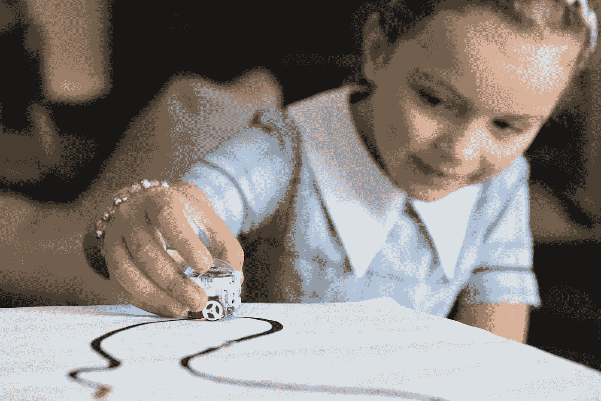
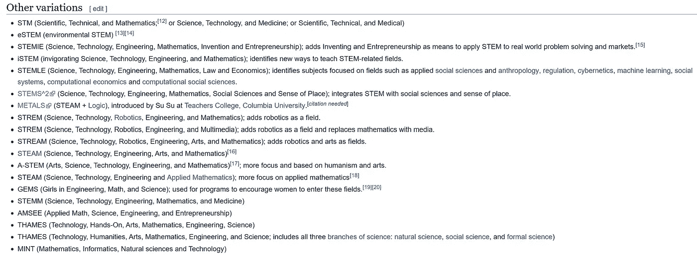

# 世界级 K-12 STEM 项目的 7 个步骤

> 原文：<https://medium.com/swlh/7-steps-to-a-world-class-k-12-stem-program-a0600269e8d8>

Photo by [STEMShare NSW](https://unsplash.com/@stemshare_community?utm_source=unsplash&utm_medium=referral&utm_content=creditCopyText) on [Unsplash](https://unsplash.com/search/photos/engineering-education?utm_source=unsplash&utm_medium=referral&utm_content=creditCopyText)

在过去的 17 年里，我一直在科技行业和 K-12 教育行业工作，我对教师和学生有很多机会通过 STEM 教育获得高质量的学习体验感到敬畏。多年来，我已经确定了开发一个成功的、可持续的、世界级的 STEM 项目的一系列关键要素。

# 1.为 STEM 教育建立清晰的愿景

STEM 是一个已经存在了相当长时间的缩写词，代表科学、技术、工程和数学等学科。选择这些主题是基于这样一个事实，即大多数经济体的创新都围绕着这些内容领域。话虽如此，但这并不意味着其他科目或学科不重要，而是艺术和有效沟通技巧的整合对于学生和教师成功开展高度参与的学习体验至关重要。

为了更全面，你可能会尝试在愿景中包含更多的字母。例子包括，蒸汽，蒸锅，流和茎。记住关于设定目标的古老咒语。“目标就是目标。两个目标是半个目标。三个目标是一个目标的三分之一……”**如果实施得好，STEM 的四个领域将有巨大的重叠，并开始维持其他文化和艺术领域。**此外，许多主要组织，如美国国家科学基金会(NSF)和美国国家科学教师协会(NSTA)已经建立了丰富的资源来澄清对原始缩写的需求。

快速查看一下 wikipedia.org，就能发现词干首字母缩略词的以下变体:

[https://en.wikipedia.org/wiki/Science,_technology,_engineering,_and_mathematics](https://en.wikipedia.org/wiki/Science,_technology,_engineering,_and_mathematics)

**在某种程度上，添加这些额外的字母应该会变成普通的“教育”我会让你决定每个字母代表什么。**

S ***解决方案 1:*** **明确 STEM vs. STEAM 等的“为什么”。与各级人员合作，确定整个学区对 STEM 教育的共同定义，并坚持下去。确立 STEM 为什么重要？它如何改变学生和老师的生活？**

# 2.建立明确的实施目标

现在您有了一个清晰的定义，那么您的实现会是什么样子呢？这里有几个例子:词干，词干，词干，以及所有的变体。这里，字母的大小决定了实现的类型。大多数 K-12 学区都有他们必须遵守的州科学和数学标准，这导致 STEM 实施平淡无奇，与传统教育没有区别。其他地区领导认为，要做好 Stem，必须以科学内容为导向，并坚持以“STEM”为实施手段。毕竟，有一种科学方法代表着“如何”做科学。再次，可以将教师的舒适程度作为实施背后的驱动力。挑战在于“T”和“E”。**大多数 K-12 教育工作者很少或根本没有技术和工程方面的知识或正规培训。**在大多数情况下，技术被视为文档相机、笔记本电脑等形式的教学技术。

STEM 的成功实施可以立足于高中阶段的职业和技术教育工作。确定高中存在的 STEM 职业道路，并关注在这些领域取得成功所需的技术和技能。通常，STEM 中的“E”以工程设计流程(EDP)的形式出现。这解决了 STEM 教育的“如何”问题。EDP 是一种工程解决问题的方法。它本质上是系统的和迭代的，并且促进了设计解决方案、原型化解决方案、通过测试获得反馈和改进解决方案设计的概念。

S ***方案二:*明确你选择的**的实现。**如果 STEM 要在各级实施，一定要建立与愿景一致的目标。**如果高中 CTE 编程将推动实施，确定学生和教师需要采用什么技能和流程才能保持一致。**确保在下一代科学标准框架的数学实践和科学与工程实践标准中锚定数学和科学实施。**这将为您提供实施的“方法”,并建立各级学习的轨迹。

# 3.影响课堂教学

教师仍然是影响学生表现和成功的最重要的角色。因此，任何 STEM 实施计划都应该包括一个教师专业发展计划，以获取知识、建立信心并影响学生的学习。这是系统的大部分精力和努力应该放在的地方。

美国的大多数教师培训项目都没有为教师在 STEM 领域取得成功做好充分的准备。事实上，传统的教学方法仍然占据主导地位。**尤其是数学，仍然依赖于死记硬背、计算算法和工作表。所有这些方法都疏远学生，缺乏动力，缺乏真实世界的背景。需要的与我刚才描述的正好相反。**

**在 STEM 教育中，影响教学和学习策略的最有效方法之一是使用基于项目的学习(PBL)。** [研究](http://live-buckinstitute.pantheonsite.io/sites/default/files/2019-01/PBL_Evidence_Matters_Volume_I.pdf)表明，PBL 是一种让学生参与大规模深度学习体验的教学方法，这种体验可以发展学生的能动性和效能。通常情况下，学生经历跨学科和跨专业的学习经历，导致不同形式的评估。对于学生和老师来说，学习经历应该是丰富的，可以改变他们的生活。因此，为 PBL 做规划并不容易。教师需要知道在动态的、非结构化的学习环境中工作是什么样的，并发展他们对当前各种学科中使用的技术的了解。

请注意 STEM 中与学生身份相关的许多挑战。**许多代表性不足的学生群体面临的挑战是，他们看不到各种领域中与他们相似的 STEM 专业人士。对于这些学生来说，他们的 STEM 身份有一个固有的信息。如果得不到解决，学生将会对自己的学习能力和 STEM 技能形成一种固定的思维模式。请记住，STEM 教育应该面向所有学生。传统上在“游戏学校”表现良好的学生，在获得“A”不再是公式化的时候会很挣扎。这些学生需要什么技能？**

我有幸与俄亥俄州立大学的 Sheryl Sorby 博士和范德比尔特大学的 Nicole Russell 博士等研究人员一起工作，他们证明了女性学生可以很容易地获得空间推理技能，非洲裔美国人完全有能力达到最高水平的数学水平。**让有抱负的学生作为观察员参加 STEM 会议，传达他们所听到的内容，有助于培养他们的沟通技能，并认同与他们相似的研究人员。**加入女性工程师协会(SWE)、美国印第安人科学与工程协会(AISES)、全国黑人工程师协会(NSBE)、西班牙裔专业工程师协会(SHPE)和非洲裔美国数学科学研究人员会议(CAARMS)等组织将为发展代表性不足的学生身份提供资源和机会。

S ***解决方案 3*** : **为分级教师发展专业学习团队将在学区内提供推动力。**这些群组应提供关于 STEM 及其各种实施的基本信息，并为教师提供在其内容领域背景下的真实世界问题解决方案。**课程、教学和评估都应随着专业学习经历而改变。** **在发展学生和教师机构的同时，PBL 可以为维持这种方式提供坚实的基础。制定地区采用和推广计划。**务必在 STEM 领域建立包容性卓越的关注点。也要努力发展未被充分代表的学生群体的 STEM 身份。

Photo by NASA on Unsplash

# 4.激励教师、学生和社区成员

维持整个地区 STEM 计划的实施和持续改进的最佳方式之一是找到讲述故事的方法，以吸引更多的利益相关者。要做到这一点，最好的办法就是让学生成为该地区所有事务的主要代言人。为学生提供向各种观众展示作品的机会是关键。与当地企业和不同技能的社区成员合作做两件事。首先，它为社区成员提供了一种参与当地学校的方式，其次，它为教师和学生提供了一个外部受众。此外，这些机构群体成员也是能够继续支持这些举措向前发展的投票人。他们可以与学区合作，为教师和学生提供实习和见习机会。这些关系中有许多可以透过地区基金会来发展。

**分享学习如何变化的其他例子包括为学生和教师举办 TedX 活动，与学区管理员和社区成员举行学生小组讨论，以及让教师和学生出席国家和国际会议。**

S ***解决方案 4*** :在夏季和学年期间建立学生实习和教师见习。**开展活动，为学生和教师提供机会，分享他们教学和学习的转变方式。**建立每月简讯，从学生和教师的角度捕捉当前事件和教学经验。

# 5.为所有级别创建大规模学习体验(LsLE)

这不同于上面描述的 PBL。通常情况下，大规模的学习经历持续时间较短，给学生和教师提供了发展他们在小组环境中工作的能力的机会。这也是学生在现实世界解决问题的背景下接触各种技术的绝佳机会。例子包括:

**初级**:少年乐高联盟、首届乐高联盟、近空间气球发射、刮刮乐日、代码小时、编码竞赛、数学联盟、TedX、谷歌科学博览会、科学奥林匹克竞赛、国家科学碗、零机器人

**中学:**近空间气球发射、VEX Robotics、首届乐高联盟、Scratch Day、Hour of Code、eCybermission、编码竞赛、数学联盟、TedX、谷歌科学展、科学奥林匹克竞赛、国家科学碗、僵尸球、美国团队火箭挑战赛

**高中:** Vex Robotics、FIRST Robotics、近空间气球发射、网络爱国者、NASA HUNCH Design &原型、NASA HUNCH Softgoods、NASA HUNCH 烹饪挑战赛、TedX、Botball、美国团队火箭挑战赛

***解决方案六*** :在选择 LsLE 时要有选择性。做得少不如做得多。

# 6.创建一个从小学开始的影响轨迹

小学教师是最有能力教授所有核心内容领域的知识、科学、社会研究和数学的。小学课堂本质上是纯跨学科的。此外，我认为他们可以接触到任何学校系统中最有创造力的头脑。

初级阶段有很多很好的资源可以利用这种天赋。我喜欢的一个这样的资源是[工程基础](https://eie.org/eie-curriculum)课程。该课程由三部分组成:教师指南、故事书和一套材料。这些故事立足于生命科学、地球&空间科学和物理科学这三个领域。共有 20 个单元，以来自不同背景的儿童经历现实世界的问题并寻求工程解决方案的故事开始。**学生学习和实践工程设计流程，磨练他们在小组环境中的协作能力。**这些材料要求动手解决问题。一旦小学生上了初中和高中，他们就会有几年的实践 EDP 和团队建设技能的经验。此外，他们开始根据自己在低年级的经验推动系统的变革。

S ***解决方案 6* :** 确定允许学生在真实环境中学习和实践 EDP 的课程资源。

# 7.发展你的领导技能，以身作则

作为一名领导者，您必须继续了解技术如何继续影响这个快速变化的世界。制定一个参加会议的计划，为教师、行政人员和地区领导提供支持和见解。还要关注对当地、国家和国际社区有影响的学生成果。积极参与州和国家 STEM 组织。在 STEM 中开展您自己的调查，并与您的成员分享。最后，建立一个计划，让学生回到学区分享他们的研究生经历，并帮助培养下一代 STEM 专业人员。