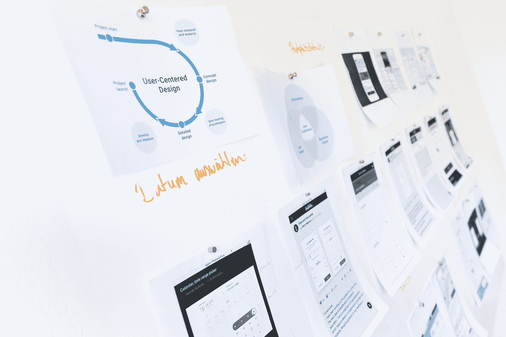

# 作为一名年轻企业家，你需要知道的 7 件事

> 原文：<https://medium.com/swlh/7-things-you-need-to-know-as-a-young-entrepreneur-b341f467bb92>

Photo by [Fred Kearney](https://unsplash.com/@fredasem?utm_source=medium&utm_medium=referral) on [Unsplash](https://unsplash.com?utm_source=medium&utm_medium=referral)

2018 年，我做出了成为一名*企业家的最终决定。*

我意识到，自己创业，做自己的项目，才是我真正想做的。那时我已经有了自己的创业项目，也有了一些启动新项目的经验。

然而，一旦做出了决定，大项目和合作开始出现，我就有了许多新的收获。

# 1.勇气

如果你想成为一名成功的年轻企业家，你必须要有足够的勇气。

除了你自己，可能没有人会相信你。你必须成为自己最大的粉丝，敢于尝试很多事情。

你需要有勇气接受对你来说是新的挑战。简单地接受它，接受挑战，并弄清楚你以后会怎么做！

我负责组织和主持研讨会，去年我们最大的客户给了我们一个机会，让我们做一些全新的事情。我们说**是的**，并想出了以后该怎么做。

> **如果我们有勇气去追求，我们所有的梦想都能实现。—华特·迪士尼**

# 2.坚持

没有适量的坚持(意味着*大量的坚持)，*你不会得到满意的结果。这是每个企业主都可以保证的。

这只是需要时间和努力。你将面对精疲力竭的客户和伙伴。你只需要经历它。

如果你有一个清晰的愿景，知道你在追求什么，你会更容易坚持下去，继续你的道路。

一定要清楚你的原因，这将帮助你坚持任何事情，不管它有多难。

> 坚持不懈，锲而不舍，你会发现大多数可以实现的事情都是可能的。—菲利普·斯坦霍普

# 3.(否)计划

Photo by [rawpixel](https://unsplash.com/@rawpixel?utm_source=medium&utm_medium=referral) on [Unsplash](https://unsplash.com?utm_source=medium&utm_medium=referral)

老实说，当我决定成为一名企业家时，我觉得我有一个计划。我今年 21 岁，大多数人在我这个年龄都不知道自己想要什么，而我是那个说*我知道自己想要什么的人，那就是发展自己的事业。*

但是现在我是一个全职企业家，不再把它作为一个副业，我觉得我不知道自己到底在做什么。至少有时候是这样。

作为一名企业家，你经常会觉得你需要有一个计划。你制定计划，很多计划。但最终，事情并没有按计划进行。我想在制定计划和对计划被拒绝无动于衷之间找到恰当的平衡很难，但也很重要。

> 每个人都有自己的计划，直到他们的嘴被打了一拳。迈克·泰森

# 4.处理

Photo by [NEW DATA SERVICES](https://unsplash.com/@new_data_services?utm_source=medium&utm_medium=referral) on [Unsplash](https://unsplash.com?utm_source=medium&utm_medium=referral)

如果我只能给一个刚刚开始新项目的团队一个建议，那就是 ***构建流程！***

说真的！

如果你有流程和一步一步的指导，生活会好得多！

在任何业务中，你都会发现重复的任务，有一个遵循的结构会让你的生活容易得多！

# 5.输入与输出

尤其是在一个项目的开始，人们往往会迷失在小事情中。

不必要的任务似乎有优先权，很难衡量具体待办事项的重要性。

要想富有成效和效率，我们必须追求重要的东西，而不是紧急的东西。

 [## 如何打破你生活中的紧急神话

### 你多久会为生活中的小事感到压力？你花了多少时间在…

medium.com](/swlh/how-to-beat-the-myth-of-urgency-in-your-life-b35e53b2025f) 

当开始一个新项目时，问问自己哪些步骤最有影响，带来最多的产出。

根据结果确定你的行动。

# 6.扼杀创意

Photo by [Kai Pilger](https://unsplash.com/@kaip?utm_source=medium&utm_medium=referral) on [Unsplash](https://unsplash.com?utm_source=medium&utm_medium=referral)

这一条可能听起来很难，但对保持注意力非常重要。

在我的团队里，我们有很多想法。每天似乎都有新的机会出现。

想法很棒，但如果你在上面浪费太多时间，它们会变得极其危险。

我们所做的是考虑新的想法，验证它们，但也能够非常迅速地扼杀它们。这种能力使我们能够保留最好的想法，但迅速摆脱耗时的想法。很多时候，放弃新想法似乎很难，因为它们看起来很有前途。我们要做的是，要么立即采取行动，实施想法，要么就把它们扔掉。

# 7.团队，团队，团队！

Photo by [Quino Al](https://unsplash.com/@quinoal?utm_source=medium&utm_medium=referral) on [Unsplash](https://unsplash.com?utm_source=medium&utm_medium=referral)

对我来说，过去的几个月让我意识到你的团队有多重要。说实话，我以为如果你很专业，你可以和任何人合作，不一定要成为最好的朋友。但是如果是创业就有点不一样了。我开始和那些我真的只想一起工作的人一起工作，但基本上没有结果。

如果你在追求大的目标，想要建立大的东西，你就得 ***喜欢你的队友。*** 老老实实。你需要有相同的愿景，相同的目标，并为你的想法而死。

拥有一个无论如何都可以 100%信任的团队是非常重要的！

如果你自己有一个想法，可能很难找到合适的联合创始人，但相信我:要挑剔。

你的团队决定你的成功与否。

> 生意场上的大事从来不是一个人做出来的。它们是由一群人完成的。—史蒂夫·乔布斯

> *如果你想要我的* [*关于生产力的免费电子书*](http://jointhehustle.com/free-ebook-top-10-productivity-hacks/) *和最新的* [< <点击这里> >](http://jointhehustle.com/free-ebook-top-10-productivity-hacks/)

## 这篇文章发表在 [The Startup](https://medium.com/swlh) 上，这是 Medium 最大的创业刊物，拥有+428，678 名读者。

## 在这里订阅接收[我们的头条新闻](https://growthsupply.com/the-startup-newsletter/)。

