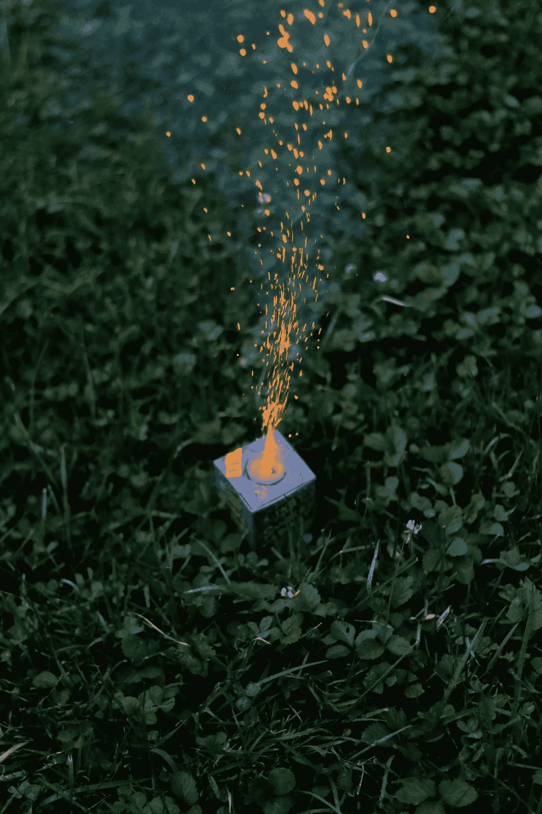

# 7 个安全度过 7 月 4 日的小贴士

> 原文：<https://medium.com/swlh/7-tips-for-a-safe-4th-of-july-e2fe008e9112>

## 安全总比后悔好

[@skylergeraldphoto](https://unsplash.com/@skylergeraldphoto) Unsplash

多年来，我姑姑一直是丹佛一家最大医院的儿科护士长。当我们其余的人对食物、游行、庆祝和烟火感到兴奋时，她只会说对这个节日不屑一顾。

我那时大概 7、8 岁，我问她？

> 你为什么讨厌…