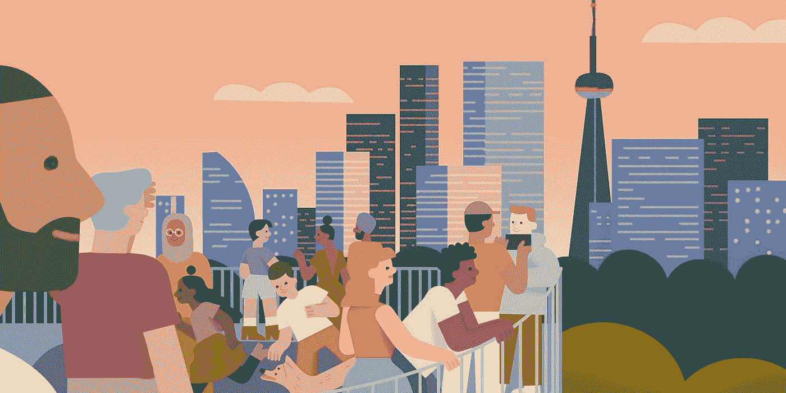
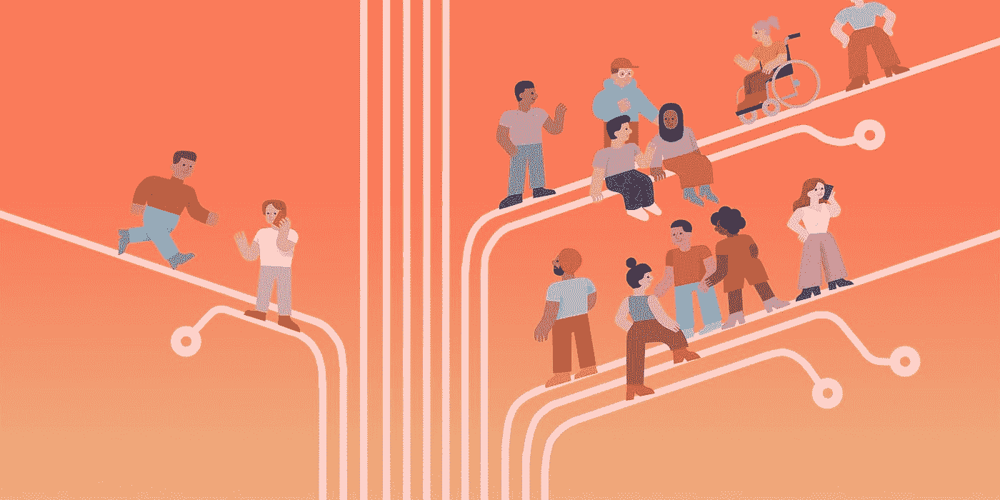

# 7 家多伦多创业公司，关于多样性、归属感和包容性

> 原文：<https://medium.com/swlh/7-toronto-startups-on-diversity-belonging-and-inclusion-b37f55ebee48>

那么我们到底走了多远…？

Art by Karolina Ficek, Illustrator at Sandbox Studios (2019).

一个月前，我参加了 VentureOut，这是在多伦多举行的 LGBTQ+技术社区的第一次会议。我决定参加，因为我很好奇我们已经走了多远。我们如何能够围绕人们可能通过简单的存在而经历的隐藏的摩擦发展意识。我对此感到兴奋——特别是因为我想知道多伦多的科技初创公司对此有什么看法，特别是因为科技初创公司往往对世界产生不相称的影响。

我采访了来自火星探索区的 Lekan Olawoye(人才开发)，他给了我一个有趣的指标。多伦多显然在 2018 年领先于[大多数科技雇员，击败了湾区——三藩市、纽约州、华盛顿州和芝加哥*的总和。它是世界上最多样化的科技之都。*](https://talentdevelopment.marsdd.com/resource/tech-for-all/)

听到这些，我心想:见鬼，我们最好有话要说。

^Karolina Ficek, Sandbox Studios (2019).

# **为什么 DIBS(多样性、包容性、归属感)很重要？**

我不知道从哪里着手解决这个问题。因此，我采用了 MarSDD 的“全民技术”报告中概述的三个主要观点来帮助我构建讨论框架。

# **1)市场视角:“公司必须反映他们所服务的多样化客户群”**

多伦多金融科技 Wealthsimple 的 mallory Greene(CSR 负责人)写道:“我们的使命是让每个人都能获得金融服务——无论年龄、资产净值或环境如何。如果我们的团队不能反映我们想要服务的客户，我们就无法完成这个使命。”(如果你去看看他们的杂志，你会看到针对各种类型的人的惊人内容。我真的很喜欢这个。)

Opencare 的 Emma Koza(软件工程师)说得很好很简单——“人们和他们的需求不断变化，一个完全包容的产品必须以同样的速度变化才能满足这些需求。”

Crescendo 的首席执行官兼联合创始人丹尼尔·图巴·德索萨(Daniel Tuba D'Souza)表示:“来自新兴国家的女性、少数族裔和个人的购买力预计到 2025 年将超过 30 万亿美元。公司正在改变他们设计和销售产品的方式，以更好地吸引这些饥饿的、传统上代表不足的观众。

在快速全球化的世界中生存的秘诀*不仅仅是拥有一个看起来*多样化的团队，而是能够认识到你遗漏了哪些观点，以及这如何影响你创建的产品和活动，目标是建立一种包容的文化，反映、授权和利用这些观点。"

# **2)生产力视角:“如果人们对自己的皮肤感到不舒服，他们就不会表现得很好。”**

Fiix Software 的 Katie Allen (CSR 经理)提醒我，DIBs 的努力效果很好，因为它们创造了更舒适的员工，并通过这种方式创造了更有生产力的员工。凯蒂表示，人们在生活中会遇到不同的背景，当工作场所以他们需要的方式支持他们时，他们的日常活动就会变得无摩擦。如果员工感到舒适，简单地做一个人需要更少的精力，有更多的精力专注于工作。

RC wood mass(Crescendo 的产品设计师)在 VentureOut 2019 上发表了一篇演讲，他们用简洁的谈话扩展了这次对话的范围。他们提出，同性恋/跨性别者实际上拥有*更多的*抽象思维和同理心，这使他们非常适合组织中的产品角色。

这真的与我个人从 RC 的演讲中看到的一个假设有关。我认为，在产品设计中不断增长的对“倾听你的顾客”原则的关注，使得同性恋/跨性别者成为很好的雇员。这是因为他们一生都是同理心的天然促进者。对当今产品世界的一瞥，揭示了对以人为中心的设计、移情倾听和其他实践的广泛关注，这些实践植根于更好的理解和打破我们对人的假设。

# **3)人才视角:“物以类聚。”**

Lekan(在 MarSDD)补充说，“成长中的科技公司倾向于在推荐的基础上招聘，这意味着最初的人才库将倾向于招聘志同道合和长相相似的人。”Lekan 和我探讨了在 MarSDD 与当地黑人和拉丁裔社区团体直接接触的实践和当地接触的类型。为了建立一个多元化的人才生态系统，招聘社区可以通过在各自的空间接触边缘化社区来积极参与，而不是期待人才到来。

# **这些计划是如何执行的？**

在采访这 7 家初创公司时，我对他们所付出的努力的多样性感到惊讶。Wealthsimple 的 DIBs 计划始于一位办公室协调员发起的一次简单对话。现在，该计划已经发展到包括关于[交叉性](https://www.telegraph.co.uk/women/womens-life/10572435/Intersectional-feminism.-What-the-hell-is-it-And-why-you-should-care.html)的研讨会，通过 Slack 的每周 DIBs 讨论，甚至关于[如何为内向者举行包容性会议的思想领导力](https://hbr.org/2016/04/run-meetings-that-are-fair-to-introverts-women-and-remote-workers)。Looka(前身为 Logojoy)创建了安全空间 Slack 频道，专注于让他们的工作空间更容易访问，现在专注于实现招聘团队的多元化。Opencare 主办妇女节场外活动，在入职过程中要求代词，资助 DIBs 活动，并有一个专用的多功能房间用于祈祷或其他需求。Fiix 通过研讨会、活跃的 slack 渠道、活动赞助和公平的招聘实践全面吸引 DIB。Fiix 最成功的地方是有效地激发了员工(比如我自己)对这个话题的深入探究。Fiix 目前正在试行 [Crescendo](http://getcrescendo.co) ，这是一款在多伦多开发的新 Slack 应用，旨在增加工作场所的包容性教育。

**“大多数情况下，我们会从我们看得见的方面(种族、民族、性别等)来考虑多元化。存在无形的维度，例如学习障碍。”Wealthsimple** 的 Mallory Greene(企业社会责任主管)

Fiix 的人才经理 Dean Delpeache 非常友好地与我分享了他的隐形身体残疾经历。“我的面部状况让我的半边脸下垂。这就是我不太喜欢照片的原因。”令我惊讶的是，我认为像拍照这样简单的事情会成为包容性体验的障碍。

**“这是关于创造一个脆弱的空间”Kayla Van xfSchyndel(人员和文化主管)——Koho**

因为人们是如此独特，他们有独特的需求，现代工作场所无法为他们创造空间。这意味着人力资源的工作是为了发掘每个人的独特需求而创造。Kayla 提到，这通常意味着向他人展示你自己的弱点，以显示相似性和共同点。

# **最后，我问这些初创公司，他们觉得自己在 DIBs 之旅中处于什么位置。**

> “我们现在正处于旅程中，我们已经取得了很多成就，并保持了对话的开放性，但像大多数人一样，我们仍有一段旅程要完成(或者可能永远不会结束。) "
> 
> “包容之旅的终点在我看来并不存在”
> 
> "我们都不是专家，我们都保持开放的心态。"
> 
> “我们并不完美。”

# **有意思。**

房间里的专家们都坦然承认他们还有很多东西要学。我发现这突出了创业文化中真正的学习心态，或许也指向了他们的成功。但除此之外，真正的移情思维和存在是什么样子的。