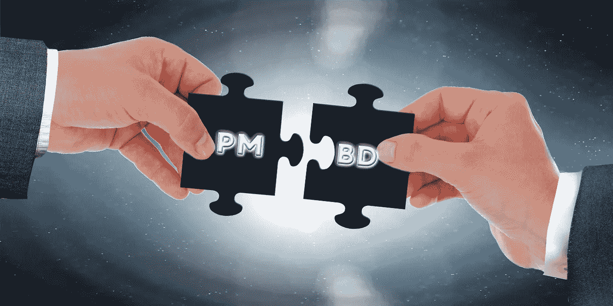

# 您的项目经理和业务拓展经理可以通过 7 种意想不到的方式合作改善您的业务

> 原文：<https://medium.com/swlh/7-unexpected-ways-your-pm-and-bd-can-collaborate-to-improve-your-business-76456d948722>

# 产品管理和业务开发的共同点比你想象的要多

你的项目经理最后一次和你的业务代表坐下来谈是什么时候？不，我不是指当你的项目经理解释产品时，你的业务总监可以找到合适的渠道来销售。我是说，真的坐下来一起工作，敞开心扉，在所有事情上合作。如果这种情况不经常发生，你就错过了一些好机会。

## 1.全面、无限的价值

在我们这个复杂的世界里，充斥着各种工具和高度专业化的服务，单靠自己提供全面的端到端服务是非常具有挑战性的。产品经理经常使用现有的工具和服务，而不是内部开发。业务拓展经理通常与现有渠道合作，而不是建立销售组织。但是，如果他们能对市场有一个统一的看法呢？为你所在的市场想出最全面的解决方案。不受产品的合理增长或我们合作伙伴的合理范围限制的东西。视野可以开阔得多。您可以提供创新的整体解决方案，其中一些是内部构建的，一些是通过合作完成的。

## 2.一起走出大楼

项目经理经常被鼓励“走出大楼”，与客户和潜在客户交谈，了解他们的需求。企业发展部经常会见潜在的合作伙伴，了解他们的产品。他们都努力找到根本动机，通常使用相似的倾听方法(例如[问‘为什么’5 次](https://www.bignerdranch.com/blog/the-five-whys-for-product-managers/))。他们都需要了解竞争对手的动向。两者都需要敏锐的耳朵来识别增值和差异化的机会。有时，他们甚至会发现自己面试的是同一个人，从合作伙伴开始，发展到客户(反之亦然)。鼓励他们分享笔记、印象，甚至可能一起走出大楼！

## 3.线框，LOI 和条款清单

如果你花点时间想一想，产品线框和商业意向书(LOIs)或条款清单也扮演着同样的角色。两者都是抽象概念的高级表示。以高层次的简单“语言”起草，足够宽松，不会使事情复杂化(法律上或技术上)，但足够清晰，可以陈述具体的意图或计划。这两种方法都在流程的早期使用，以便让其他利益相关者做出反应。在不同的场合起草了之后，我可以说，如何具体和如何高水平的挑战是一样的。你的 PMs 和 BDs 可以互相帮助找到平衡。其中重要的关键点得到了很好的阐述或设计，但同时，为接受者留下足够的“贡献空间”以获得主人翁感。

## 4.MVP、试验和试点

你的项目经理最难也是最孤独的工作是 MVP。决定从 1.0 版中删除哪些功能，同时保留足够的功能来测试关键的产品假设。令人惊讶的是，你的 BD 团队也有类似的挑战。大多数合作关系都是从一个简单的“约会”、一个联合试验项目或试点客户开始的。选择和设计正确的试点，一个有“速赢”潜力的试点，并不容易。这实际上非常类似于决定一个 MVP 版本。因此，即使项目经理不是业务开发专家，反之亦然，也许正因为如此，他们可以相互提供不带偏见的建议。问一些困难的问题:“如果你做了 x 而没有做 y 会怎么样？”。在类似的挑战中引入新的视角。

## 5.你的决策过程

谁制定产品路线图决策？谁来决定[与](https://seths.blog/2009/09/understanding-business-development/)的合作关系？几乎每个人都对这两个问题有自己的看法，也有同样多的人表达了自己的观点……但是从决策者的角度来看，这两个决策过程都需要受到限制。双方都需要有一个过程来审视想法，让每个人都发表自己的意见。但两者都需要有一个严格的流程来决定如何决策、如何定义 KPI 以及何时终止某项功能/合作伙伴。你会惊讶于这些过程是如此的相似。比他们申请的领域更能反映公司的文化和管理风格:PM 或 BD。

## 6.焦点

PM 和 BD 角色高度暴露于注意力不集中的风险。两人都收到了大量的建议、想法、推介等。两者都很容易陷入杂草中。你的业务拓展很容易陷入与几十个第三方的会面，或者过早地陷入合同语言。所以，你的项目经理会不会陷入设计无穷无尽的功能，或者在试水之前陷入微型复制的困境。[分清轻重缓急是关键](/@stevesanger/life-in-business-development-at-a-startup-how-its-different-from-sales-e308112d8d3a)，学会说“不”(或“现在不行”)也是关键。在我担任产品主管的上一家公司，我发现这有助于我与他人(最好是业务发展部)一起安排我的优先事项。我也喜欢扮演 BD 努力的“橡皮鸭”。我发现当鸭子实际上在做一些自己的优先排序时，它就不再是橡胶做的了…

## 7.激情

我最近读了一篇关于 [PM 激情](/swlh/what-you-should-be-looking-for-in-a-product-person-ee40e39a7301)的好文章。作为一个从 BD 开始，然后转到 PM 的人，我不禁看到了与 BD 激情的相似之处。措辞稍作调整:技术=法律、用户=合作伙伴体验、用户=合作伙伴心理、数据(分析=财务)、项目管理和古怪=创造力。所以，如果你(或你的人力资源)正在使用这些工具来评估经前综合症，为什么不把类似的原则扩展到面试商业发展呢？当你这么做的时候，如果 PM 和 BD 有相同的热情，你不认为他们会很好地合作吗？毕竟，他们都在寻求用使他们与众不同的创造性天赋来平衡公司的剧本。

## 结论

PM 和 BD 的共同点比看起来要多。我们倾向于将它们隔离在后端和前端。如果你把两者结合在一起，你认为会发生什么？

*原载于 2019 年 1 月 28 日*[*orensteinberg.com*](https://orensteinberg.com/product-management-and-business-development-have-more-in-common-than-you-think/)*。*

## 这篇文章发表在 [The Startup](https://medium.com/swlh) 上，这是 Medium 最大的创业刊物，拥有+417，678 名读者。

## 在这里订阅接收[我们的头条新闻](http://growthsupply.com/the-startup-newsletter/)。

