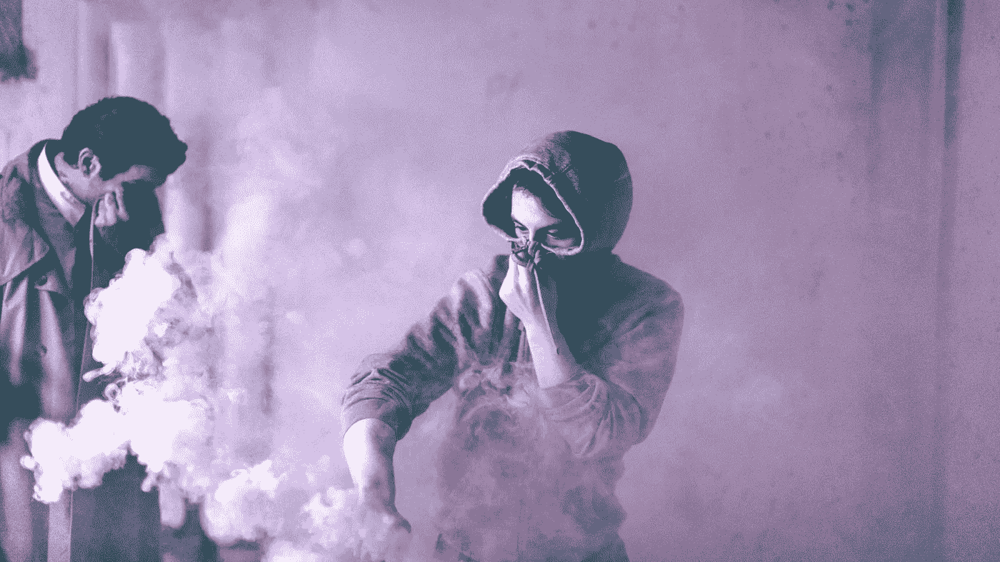

# 对付有毒客户的 7 种方法

> 原文：<https://medium.com/swlh/7-ways-to-deal-with-a-toxic-client-903989bd39bc>

Photo by [Jules D.](https://unsplash.com/@varietou?utm_source=unsplash&utm_medium=referral&utm_content=creditCopyText) on [Unsplash](https://unsplash.com/search/photos/toxic?utm_source=unsplash&utm_medium=referral&utm_content=creditCopyText)

有毒客户是自雇的一个不幸现实。自由职业意味着在你的职业生涯中，你会遇到很多白痴。

去客户家给他们一巴掌就好了，但是一定要保持自己的职业素养。向客户发火，不管他们多么活该，永远不会给你带来好的影响。