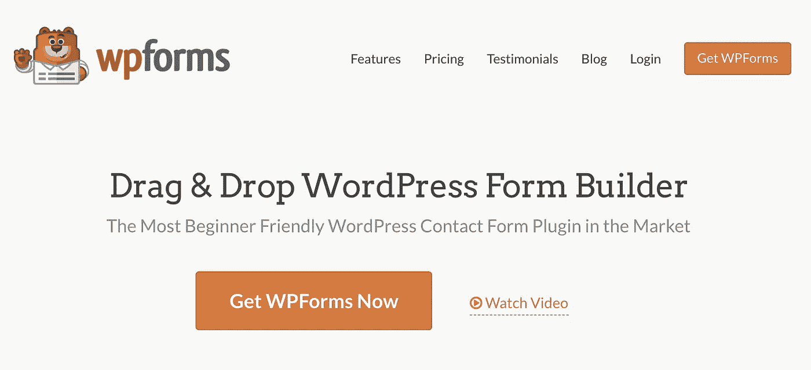
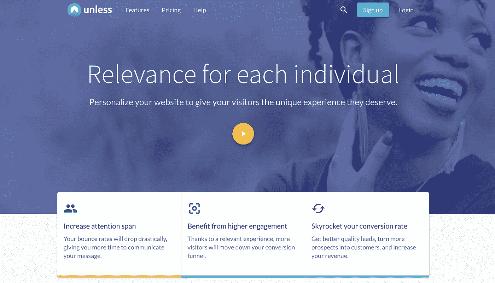
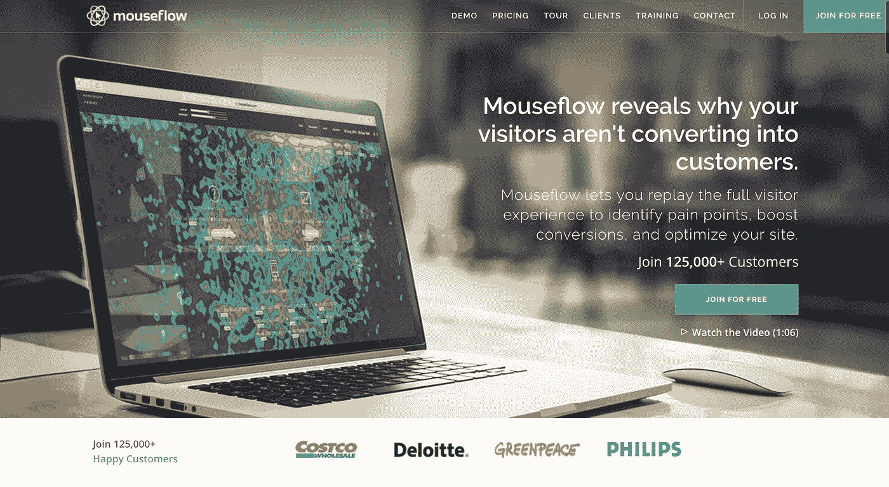
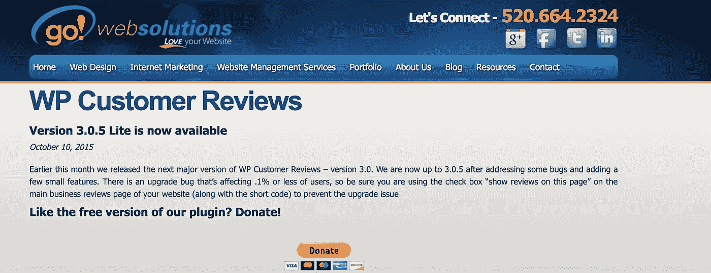
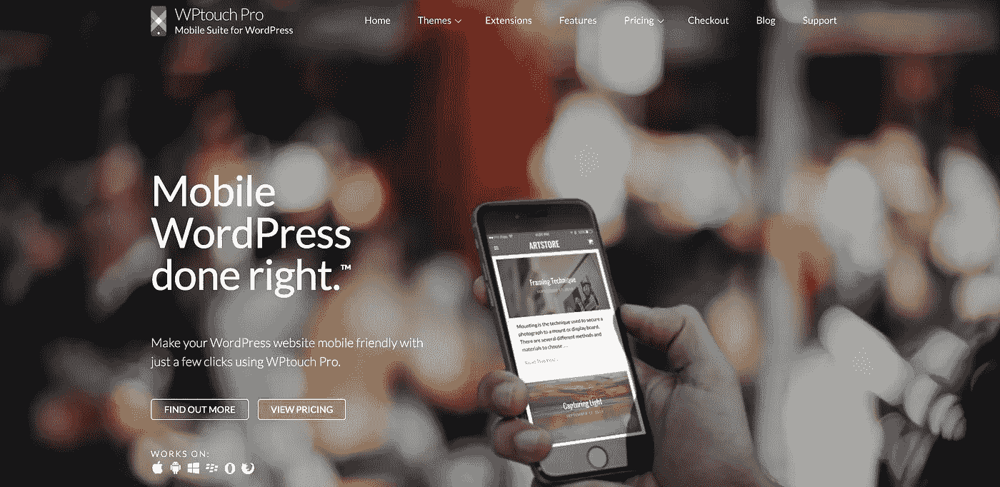

# 你需要知道的 7 个 Wordpress 插件来改善你的访客体验

> 原文：<https://medium.com/swlh/7-wordpress-plugins-you-need-to-know-about-to-improve-your-visitor-experience-3294d5034343>

Photo by [Tran Mau Tri Tam](https://unsplash.com/photos/tZnbakTUcTI?utm_source=unsplash&utm_medium=referral&utm_content=creditCopyText) on [Unsplash](https://unsplash.com/search/photos/wordpress?utm_source=unsplash&utm_medium=referral&utm_content=creditCopyText)

我们都知道 Yoast SEO、WooCommerce、Leadpages、Jetpack 和 Akismet。我不需要告诉你这些超级流行的 Wordpress 插件，因为它们是最容易找到的插件。但是 Wordpress 目录中有超过 54，000 个插件(在撰写本文时)，这意味着你可能不知道一些有价值的工具，你可以用它们来改进你的网站。在这篇文章中，我将介绍一些不太为人所知的插件。请继续阅读，了解如何利用它们将你的 WP 网站推向新的高度。

## **1。** [**Smush 图像压缩与优化**](https://wordpress.org/plugins/wp-smushit/)

如果你想抓住你的访问者的注意力，那么你需要引人注目的图像。然而，高质量的图像往往很大，这导致网站运行缓慢。一个缓慢的网站，意味着更高的跳出率和更低的转化率。为了在不牺牲图像质量的情况下减小图像的大小，你可以使用一个插件，比如 Smush Image Compression，简称 WP Smush。Smush 图像压缩对 1MB 以下的图像是免费的。付费版本可用于更大的图像。付费计划还提供了更广泛的功能，你可以在无数的网站上使用。

**关键特性**

*   在不损失图像质量的情况下缩小图像尺寸(无损优化)。
*   只需一次点击，即可批量优化多达 50 张图像。
*   当图像压缩时，将图像调整到特定尺寸。
*   找出让你的网站变慢的图片。
*   处理各种文件(PNG，JPG 和 gif)。

## **2。**[**WP 表单**](https://wpforms.com/)

一个网站很少是完整的，如果没有一种方法来捕捉你的访问者的电子邮件地址。有很多 Wordpress 的表单生成器可以用于这个目的，但是没有几个像 WPForms 一样容易使用。当谈到可用性时，插件的拖放构建器将大奖带回家。它在多个计划中提供。他们的基本计划是每年 39.50 美元，并附带一个网站的无限形式。该计划附带了方便的模板，您可以使用这些模板来部署联系表单、请求报价表单和建议表单。简讯形式的模板可供 Plus 用户及以上用户使用(起价 99.50 美元)；订购表和捐赠表面向专业用户及以上用户(每年 199.50 美元起)。

**主要特点**

*   使用拖放构建器构建表单。
*   创建多页表单并显示进度条。
*   用条件逻辑构建表单。
*   包括垃圾邮件防护。
*   使用自定义 CSS。
*   从文本编辑器或使用短代码在帖子和页面上嵌入表单。
*   将表单与 PayPal 和 Stripe(专业版及更高版本)集成
*   利用 Zapier 第三方集成(专业及以上)
*   发起调查和投票(专业及以上)
*   处理弃船(专业及以上)

## **3。** [**除非**](https://wordpress.org/plugins/instant/)

如果你认为上面的插件很漂亮，那么你会很高兴听到除非。除非是网站的个性化平台。如果你是个性化的新手，你应该知道[全球一半的公司](https://www.dynamicyield.com/guides/personalization-maturity-assessment-q1-2018/)已经将这种营销策略确定为重点。这不足为奇，因为个性化可以增加收入[5%到 15%](https://www.mckinsey.com/business-functions/digital-mckinsey/our-insights/marketings-holy-grail-digital-personalization-at-scale) 。使用 Unless，您可以创建访问者细分，并根据他们的兴趣、位置、过去的活动等向他们显示不同版本的网站内容。该插件使您能够安装除非脚本，并开始在您的网站上使用此功能。除非计划从每月 449 美元开始。

**主要特点**

*   根据位置、行为、CRM 中存储的数据等建立受众细分。
*   基于机器学习算法获得建议的受众分群。
*   创建个性化食谱，为每个受众群体定制内容。
*   使用内嵌编辑器定制您的网站内容和设计。不需要编码经验。
*   基于访问者信息，如名字或位置，动态地将文本插入到您的站点中。
*   个性化你的整个转换漏斗。
*   有选择地显示智能加载项，如弹出窗口和行动号召栏。
*   使用分析仪表板监控您的个性化工作的结果(可以与 Google Analytics 集成)。

## **4。** [**鼠标流**](https://wordpress.org/plugins/mouseflow-for-wordpress/)

很难确切知道为什么访问者不在你的网站上转化。像 Mouseflow 这样的插件可以消除很多猜测。这个工具可以让你记录和回放访问者与你网站的互动。这有点像在你的网站上安装一个摄像头，除了记录是匿名的。想想跟踪点击、滚动行为、表单交互等等。热图有助于您识别重要的活动趋势并采取行动。如果您想了解更多信息，您可以随时使用 Mouseflow 发起一项交互式调查。他们有一个免费的计划，但要充分利用这个工具，你可能要考虑他们的入门计划，每月 29 美元。该计划支持 1 个网站的 10，000 次页面访问，以及 3 个月的存储空间。

**主要特征**

*   记录和重放访问者会话。
*   使用热图揭示浏览行为模式。
*   逐页跟踪活动，通过漏斗评估活动。
*   监控表单交互。
*   将 Mouseflow 与 Google Analytics 和其他主要分析和 UX 工具集成。
*   对 GDPR 的“不跟踪”支持。

## **5。** [**社会战争**](https://wordpress.org/plugins/social-warfare/)

现在，每个人都知道社交媒体的重要性。一个好的社交策略对任何企业来说都是必须的。Wordpress 有几十个社交插件，很难选择。与 AddThis 等插件相比，social war 不太为人所知，但它是一个非常强大的插件，允许您为最受欢迎的社交网络添加社交分享按钮，单击以发布推文功能(这对于推广您的内容非常方便)，等等。该插件在专业版中也可用，该版本具有自动 UTM 跟踪每个共享链接等功能。

**主要特点**

*   自定义社交共享按钮，以符合您网站的外观。
*   定制当访问者点击 tweet 按钮时填充的 tweet，并在 share 链接上包含图像。
*   在你的网站上展示 Twitter 卡片。
*   为博客创建可发布的引用。
*   显示社交分享计数。
*   使用短代码在任何地方放置共享按钮。

## **6。** [**聊天燃料**](https://wordpress.org/plugins/chatfuel-customer-chat/)

很有可能，你已经登陆了许多在右下角有一个小聊天窗口的网站。如果您想知道如何在自己的网站上实现这样的小部件，您可以使用 Chatfuel 这样的工具。Chatfuel 的酷之处在于，它与脸书信使(一个拥有 10 亿用户、点击率比电子邮件高出 10 倍的平台)有关联。对于拥有脸书页面(大多数都有)并且正在寻找 Intercom 或 Drift 等工具的简单版本的公司来说，这是一个很好的解决方案。没有编程技巧也很容易设置。更先进的机器人可以由知情人士制造。

**主要特征**

*   通过脸书信使直接在你的网站上与访问者交流。
*   自动回复。
*   将对话移交给团队中的其他人。

## **7。** [**WP 客户评论**](https://wordpress.org/plugins/wp-customer-reviews/)

如果你在你的 Wordpress 网站上提供任何种类的产品，那么你也应该考虑评论的重要性。[研究](https://www.invespcro.com/blog/the-importance-of-online-customer-reviews-infographic/)告诉我们，88%的消费者对在线评论的信任程度不亚于他们对个人推荐的信任程度，72%的消费者只有在阅读了正面的产品评论后才会采取行动。在你的网站上添加一个评论插件是开始收集客户反馈并在你的网站上展示评价的一个立竿见影的方法。WP 客户评论是一个很好的独立插件来实现这一点。

**主要特点**

*   自定义客户在评论中填写的字段。
*   审核评论并控制显示哪些评论。
*   使用短代码在任何页面或帖子上插入评论和评论表格。
*   修改样式表以匹配您的主题。
*   添加管理员回复并显示在评论下。
*   防止自动垃圾邮件机器人提交评论。
*   支持商业和产品评论类型。

## **加成:** [**WPTouch**](https://wordpress.org/plugins/wptouch/)

如果我在一篇关于改善访问者体验的文章中忽略了移动优化，那我就太疏忽了。毕竟，去年全球 52.2%的网站流量是通过手机产生的。进入我们的奖励插件 WPTouch。这个工具可以立即启用你的 Wordpress 站点的移动友好版本。如果你还不确定你的网站是否真的响应迅速，这是必备的。他们声称让你的网站在手机上的速度提高了 5 倍，并在他们的产品中内置了主题。

**主要特点**

*   在同一个 URL 上部署一个完全移动优化的主题。
*   与 Wordpress.org 上的 30 大插件无缝集成
*   提高你的移动网站速度。

## **结束**

相关性、速度和可用性是良好访客体验的核心原则。这篇文章中的插件以他们自己独特的方式阐述了这些原则，是任何 Wordpress 网站的优秀补充。我希望这个列表能启发你，帮助你提高转化率！当然，这些插件只是 Wordpress 世界中的一小部分。知道其他很棒的工具吗？在下面给我写一行。

## 这篇文章发表在[《创业](https://medium.com/swlh)》上，这是 Medium 最大的创业刊物，有+440，678 人关注。

## 订阅接收[我们的头条新闻](https://growthsupply.com/the-startup-newsletter/)。

