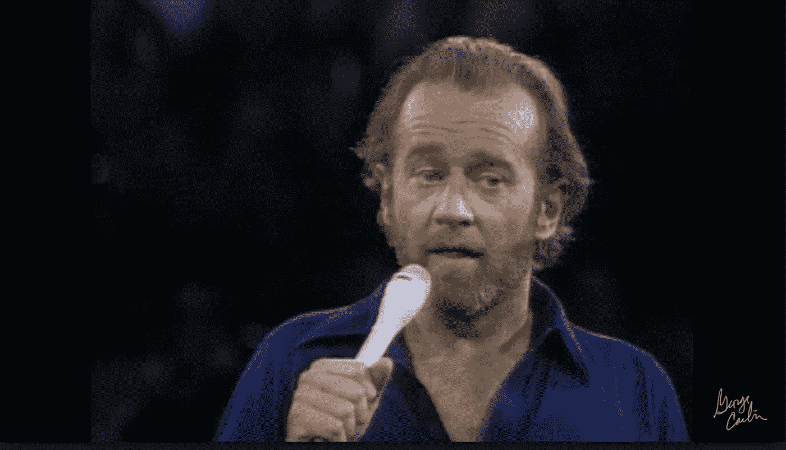

# 领导者应该避免的 7 个词

> 原文：<https://medium.com/swlh/7-words-leaders-should-avoid-8dc40362d4a8>

## 导致有毒文化的有毒词汇

1966 年，兰尼·布鲁斯在纽约市的一场单口喜剧表演后被捕。我不会提到他在表演中使用的九个词，但我们只能说，这些词你不会在你母亲面前使用。

1972 年，喜剧演员乔治·卡林发行了一张名为 *Class 小丑*的单口相声专辑，专辑中有一首名为“永远不能在电视上说的七个词”的歌曲，这是一段独白，他在其中表达了对不能在电视上任何特定上下文中使用这些词的不屑。还是那句话，他用的七个字我就不提了，但是你可以在这里看他的表现。

1978 年，约翰·道格拉斯和他 15 岁的儿子在下午两点开车时，从 WBAI 电台听到了这七个脏话。他向联邦政府声称这种语言不适合公共广播。

在一项 5 票对 4 票的裁决中，最高法院正式确立了美国广播中的不良规定。据说，这种语言不应该被儿童喜欢的人使用，而且这种语言是“冒犯性的”，可能导致恶意的猥亵行为。

我在想这七个永远不应该在电视上说的词，我想知道这个政策如何应用于领导。我想出了作为领导者永远不要说的七个词:

# **1。** **错了**

当你处于人们期待你的判断和认可的位置时，直截了当地告诉别人他或她错了是令人难以置信的沮丧。这只会打击某人的信心，让他们下次接近你时产生一种不情愿的感觉。

**试试这些短语吧:**在正确的轨道上；不完全是；我有不同的想法

# **2。**忙**忙**

作为领导，永远不要说或者抱怨自己有多忙。你已经做出了选择和承诺，把自己放在那个位置上，为你知道会让自己陷入的事情烦恼是不合适的。

试着用这些短语来代替:戴许多不同的帽子；应付一些不同的情况

# **3。** **老板**

领导永远不是老板。这立即意味着一种权力感，一种可能让同事感到害怕的全能。

**试试这些吧:**领袖；船长

# **4。** **有趣的**

有趣是个填充词，很像“嗯”或者“喜欢”。当给出一个想法或评论，可以引出像“有趣”这样的评论时，试着花一点时间进一步思考在这种情况下真正产生了什么情绪，然后分享你的想法。

**试试这些吧:**发人深省；深刻；不明显

# 5.**性感**

这是真正的职场流行语。“这不是最性感的任务，但却是必须完成的工作。”作为一个领导者，在这些情况下找到一个不同的词是很重要的，这个词太普及了。

**试试这些吧:**独特；沉闷；流行的

# 6.**永不**

像“永远不要”这样明确的词语揭示了缺乏成长的心态。成长和进化对任何一个领导者来说都是必不可少的，所以使用像某事可能发生或永远不会发生这样的确定性陈述是很有局限性的。在商业和生活中，一切都是视情况而定的，所以不要把自己变成一个伪君子，说一些事情永远不会发生，然后如果情况需要那种解决方案，就去做。

**试试这些吧:**很少；几乎没有；鉴于这种情况

# 7.**完成**

你作为领导者的工作永远不会结束。你总是可以继续成长。你总是可以继续变得更好。总是有别的事情要做。

**改试试这些:**差不多了；在制品

这些话会导致工作场所的中毒和消极文化。领导者的角色是不断激发希望，最大化员工的快乐，并在工作场所培养对每个人的尊重和平等。

这些仅仅是无数不应该被领导者使用的词汇中的七个。

你还能想到什么？

## 这篇文章发表在 [The Startup](https://medium.com/swlh) 上，这是 Medium 最大的创业刊物，拥有+417，678 名读者。

## 在这里订阅接收[我们的头条新闻](http://growthsupply.com/the-startup-newsletter/)。

