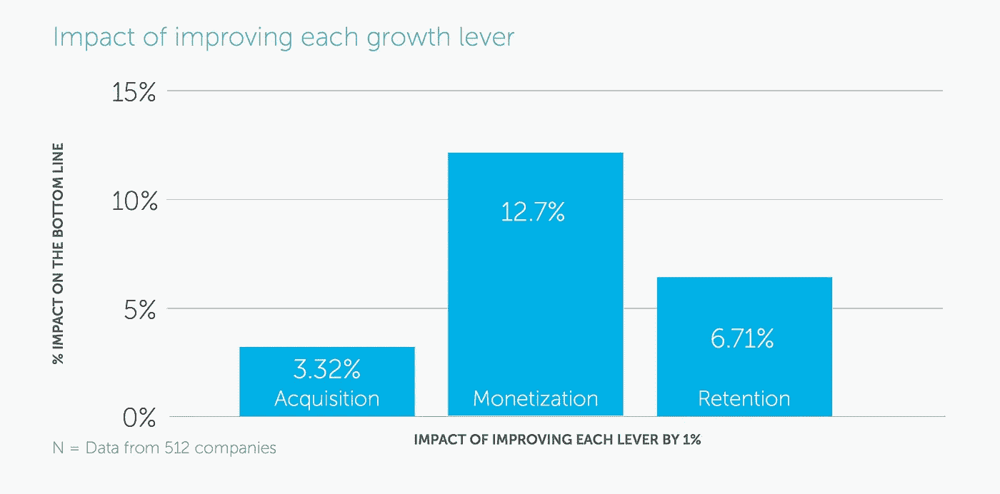

# 定价在 SaaS 会继续被忽视吗？

> 原文：<https://medium.com/swlh/7500-words-on-saas-pricing-is-pricing-and-monetization-in-saas-still-undervalued-b570a8c0f887>

人们很快做出心理判断。因此，产品如何定价至关重要。

定价是决定 SaaS 企业如何(以及是否)发展的最重要策略之一。

在过去 3 年中，ProfitWell、Chargebee、ChartMogul 和许多其他专注于 SaaS 行业金融平台的企业发布了几项研究、报告和关于 SaaS 企业应如何思考和做 SaaS 定价的简单时尚建议。

从那以后，我分析了数百篇关于这个话题的文章，并想:“为什么不把最相关的讨论都放在一个屋檐下呢？”。

这就是下面这个故事的内容。

PS:如果你最终喜欢我在这里所做的，至少给我十几下掌声祝我好运:)

# 目录

*   [货币化与收购](#0ca0)
*   [定价策略的重要性](#1eac)
*   [定价策略包括什么？](http://What does a pricing strategy entail?)
*   [围绕价值指标定价](#9701)
*   [扩大收入的策略你可以使用](#29e3)
*   [考虑规模定价](#9ded)
*   [我是否应该使用定价层级](#c0b9)？
*   [适应当地现实](#986a)
*   [是否免费增值？](#4720)
*   意识到审判意味着什么
*   [选择按月还是按年，或者两者都选](#90ae)
*   [定价页面:如何处理标题](#0462)
*   [精明的打折方式](#6ee9)
*   [演示还是不演示？](#ea41)
*   [详述不同的功能](#50f6)
*   [获得资格并消除购买障碍](#c507)
*   [使用暗箱“企业”计划](#8ee1)
*   [做定价实验](#daed)
*   [不同的视角:行为心理学](#0e0d)
*   [终极挑战:物价上涨](#4f91)
*   [资源](#b6e3)

# 货币化与收购

我在帕特里克·坎贝尔的一篇文章中读到一句话，从此便爱上了这句话:

> “订阅模式的美妙之处在于，关系是收入模式的一部分。你为你的客户提供持续的价值，反过来，他们继续为你的价值付费。历史上没有其他商业模式能让我们这些企业家与他们的客户如此契合。”

对我来说，这表明了传统销售模式的演变，这种模式会对产品收取很高的价格，在销售阶段将资源投入到营销上，而忘记客户旅程的其余部分。Saas 不是这样工作的。如果你想让你的客户付钱，你需要不断推动你的产品向前发展，与你的客户群接触，并确保对服务的满意度。

奇怪的是，正如 PriceIntelligently 报道的那样，与你当前的客户群合作，增加他们从你的产品中获得的价值，从而更好地货币化——与收购等内容相比，这仍然是一个被低估的话题。

Source: [PriceIntelligently](https://www.priceintelligently.com/blog/monetization-matters-for-saas-growth)

同一份报告显示，虽然收购主题占 2014 年至 2016 年出版物的 3/4 以上，但货币化实际上是收购对产品增长的影响的 4 倍。

Source: [PriceIntelligently](https://www.priceintelligently.com/blog/monetization-matters-for-saas-growth)

> 单靠获取新客户是无法建立可持续的 SaaS 业务的。— [工资变动](https://www.paymotion.com/ecommerce-blog/why-expansion-revenue-matters-and-how-to-grow-it/)

SaaS 的美丽带来了单位经济学的美丽。

正如 Brian Balfour 在他的“[为什么产品市场匹配是不够的](https://brianbalfour.com/essays/product-market-fit-isnt-enough)”文章中提到的，找到你的市场-产品-渠道-模式匹配从你的市场开始。这正是你的货币化策略应该开始的地方。了解你的受众，量化你的买家角色

# 定价策略的重要性

一旦你了解了你的受众是谁，应该是什么，一旦你弄清楚哪些可以成为你的渠道，最后你如何围绕他们塑造你的产品，是时候定义你的模型了。这就是定价的由来。

PriceIntelligently 还提到:

> 在企业的整个生命周期中，各公司平均花费在定价上的时间总共只有 8 个小时。

就像 SaaS 的美丽伴随着持续的市场和产品发展一样，鲍尔弗谈到的平衡需要培育，因此其组成部分需要定期审查。

因此，除了要有一个清晰的流程和一个涉及贵公司多个团队的工作组之外，该工作组定期(每两个月一次)开会分析当前绩效，(每三个月一次)提出改进建议，(每六个月一次)审查定价策略并应用更改是至关重要的。

# 蓖麻战略需要什么？

决定您的企业在定价方面的发展方向包括:

*   了解你的受众是谁，你将通过哪些渠道接触到他们，以及你的产品是如何围绕这一契合度构建的——了解你的客户 LTV，确定你的 CAC，进而如何根据你的单位经济学定位你的价格点。
*   找出你的产品给观众带来的价值。了解了这一点，您就可以根据客户的增长来设计您的产品和定价。以下是更多相关信息。
*   创建您的产品定价页面。

## 设计一个定价页面有很多事情要做

花时间思考你的市场-产品-渠道匹配的整个过程会引导你设计网站上最重要的页面。

您的定价页面是一切与您的业务相关的内容所在。你的业务的所有基本单位经济学，对你的受众在你的产品中看到的价值的理解，以及随着你的客户增长、生活(或者它应该！)在你设定的定价策略下。

因此，设计它超越了化妆品和转换优化技术。以下是在定义您的策略和创建您的定价页面时需要考虑的事项。

# 围绕价值指标定价

价值度量。那是什么？

在发现你的产品所带来的价值之后，你需要在你的产品中找到一个可以与你的客户的业务增长相联系的使用指标。围绕它创建您的定价策略将确保客户在升级到下一个计划/层级时获得更高的感知价值。

> 选择合适的价值标准对您的业务有着显著的影响。想象两家 SaaS 公司，每家都有 100 个客户。第一个收费是每月每个席位的方案，但是每个客户几乎不需要一个以上的席位。另一家出售完全相同的产品，但按照应用程序中的特定使用量收费，每月最低收费。前者有一个从客户那里潜在获得的 MRR 的人为上限。后者的 MRR 将随着其客户的增长和/或更多地使用该产品而增长。我更愿意待在第二家公司。— [智能定价](https://www.priceintelligently.com/blog/ab-test-pricing-page-strategy)

正如我们在上面看到的，你的价值标准是你的产品为你的客户业务提供价值的可量化的方式。你提供一定数量的与价值相关的功能(比如一定数量的电子邮件、关键词搜索或用户)，作为回报，他们会付给你报酬。

采用围绕这一指标的定价策略，确保您推动扩张收入，能够增加您未来从现有客户那里获得的价值。

如果您不将不同的定价选项与可扩展的定价模式结合起来，这意味着您将不得不在保留和获取计划上更加努力，以确保业务增长。虽然您可以通过不同的方式扩大收入(我们将在下面看到)，但基于价值的定价有助于您以与您的客户扩展其业务相似的速度扩展您从每份合同中获得的价值，保持他们从您这里获得的一致感知价值。

经常被引用的一个很好的例子是 Wistia 的。

Source: [Wistia Pricing Page](https://wistia.com/pricing)

一旦你想出了一个定价方案，就用这个简单的问题来测试它:当你和你的客户谈论你的价格和你所创造的价值时，你会有多舒服？

# 您可以使用的扩大收入策略

随着一家 SaaS 公司用户群的增长，持续的流失率成为持续增长的一个日益严重的问题。

为什么？

客户流失是几何增长，而新客户的获得是线性增长。因此，单纯通过扩大你的客户群和他们产生的收入来抵消客户流失是不可能的。

扩大收入基本上是推动现有客户更多地购买你的产品。

> 除了初始费用之外，你可以从现有客户那里获得的额外收入被称为扩张收入。— [工资变动](https://www.paymotion.com/ecommerce-blog/why-expansion-revenue-matters-and-how-to-grow-it/)

同样，在设计定价策略时，您应该考虑扩大来自该客户的收入的机会。如果设计正确，定价应该降低，以允许您抓住仍然有利可图的最小/最便宜的客户，直到愿意支付大量费用的最大客户。

让我们来看一下扩展定价的一些常用轴:

*   适合客户业务不同发展阶段的产品特性
*   用户数量(向公司内更多的人销售产品并按座位收费(例如 Salesforce，Expensify))
*   使用深度(诱使客户存储更多数据或使用更多服务(例如新遗迹，Twilio，Heroku))
*   交叉销售轴心(销售增加核心产品价值的相邻产品(例如 AWS S3、EMR 等)

## 交叉销售轴

对于 SaaS 企业来说，有一些有趣的方式可以做到这一点:

*   购买或制造与现有产品密切相关的额外产品；
*   销售与现有产品完美集成的附加模块；
*   创建 AppStore，销售第三方产品，抽取利润分成；
*   创建一个服务市场，在这里你可以联系到为你的产品提供服务的合作伙伴，并收取一定的交易费用；
*   寻找围绕产品使用产生的其他费用(如电子商务中的支付交易费、广告收入等。)，问问自己有没有可能从中抽取一部分收入。

对任何 SaaS 来说，理想的情况是其不断扩大的收入水平高于其流失水平。这被称为[负流失率](https://tomtunguz.com/negative-churn/),它基本上意味着你正在以高于收缩率的速度扩大你的客户群——转化为指数增长。

# 考虑规模定价

[根据《创业者指南》](https://www.forentrepreneurs.com/multi-axis-pricing-a-key-tool-for-increasing-saas-revenue/)，根据受众在特定时刻所处的成长阶段，调整产品定价有助于实现产品包装和受众从中获得的价值之间的契合。

以下是不同客户如何从您的产品中获得不同价值水平的一些例子:

*   他们是一家更大的公司，有更多的员工在使用该产品
*   他们使用产品中更少或更多的功能
    他们有更多的项目被你的软件处理。例如，如果是电子邮件营销软件，他们可能有非常大的邮件列表；如果是备份服务，他们可能有非常大的数据集需要备份

情感上的支付意愿在这里起着至关重要的作用，也是一个已经辩论了很长时间的话题[——它基本上告诉你，支付意愿实际上是基于感知价值的，通过改变感知价值，或者简单地通过更有效地交流你的价值，你可以改变支付意愿。](https://www.cmu.edu/dietrich/sds/docs/loewenstein/RoleEmotionEconBehav.pdf)

Source: [Openview Partners](https://labs.openviewpartners.com/b2b-pricing-technology-adoption-lifecycle/#.XGqrXJP7TOQ)

# 我应该使用定价层吗？

通过[创建量化的购买者角色](https://www.priceintelligently.com/blog/quantified-buyer-personas)，了解您的客户群业务如何发展，以及他们在发展的每个阶段看重什么，然后将其与可扩展的价格点打包，从而创建不同的定价层。

> 关于定价页面的所有决策都是优化，以逼近价值创造曲线并对其收费。— [条纹图谱](https://stripe.com/atlas/guides/saas-pricing)

“预期”的设计是有原因的。坚持好、更好、最好通常是明智的——除非你的目标是大量不同的人物角色。

在强调你的“首选”计划时要有创意。或者通过使用不同的颜色、大小、位置，或者通过平滑地动画化其元素。

了解谁是你的不同客户使你能够陈述每个计划是为谁准备的，所以去做吧。没有理由不这样做。这也可能是有抱负的——游客会购买与他们想成为的人相对应的计划。不要把你的计划称为银、金、白金——给他们一个你的每个客户都能理解的名字(自由职业者、小工作室、大工作室)。

出色完成工作的示例: **Appcues**

Appcues Pricing page. Source: [PriceIntelligently](https://www.priceintelligently.com/blog/saas-pricing-page-design-wistia-appcues-drift-strategy)

*   **的人口统计数据**被浓缩成一个最能描述该角色的词:例如，一个创业者、一家初创公司、一家成长中的公司或者一只大型独角兽。
*   **的支付意愿**表现在实际定价上，随着人口统计和功能的增长而增长。
*   有价值特征的**包装**显示了每个购买者角色的相对偏好。例如，Bootstrap 角色只希望快速方便地访问产品，而 Growth 则希望定制分析和支持。

> “量化您的买家角色为您的定价和包装提供了具体的起点，向您展示了您的客户到底看重什么，以及他们愿意支付什么。只要你在这个范围内定价，并正确地对你的套餐进行分层，你就会有客户。”—智能定价

*   如果你知道你的客户真正看重什么功能，那么这应该是他们访问你的定价页面时看到的第一件事。

## 定价页面示例

ChartMogul 在 Pinterest 上的 SaaS 价格页面上发布了一篇精彩的年度评论。值得一试。

Source: [ChartMogul’s Pinterest](https://www.pinterest.de/Mr_Ed/chartmogul-top-saas-pricing-pages-2017/)

## 你不应该做什么

阅读 Profitwell 的[“最悲伤的 SaaS 定价页面”](https://www.priceintelligently.com/blog/the-saddest-saas-pricing-pages-of-the-year)来一瞥你应该避免什么。

# 适应当地的现实

Source: [Chargebee](https://www.chargebee.com/blog/saas-business-growth-findings/)

在当今的全球市场和容易获得的经济报告下，企业根据其经营的主要地区对其产品进行不同的定价并不困难。根据 Chargebee 与 ProfitWell 的调查结果，[这可以通过许多不同的方式实现，从简单到更复杂的方法:](https://www.chargebee.com/blog/saas-business-growth-findings/)

*   **外观本地化(早期到晚期的成长阶段)** —简单地确保当有人访问您的定价页面时，货币本地化到他们的地区。
*   **市场定位** **(后期增长阶段)** —确保每个地区有不同的相对价格(例如，美国 100 美元，英国 150 美元，等等。)基于市场饱和度和需求。为此，您需要:

— — — a)确定每个地区的支付意愿:开展价格敏感度活动是衡量每个地区不同支付意愿的最简单方法。

— — — b)了解你的买家角色:这需要做一些额外的工作，但通过了解你的产品在不同地方引起共鸣的不同方面，你将能够找出你的市场偏好，并为每个地区不同地定位你的产品。

— — — c)表面上的本地化:你仍然需要确保你的登录页面和货币符号在每个地区都设置得当。

# 免费增值还是不免费？

免费增值是 SaaS 企业的一个趋势。它为用户提供了一种无摩擦的方式来注册你的产品，希望让他们在未来走向更高的计划。

然而，越来越多的人意识到，提供略高于零的产品的产品将很难增长，除了一些大公司，今天的产品永远不会有大的增长。为什么？因为[低 ARPU 产品需要通过低 CAC 渠道](https://brianbalfour.com/essays/channel-model-fit-for-user-acquisition)分销才能盈利。低 CAC 渠道是典型的病毒式传播，而且收费高一点。除非你能够通过你的产品中不可思议的[病毒效应](https://www.forentrepreneurs.com/lessons-learnt-viral-marketing/)获得大规模分销，否则你就是在赌一个不愿意花钱的客户会通过你的定价层向更高的 ARPU 产品层移动。

免费增值模式的典型问题:

*   免费用户吃掉支持——很容易掌握，但经常被缺乏经验的营销人员遗忘。更多的用户通常意味着更多的支持，这意味着你要么开始削减周转时间，要么决定招募更多的代表或开始限制你提供支持的对象。
*   免费用户使用资源——我说的资源指的是服务器存储、速度和你可能使用的任何第三方应用的可能配额(Segment、Hotjar、Mixpanel 等)。阅读关于 Baremetrics 的免费增值模式开始崩溃时发生了什么的[。](https://baremetrics.com/blog/freemium-saas-implode)
*   付费产品具有更大的价值——通常，有一些免费用户并不重视你的产品，如果一夜之间需要他们的产品，他们会很乐意付费使用。
*   免费用户带来更多免费用户——虽然免费通常有助于产生口碑，但免费用户通常会带来其他免费用户，因此上述成本可能会很快开始上升。
*   人们通过为每个用户开设多个账户来利用免费账户，以便能够绕过限制。

 [## 如何避免 SaaS 免费试用滥用

### 在拉斯维加斯的黑帽会议上，一个安全研究二人组展示了他们如何构建一个挖掘加密货币的僵尸网络…

sixteenventures.com](https://sixteenventures.com/free-trial-abuse) 

免费增值模式的类型:

*   硬性限制——想想 MailChimp，你被限制发送 X 封电子邮件，或者 Zapier，你被限制每月发送 Zaps 的次数。这些限制不会取消功能，但会限制您继续使用该平台，迫使您升级才能继续使用。
*   软限制——想想 Zapier 不允许你在其免费计划中使用多路径 Zaps。软限制通过删除服务的某些功能来限制服务的可用性。

选择免费增值模式的考虑因素:

*   想想你是否希望你的免费计划被发现。许多企业选择淡化他们的免费服务，甚至隐藏它。
*   如果你的免费计划是一个完全不同的(或有限的)功能集，试着在视觉上区分它。
*   对免费计划的限制直言不讳——这将有助于访问者做出决定。
*   考虑混合硬限制和软限制。
*   时间可能是自由计划的一个限制，然而，我更喜欢把这些作为试验来解决。

[Chargebee](https://www.chargebee.com/blog/saas-freemium-model-advantages-and-disadvantages/) 列出了以下免费增值模式有意义的场景:

1.  DIY 产品/服务，服务新客户的成本接近于零。这些是默认为免费增值模式设计的业务。
2.  当你把你的免费增值计划作为市场中的一个差异化因素时。
3.  当你把你的免费增值计划作为一个免费的品牌推广工具时。
4.  当你用你的免费增值产品来推销你的付费产品时

最终，这一切都取决于你对你给市场带来的价值的理解程度，以及它与免费增值模式的契合程度。

Dan Martell 将其总结为四个要点，并表示，要评估免费增值模式是否适合您，您必须答对其中的三个要点:

*   你所在市场的潜在用户数量:越多越好——记住，只有大约 5%的免费用户最终会付费给你
*   获胜所需的特定市场优势:你希望免费增值模式为你的企业赢得什么？是竞争优势吗？是免费配送吗？是得到更多的推荐吗？而这个目标有多现实？
*   你的产品的最大复杂性及其工作原理:你的产品有多简单明了？你的产品是否能与周围的喧嚣区分开来？对你的客户来说，提升定价层是否足够有利可图？
*   每增加一个用户的具体成本:服务一个额外用户的边际成本可以忽略吗？你能在不增加成本的情况下扩大运营吗？您是否有能力应对规模的指数级增长？

免费增值的一个有趣的替代品是 Cheapium。查看“[免费增值是一种烧钱的商业模式，Cheapium 更好”](http://jaredbrown.me/post/6071815182/freemium-is-a-money-burning-business-model)了解更多信息。

> Cheapium 的工作原理是以象征性的价格提供基本功能，通常是一美元或更少，同时对高级功能收取额外费用。这可以是一次性或经常性费用的形式。Cheapium 创造了一个较低但并非微不足道的进入壁垒。系统中的所有用户都在付费。这听起来可能是一个很小的区别，但这比免费增值有几个优势。

最后，Hubspot 等几家 B2B 企业已经意识到，纯粹的免费增值(销售发生前不接触)已被证明对增加交易规模没有好处。因此，相反，当他们遇到硬限制或进行小额初始购买时，他们使用内部销售来验证他们的免费增值销售线索。这确实帮助他们扩大了交易规模，否则，他们将无法做到这一点。你可以在 OpenView 文章[“为什么产品合格的销售线索是失败的免费增值模式的答案”](https://labs.openviewpartners.com/product-qualified-leads/#.XGwtVpP7TOS)中了解更多信息

想了解更多关于免费增值的内容吗？

[SaaS 的免费增值模式——好的，坏的，以及介于两者之间的](https://www.chargebee.com/blog/saas-freemium-model-advantages-and-disadvantages/)

[Craigslist，维基百科，和富足经济](https://medium.freecodecamp.org/welcome-to-the-abundance-economy-there-are-free-lunches-all-over-the-place-b9d0a417fd1a)

# 意识到审判意味着什么

考虑是否应该提供产品的试用版？这取决于你的受众、产品，并会影响你在销售过程中的接触程度。

如果你决定试用，那就把这 7-15-30 天当作一个机会，让用户坚持使用你的产品，最好是转向付费订阅。

免费试用是大多数 B2B SaaS 解决方案的主要内容——许多访问者会寻找试用注册按钮——一种“让我看看这个东西”的呼喊，而不是在营销页面中挖掘。这很好，只要你能给客户一个很好的自助试用体验。

你需要一个很好的入职计划，无论是自动的还是手动的，都与解释起来有多容易，以及你的受众已经掌握了多少基础知识有关。

来自 ChartMogul 的关于试验的一些[经验:](https://blog.chartmogul.com/saas-pricing-pages-2017/)

*   提供免费试用通常是有意义的，除非你的主要目标是企业业务，或者不可能提供顺畅的自助入职体验。
*   免费试用和免费增值之间的界限正在变得模糊。两者各有利弊。
*   几乎每个提供试用的企业都使用“不需要信用卡”这一术语。用户会寻找并期待这一点。

> 大多数 B2B SaaS 公司发现，取消信用卡要求增加了他们获得的免费试用注册的数量，但降低了激活率(实际使用软件的用户数量)和付费使用的转化率。在公司生命周期的早期，这通常是不值得的。(您的企业需要能够在运营上做相当复杂的工作，以培养客户激活，然后说服他们在稍后的试用中放弃他们的信用卡详细信息，以便 it 赢得 net here。)——[条纹图册](https://stripe.com/atlas/guides/saas-pricing)

*   对于更多面向企业的平台，演示路线可能是有益的。复杂的产品最好由真人演示(而不是自助试用)。企业客户更喜欢这种购买方式，他们的问题可以得到回答，定制价格也可以讨论。

> “[免费试用的目标是]迅速让潜在客户成为付费客户是最合理的下一步……[这是]在您的客户通过实际使用产品实现(或看到他们实际上可以实现)他们想要的结果之后。”——[林肯·墨菲](http://sixteenventures.com/effective-free-trials)

林肯·墨菲用他的观察触及了顿悟时刻的概念。设计您的试用入职流程，以确保您的试用客户尽快实现啊哈时刻——为此，您需要能够衡量他们在您的正常计划中需要多长时间，通过简化流程和缩短步骤来“瘦身”,在用户陷入困境时寻求反馈，欢迎来自创始人的电子邮件和[退出反馈调查](https://www.groovehq.com/blog/exit-surveys)以持续迭代流程。

另一个趋势是对试用和免费增值模式有不同的看法:

PopSurvey 的创始人乔希·皮格福德认为，由于不提供免费试用，PopSurvey 迫使潜在客户在注册之前做更多的研究。最终，这使得企业能够吸引一批更高质量的受过教育的客户，他们的期望与 PopSurvey 的产品提供的内容更一致。

> “在我看来，”皮格福德解释道，“这不是某种只对我们公司有用的流氓想法。这是一个非常合理的、以质量为导向的客户获取战略，我认为许多 SaaS 企业都可以从中受益。”

## 审判的替代方式

通过向您的客户提供**基于时间的退款保证**，您不仅发出了您信任您产品价值的信息，而且您还通过增加一个最小的准入门槛来证明您的用户是合格的，并且在客户要求退款时，给您自己一个与他们交谈的机会。

## 你不想做的事

*   发送太多电子邮件
*   单击诱饵主题行
*   让你的顾客自己去做

# 选择每月还是每年，或者两者都选

这也是业内的一场大辩论。[留住客户](https://blog.priceintelligently.com/blog/bid/190177/A-Guide-to-SaaS-Metrics-and-Your-Pricing-Strategy-Eliminating-Churn)是 SaaS 盈利的关键，流失的客户会浪费你为获得他们所花的相当一部分现金。

虽然年度计划显然能让你的公司提前获得额外的现金流，并让客户不再想太多，但这也意味着你对自己的产品在为客户提供足够价值方面的有效性了解较少。

每月账单:

*   需要客户更少的前期承诺(更低的购买摩擦)
*   允许您有效地分析流失率等指标
*   适合自助注册流程

年度账单:

*   增加现金流
*   会增加收入衡量的难度
*   可以减少流失
*   可能需要接触更多的销售和支持方法
*   从逻辑上讲，按年计费没那么麻烦(因为它每年少发生 11 次)。

两者兼得怎么样？这绝对是一个趋势，这让你问:“好吧，但是我应该默认打开哪个页面？”。

*   由于较高的数字的性质，显示完整的年度价格可能会将您的客户推开。
*   以月费率显示年度订阅价格是上述方式的一个很好的替代方式，因为通常这些价格都比月价格低，因此相比之下更有吸引力。然而，要小心，不要被认为是误导。

总而言之，重要的是你向客户收取的价格是透明的。考虑年度订阅可以带来的现金流，并思考如何解决缺乏反馈的问题，这通常是因为没有每 30 天考虑一次产品的价值。

# 定价页面:如何处理标题

不要把定价页面称为定价页面上的“定价页面”。

标题的工作是在用户进入定价页面后，将情感和正确的语气传递给用户。保持简短(<7 words). No real information should go here, but whatever you write should relate to your business’s values.

# Being smart about discounting

Are short-term gains worth long-term failures?

Discount wars are what keeps retail companies afloat a lot of the time. Once one sale ends, another begins. So much so, that rarely does anybody have to pay full price for anything these days.

The reason retail discounting works so well for customer acquisition and the bottom line is that a department store or supermarket isn’t looking for a recurring purchase

SaaS businesses do.

Source: [PriceIntelligently](https://www.priceintelligently.com/blog/saas-discounting-strategy-lowers-ltv-by-over-30-percent)

A study by [明智定价](http://www.priceintelligently.com/blog/saas-discounting-strategy-lowers-ltv-by-over-30-percent)发现 SaaS 贴现将长期价值(LTV)降低了 30%，同时产生了更高的流失率和更低的支付更高价格的意愿。所有的统计数据都支持这样的观点，即 SaaS 折现不是一个好主意。

通常，通过大折扣计划加入的客户有一些共同特征:

*   支付意愿较低，价格敏感度较高
*   比核心团队的流失率高得多
*   比核心组的终身价值低得多

这基本上转化为打击你的单位经济学。谈到为特定客户降低 CAC，您马上就会发现恢复 CAC 需要更长的时间。如果你降低 20%的 CAC，那么每个月你都会减少 20%。如果一个正常的核心集团需要 12 个月来偿还 CAC，这意味着 3 个月以上。对吗？

没有。我们不要忘记，这些客户更容易流失，因为他们不重视价格。

Source: PriceIntelligently

因此，你可以通过折扣获得更好的注册速度来降低你的 CAC，但是对于很多这样的客户来说，你永远也不会收回这些成本。这对你的现金流造成了可怕的影响(严重受你恢复 CAC 时间的影响)，特别是如果你是一家资金紧张的公司。

## 折扣规则

*   折扣需要是离散的。不要在你产品的登陆页面上闪现它们。你只会让你现在的顾客不高兴。考虑将电子邮件营销或登录页面等专用渠道作为您开展任何折扣活动的目的地。
*   折扣应该细分到特定的受众群体，对他们有意义。
*   折扣应该是有时间限制的，否则，就降低价格。

## 那你能打什么折扣？

*   包装折扣。在用户选择价格点或进行首次购买后，提供较低价格点的捆绑包会导致用户花费比他们最初愿意花费的更多。在你的定价页面上避免套餐折扣——这会导致客户愿意花更多的钱，而实际上通过在早期购买你的套餐来减少花费。
*   向对价格更敏感的受众群体(例如学生)提供折扣，如果学生购买了第一件产品，您可以为另一件产品提供折扣。(例如，MacBook 的 200€+iPad 的 20€)。
*   扭转局面，通过赋予某些额外功能(如不同类型的客户服务)价值来打折。
*   年度折扣。对于现金流、客户流失和不被其他客户错误地察觉来说是非常好的。给你一个建议:把它框成一个切实的好处，而不是一个百分比——“两个月免费”，而不是八折。

# 演示还是不演示？

与流行观点相反，演示的主要目的不是演示你的产品！让我再说一遍:演示的目的不是演示你的产品。——[*罗布冈萨雷斯*](/@gonzofy/how-to-demo-your-saas-product-752dfc0e2051)

因此，演示为您提供了一个机会，让您可以了解您的客户、他们的棘手问题，并采用优势解决方案的方法向他们销售您的产品。

好吧，所以我应该一直这么做，对吗？

我认为这一切都与机会成本有关。

*   如果你是一个独角戏，你有一个 10 美元的 ARPU 和一个非常低的 LTV 产品，你的时间可能在其他地方更有价值。在这种情况下，我可能会专注于实现出色的入职体验。
*   如果你的产品 ARPU 很低，而且太复杂，无法通过自助入职来解释，那么你应该考虑用内容来更好地证明你的用户的资格，例如，在用户浏览完这些内容后，只根据请求进行演示(这应该首先消除基本的疑虑，从而节省你的时间)。
*   就 LTV 而言，你可以在入职阶段开始提供聊天时间。
*   如果你的产品有合理的单位经济性(主要是 LTV)，你一定要展示它。最终，你会看到用户蜂拥而至，也许是时候考虑伸出援手了。

尽管如此，正如本故事前面部分所提到的，您应该将价值与您的定价策略联系起来，这意味着您应该始终考虑为大客户提供“企业风格”的黑箱定价选项。对于这些人，你可以用你可能获得的收益来证明演示的成本是合理的。

那么你演示 SaaS 的目的是什么？就像在文案中，也许在所有的营销和销售中，你展示的目标首先是**确定你的潜在客户的痛苦**。从那里，你进一步确定**你的产品是否适合解决痛苦**。

相反，[演示](/@gonzofy/how-to-demo-your-saas-product-752dfc0e2051)的目标是:

1.  确定潜在客户希望解决的难题(确认！)
2.  确定您的产品是否适合解决这一难题(合格！)
3.  让潜在客户相信:( 1)你的产品是解决痛苦的好办法,( 2)你的员工真的了解他们的工作

有一些关于如何有效展示你的 SaaS 产品的好读物。我将留给你我最喜欢的“[如何展示你的 SaaS 产品](/@gonzofy/how-to-demo-your-saas-product-752dfc0e2051)”。

# 详述不同的特征

一般来说，你应该总是把你的定价层看作是一个对用户有价值的解决方案。永远不要把重点放在有没有这个或那个功能上。这是因为基于功能的定价通常不会促进增长，因为它与基于价值的指标无关。

我的建议是，将你的不同价格层集中在你为客户获得的价值上，基于价值的指标，并添加一个链接，让用户深入了解他们想要的功能。

尽管每层可以有多个功能差异，但价值指标对于跨层的价格差异至关重要。这也是扩大收入的关键。

广泛的功能列表会导致有人选择购买该软件吗？大概不会。相反，继续销售信息:这如何具体减少 X 的数量？把它写在纸上；在适当的地方补充关于特性的细节。

Source: Drift

话虽如此，无论你如何在网站上展示你产品的价值，总有一天，某些访问者只想看到一系列功能。

这对于企业客户和大公司来说尤其有效，他们在登陆你的网站之前就已经想好了一套功能。列出您平台的功能，让他们在评估您的解决方案时勾选所有选项。

*   一张表没什么不好，通常是传达这些信息最清晰的方式。试着把它放在你的主要定价部分下面，以避免分心。
*   为功能名称添加工具提示，以获得可能不明显的功能的详细描述。
*   考虑在这里显示“即将推出”的功能，如果它们很重要，可能会影响访问者的决定。

# 限定和消除购买障碍

## 添加常见问题

添加您从处于决策阶段的老客户那里获得的最常见的问题是一种很好的做法。确保记录您的早期客户访谈，并不断更新您在日常客户支持活动中获得的新问题。

## 受益于社会证明

决策是一项社会实践。对于那些认同独立理性的人来说，这似乎是违反直觉的，但我们的大脑天生会从我们的环境中寻找线索和指示。我们将他人的行为视为评估最适合自己的行为的一种方式。这就是所谓的社会证明，对成功创业有很大影响。

SaaS 网站上的社交证明有多种形式:

*   人脸
*   客户徽标
*   推荐语录
*   录像
*   社交媒体帖子

在你的定价页面上有一个社会证明部分通常是有益的，可以给那些正在考虑你的产品的用户额外的正面信息。尤其是当你能够把它和一个案例研究联系起来的时候。

# 使用黑箱“企业”计划

因此，您已经想通了所有问题，您的定价策略包括 3 个坚实的定价层，这 3 个定价层与您的受众在其成长的不同阶段从产品中获得的价值密切相关。很棒的东西。你只需要把这三个包裹并排放在一起就可以了。

等等等等。

如果你的产品开始吸引大公司，而不仅仅是你最初确定的创业目标受众，会怎么样？

这意味着你将向处于不同发展阶段的企业收取相同的费用。一家大公司的 20 人团队看待事情的方式与一家只有 10 个人的初创公司不同——除了从座位价格中获得的收入之外，你还有更多利润来扩大这类业务的收入。

这就是为什么在你的定价计划中有一个黑盒层是很重要的。一个不受硬限制或软限制约束的人。按照上面的例子，你可以把你的创业计划限制在 10 个人以内，并且把你的企业计划的底线限制在 10 个人以内，没有上限。

# 做定价实验

我个人反对以 CRO 的方式进行价格实验，因为这违背了价格策略的初衷。

A/B 测试页面元素是不同的。以下是您可以在价格页面中测试的几项内容:

*   不同的标题
*   不同的计划顺序(如果您有多个计划，您应该…)
*   不同的突出显示选项
*   元素定位
*   添加社交证明(见下文)
*   显示更多或更少的功能

同样，我不建议在您的价位上玩 A/B 测试:

*   正如[price 智能提到的](https://www.priceintelligently.com/blog/ab-test-pricing-page-strategy):有统计意义不大。假设你的定价页面已经做得相当不错了——你每个月有 10，000 次点击，并且转化了 5%的流量。如果你想测试 10%的转换率提升，从 5%到 5.5%，你需要 30，244 个样本。如果你的转换率接近 2%，这个数字就更糟糕了。如果你想测试 2%转换率的 10%提升，你需要 78，039 的样本量。你可以运行 8 个月的 A/B 测试来获得 78，000 次点击，但你的目标只是将转化率从 2%提高到 2.2%。你可以更好地度过这八个月。我们甚至不去考虑这样一个事实，即拥有不同的人物角色需要你对他们中的每一个进行有效的 A/B 测试…
*   如果你的用户知道有人得到了比他们更低的价格，他们会不高兴的。如果你只是在测试几分钱，那真的不值得你花时间。如果你测试的价格在 10 美元到 60 美元之间，那么你的客户可能会抓狂。
*   你最好做客户访谈，而不是测试小的价格增量来确定合适的稳定水平。

# 一个不同的视角:行为心理学

如你所知，一个话题总有不止一个理论。基于价值的定价在 SaaS 已被广泛接受，与基于成本或竞争对手的定价策略相比，一些来源已证明了其价值。

管理咨询公司 Vocatus 的负责人弗洛里安·鲍尔(Florian Bauer)有一个关于行为心理学的理论，解释了为什么在定价时考虑这一点如此重要，以及如何将心理学的经验应用于早期创业公司。

> (……)例如，行为定价已经从经验上证明，人们有预先定义的“支付意愿”的观念是错误的。人们倾向于在整个决策过程中接受价格，而不是愿意支付。这反过来意味着，公司的定价策略不仅应该对预先确定和量化的支付意愿做出反应，还应该关注积极扩大价格接受度。(…)
> 
> P *大米的接受度并不像基于价值的定价所假设的那样受价值驱动。这意味着人们只为产品特性付费(通过联合分析来衡量)。事实上，人们支付的远不止产品功能。环境和决策动态在很大程度上决定了价格接受度。*
> 
> *(……)有五种不同类型的行为决策策略:逢低买入、风险规避、价格接受、忠诚和冷漠。我们称之为握柄型。不同的类型对独立价格比较的结果有不同的反应。理解和预测这一点，是行为定价的核心。*

> 只要人类做决定，他们就会有可预见的偏见。这在 B2B 中可能更真实，因为在 B2B 决策中，通常涉及更多的人。

Source: [Vocatus](https://www.vocatus.com/en/service/pricing/grips)

# 终极挑战:提高价格

对于关心价格的人来说，提价通常是最大的挑战。这通常是公司的一个禁忌话题。你的销售团队不会喜欢它，你害怕吓跑你的客户。

然而，为了实现长期增长，你也需要在特定的时间点提高价格，因为你在任何市场都只能吸引这么多的受众。

## 你应该考虑提价的迹象

*   顾客告诉你你有多便宜。
*   你创造了非常高的投资回报率。
*   潜在客户不会在定价上推后。
*   你增加了新的功能，却没有将它们货币化。
*   你已经多年没有碰过定价了。

扩大你的收入应该是自然而然的事情，而且有些事情你需要考虑。

## 不要把你现有的顾客都当成祖父

如果你不得不，只有祖父的第一批客户，必须处理所有的代码问题和停机时间。

## 与价值挂钩

在传达价格上涨时，直接将它与对客户的额外价值联系起来，而不是与你联系起来

## 给你的客户一个选择

让他们以额外 X 个月的相同价格获得新的附加值。让他们以旧价格在套餐中增加更多座位。

## 做好流失的准备

流失肯定会存在。这并不意味着你的客户会生你的气，尤其是如果你在沟通时做了以上的事情。很简单，他们负担不起你正在寻找的新市场。

一些实用的建议？检查[io 将价格提高了多少](https://blog.close.io/how-to-successfully-increase-your-saas-prices)

# 结论

定价应该是所有 SaaS 创始人考虑的首要问题，但似乎定价页面通常位于发布前要做的事情列表的底部。

为你的企业创造一个定价策略不应该是一个本能的举动。这应该是一个数据驱动的过程，涉及到你的客户，目标是了解他们从你的产品中获得的价值，确定他们的不同增长阶段，并找到一个合适的价值指标来推动你的产品定价方式的演变。

在定价上说话和行动不应该成为禁忌。在早期的 SaaS 企业中，应该经常重新评估定价，并且每年两次进行调整。

从中长期来看，SaaS 业务的增长取决于该业务能否增加其不断扩大的收入，并产生负面的客户流失。扩大收入可以有几种形式，但很自然的是，随着时间的推移，每个 SaaS 企业都会提高价格。

客户希望 SaaS 解决方案能够随着时间的推移而发展，增加新的功能并提升其价值。当一个人被清楚地传达时，他们也应该接受公平的提价。

价格变化应该被视为一种进步，而不是推迟——这是每个 SaaS 企业的自然演变。

# 资源

*   [ChartMogul:2017 年 SaaS 价格排行榜](https://www.pinterest.de/Mr_Ed/chartmogul-top-saas-pricing-pages-2017/)
*   [货币化对 SaaS 增长至关重要](https://www.priceintelligently.com/blog/monetization-matters-for-saas-growth)
*   [价格合理:确定定价策略的基本技巧](https://firstround.com/review/the-price-is-right-essential-tips-for-nailing-your-pricing-strategy/)
*   [Stripe Atlas:软件即服务定价指南](https://stripe.com/atlas/guides/saas-pricing)
*   [我们如何看待定价——漂移](https://blog.drift.com/how-to-price-your-product/)
*   [选择您的定价模式](https://blog.intercom.com/picking-your-pricing-model/)
*   [如何设定价格以实现利润最大化| OpenView Labs](https://labs.openviewpartners.com/how-to-set-prices-that-maximize-profit/)
*   [关于定价的十年经验* Tomasz Tunguz](http://tomtunguz.com/pricing-summary/)
*   [价格合适:对于早期的 SaaS 公司来说，它需要](http://techcrunch.com/2014/05/16/the-price-is-right-for-early-stage-saas-companies-it-needs-to-be/)
*   [你的初创公司只有 3 种定价策略](http://tomtunguz.com/the-3-pricing-strategies/)
*   [SaaS 定价考虑| OpenView 实验室](https://labs.openviewpartners.com/saas-pricing-considerations/)
*   [3 大软件定价和打包错误| OpenView Labs](https://labs.openviewpartners.com/software-pricing-and-packaging-mistakes/)
*   [B2B SaaS-Bowery Capital 的最佳产品定价实践](http://www.bowerycap.com/blog/sales/best-product-pricing-practices-for-b2b-saas/)
*   [早期 SaaS 产品定价的 3 个简单技巧| SaaStr](https://www.saastr.com/3-simple-tips-for-pricing-saas-products-in-the-early-days/)
*   [你可能不知道但可以从](https://conversionxl.com/blog/pricing-experiments-you-might-not-know-but-can-learn-from/)中学到的定价实验
*   [5 个简单的定价技巧让你的初创公司快速成长| OpenView Labs](https://labs.openviewpartners.com/5-simple-pricing-hacks-to-jumpstart-your-startups-growth/)
*   [20 个定价页面最佳实践，将增加您的销售(+图片)](https://optinmonster.com/pricing-page-best-practices/)
*   [2017 年 B2B SaaS 定价页面:来自 100 多家顶级企业的经验教训](https://blog.chartmogul.com/saas-pricing-pages-2017/?utm_campaign=Submission&utm_medium=Community&utm_source=GrowthHackers.com)
*   [规模的产品策略:定价](https://www.mimirhq.com/blog/product-strategy-for-scale-pricing)
*   [来自 90 家公司的 SaaS 定价最佳实践:为什么最热门的 SaaS 企业现在把它们的…](https://labs.openviewpartners.com/saas-pricing-best-practices/)
*   [对 386 页 SaaS 创业定价的深入研究](http://onstartups.com/learn-by-example-38-saas-startup-pricing-pages-analyzed)
*   [对 SaaS 270 大定价页面的研究](http://blog.priceintelligently.com/blog/bid/191579/A-Study-of-the-Top-270-SaaS-Pricing-Pages)
*   [2015 年度最悲伤的 SaaS 定价页面](http://www.priceintelligently.com/blog/the-saddest-saas-pricing-pages-of-the-year-2015)
*   [3 种定价策略(以及为什么需要基于价值的定价)](https://www.priceintelligently.com/blog/value-based-pricing)
*   [SaaS 定价模型:正确的定价如何帮助你赚到财富](https://kraftblick.com/blog/saas-pricing-models/)
*   [SaaS 定价模型——定价策略示例和最佳实践|凡赛堤律师事务所](http://www.forseti.com.tr/en/article/saas-pricing-models-pricing-strategy-examples-and-best-practices/)
*   [SaaS 公司绩效定价的挑战* Tomasz Tunguz](http://tomtunguz.com/challenge-performance-pricing/)
*   [改变 SaaS 定价的完整指南](http://blog.priceintelligently.com/blog/bid/200161/A-Complete-Guide-to-Changing-Your-SaaS-Pricing)
*   [不要盲目地将你的 SaaS 定价建立在 37 个信号上](http://www.ginzametrics.com/blog/dont-blindly-model-your-saas-pricing-on-37signals)
*   [如何开发分层定价结构| OpenView 实验室](https://labs.openviewpartners.com/how-to-develop-a-tiered-pricing-structure/)
*   [价值指标:优化您的定价策略以实现高增长](http://blog.priceintelligently.com/blog/bid/195287/The-Value-Metric-Optimize-Your-Pricing-Strategy-for-High-Growth)
*   [可伸缩定价:SaaS 成功的关键工具](http://www.forentrepreneurs.com/multi-axis-pricing-a-key-tool-for-increasing-saas-revenue/)
*   [像 Expensify & Dropbox 这样以产品为导向的公司如何通过定价来增加利润|…](https://labs.openviewpartners.com/product-led-growth-pricing-strategies/)
*   [SaaS 的免费增值模式——好的、坏的和介于两者之间的——收费者的 SaaS 派遣](https://www.chargebee.com/blog/saas-freemium-model-advantages-and-disadvantages/)
*   [为什么产品合格的销售线索是失败的免费增值模式的答案| OpenView Labs](https://labs.openviewpartners.com/product-qualified-leads/)
*   [“反向货币化”打造持久的 SaaS 业务](https://wistia.com/learn/culture/monetizing-backwards)
*   订阅时代结束了吗？

## 这篇文章发表在 [The Startup](https://medium.com/swlh) 上，这是 Medium 最大的创业刊物，拥有+434，678 读者。

## 在这里订阅接收[我们的头条新闻](https://growthsupply.com/the-startup-newsletter/)。

