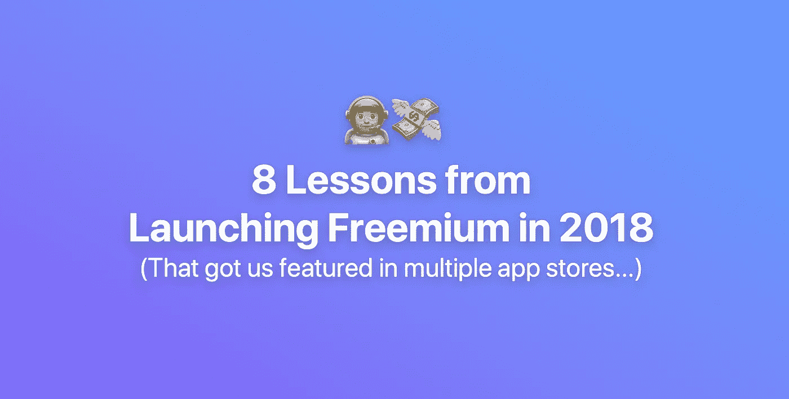
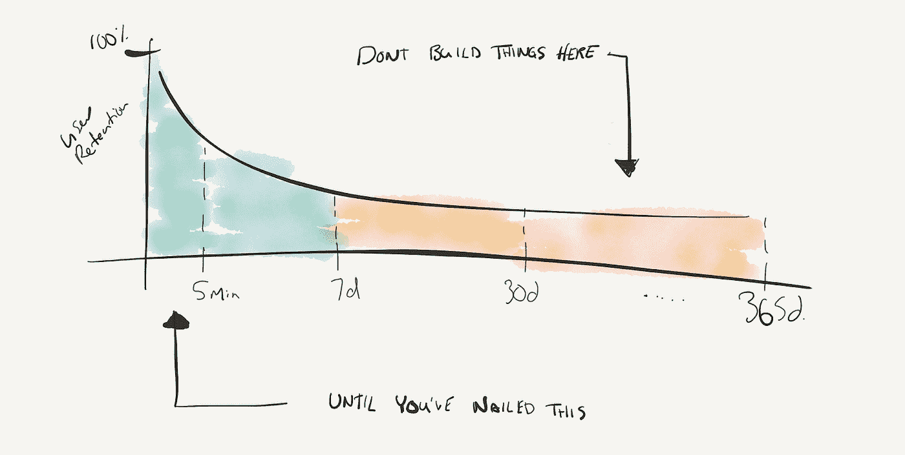
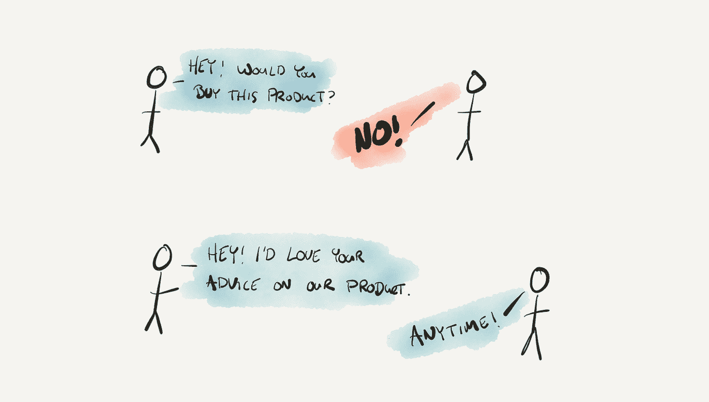
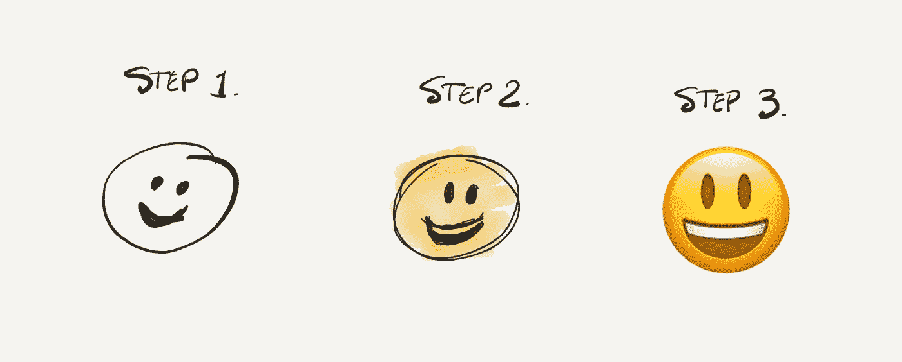
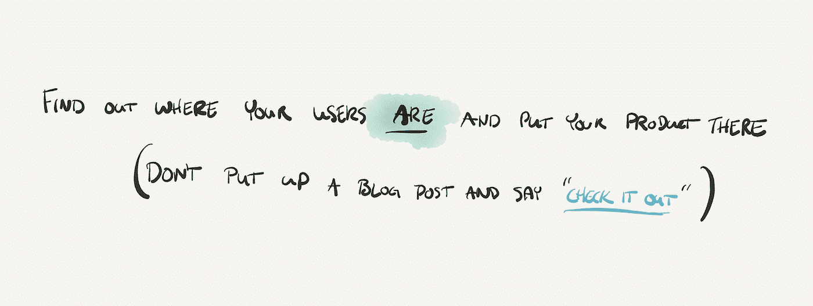

# 推出免费增值的 8 个教训

> 原文：<https://medium.com/swlh/8-lessons-from-launching-freemium-14d8cf2a6d0a>

## 考虑推出一款免费增值应用？以下是我学到的。

在建立了 5 年的企业应用程序后，我们在 2018 年初推出了免费增值版🎉因此，这是我从推出免费增值应用程序 [SoapBox](https://soapboxhq.com/?utm_source=thestartup&utm_medium=referral&utm_campaign=learns) 中学到的 8 条经验——我们才刚刚开始。

毕竟，免费增值并不容易:免费赠送你的产品，然后试图吸引用户升级到增值功能意味着大量的规划、努力和风险。但是我们在这里！😅

# **1。这需要很长时间(真的很长时间)📆**

我原以为要花三个月的时间来构建我们的测试版，三个月用于我们的付费计划，也许再花三到六个月的时间来让它面向大众。*我真是大错特错了。*

即使是一个好版本的*免费*应用程序也需要很长时间才能推出，更不用说一个好版本的 on-boarding 了，更不用说你所有的付费功能了，而且完全忽略了建立支付所需的时间。

第一个教训是接受这将需要很长时间。没关系。很难。真的没有捷径。

在 SoapBox，我们在 2017 年 3 月推出了我们的 alpha experience ( [一个用于一对一会议的 SlackBot】)，并基于客户对话进行了三个月的迭代。然后我们添加了](https://soapboxhq.com/integrations/slack?utm_source=thestartup&utm_medium=referral&utm_campaign=learns)[团队会议](https://soapboxhq.com/features/team-meetings?utm_source=thestartup&utm_medium=referral&utm_campaign=learns)功能，这又花了三个月的时间来构建和迭代。我们在 2017 年结束了对[讨论](https://soapboxhq.com/features/idea-management?utm_source=thestartup&utm_medium=referral&utm_campaign=learns)的工作(这最终成为一个专业功能)。因此，在一年之内，我们仍然在完善我们的免费应用程序。

我们添加的每一个功能都让我们更接近我们的愿景，让我们倒退到简单的入门阶段。总的来说，我们花了一年的时间专注于 14 天的用户留存率……但要改善它还有很多工作要做。直到 2018 年，我们才开始准备我们的付费功能。我们发布了[下一步](https://soapboxhq.com/features/next-steps)、[移动](https://soapboxhq.com/integrations/mobile)和应用内支付。我们基本上是在谈论那里的两年。

我见过太多的产品只是不断地增加功能，而从来没有花时间去回顾和提炼那些可以释放你的产品所有能量的好点子。

所以，是的，在三个月内完成你的应用并发布给用户。但是之后再重复做三次。给自己犯错的时间。预算一下。

> 这就是教训:为你的免费版本做两到三次错误的预算。这给了你犯错、学习和变得更好的自由。(当你对时间线感觉很糟糕的时候，请记住 Slack 已经测试了两年。)

# **2。最初的 5 分钟是最重要的⏲**

[我在](https://hackernoon.com/8-mistakes-we-made-in-our-companys-first-8-years-3d38422333b)之前已经谈过这个:专注于前五分钟。在你看 14 天保留之前，在你看 45 天保留之前。看看你的前五分钟。

是的，建立一个 MVP，但是先建立它的*部分*先*再*。这意味着忽略你可以用你正在收集的数据吐出来的非常酷的报告，相反，建立一个大多数人甚至不会注意到的板上钉钉(这是重点)。

然后，继续专注于免费创造价值。在你把你的免费版本带到对用户来说非常有价值的地方之前，不要考虑付费功能。

为什么？因为在你完成第一步之前，没人能走到第二步。如果我们的免费用户在第一天之后就开始减少，那么为 SoapBox 制定一个杀手级的付费计划就没有意义了。

最重要的是，我们是一个小团队；我们不能同时做所有的事情。如果我们什么都不做，任何事情都不会完成，或者完成得很差。

但是，如果你带着这个小而强大的团队，把他们集中在一件小事上，然后继续前进，你会慢慢地建立起一些了不起的东西。

> **这就是这里的教训:**找出你的用户必须遵循的关键路径，以使你的产品获得成功，然后按照这个顺序迭代路径的每一步**。**

# ****3。你希望谁成为你的客户？只获得他们的反馈。🤔****

**这是我在推出免费增值服务时回过头来想的一件事，“是的，我们在这方面做得很好。”**

**甚至在我们设计产品之前，我们就在目标市场中找到了人。我们伸出手说“嘿，我们需要你的建议和反馈。我们正在做这件事……”**

**这带来了红利。我们不仅得到了真实的原始反馈，而且在整个发布过程中不断得到反馈。**

**我们的 SlackBot 是一些最初反馈的直接结果:我们第一个寻求建议的人告诉我们，他不会使用像我们这样的工具，因为他不想去另一个地方。所以，我们想“好吧，让我们不要给他另一个地方，让我们用他已经在使用的工具做一些工作。”因此，我们建立了一个 SlackBot，我们的主要价值支柱来自于那次经历。**

**我们早期获得的反馈帮助我们完善了产品和信息。现在，这些人是我们品牌的最大拥护者。**

**有句话说，“要钱，要建议。求教，拿钱。”**

> ****这就是我们在这里学到的:**在你制作模型之前，向你*想要*成为你客户的人寻求建议。随着时间的推移，作为测试版用户和早期支持者，你会惊讶地发现它们有多么有用…**

****

# ****4。接近客户🕵️‍♂️****

***最接近客户的人胜出。*如此缩放。**

**当你有五个用户和几个团队成员时，接近客户很容易，但是当你有几千个用户和几个团队成员时，管理起来就困难多了。当我们扩展团队时，我们必须学会如何保持与客户的联系。**

**人们总是说:建造、测量和学习。但是我们发现我们很少优先考虑测量和学习。现在我们做到了，而且差别是巨大的。**

**随着我们的发展，我们已经做了很多事情来扩大规模。事实上，这是我变得奇怪地痴迷的东西。为了赢得比赛，我们必须这样做。**

**我们做了一些事情来收集和分享这些知识:**

*   ****影评** —每周一次，我们聚在一起观看客户经历我们的客户之旅——从我们的网站注册到入职。每周都有不同的部门(产品部、市场部、工程部等。)负责呈现影评。该团队接触客户(现有或潜在客户)，拍摄采访，做笔记，然后带我们一起学习。在我们做这些的时候，我们已经准备好了所有的[购买者之旅](https://blog.hubspot.com/sales/what-is-the-buyers-journey)、[理想客户概况](https://sixteenventures.com/ideal-customer-profile)和价值主张陈述，可以随时编辑、提炼、讨论和决定。**
*   ****我们的播客** —我们的产品经理 Jill 和我主持了一个名为 [People Leading People](https://soapboxhq.com/about/people-leading-people-podcast) 的播客，在这个播客中，我们深入探讨了专业经理(也就是我们的客户)的想法。我们远离销售我们的产品，并真正将其作为接触我们领域中最聪明的头脑的一种方式——向他们提出我们所有的问题并传播知识。(附:到目前为止，第二季我们已经录制了[的《懈怠工程》](https://medium.com/u/28279a71b4f2?source=post_page-----14d8cf2a6d0a--------------------------------)的 [rands](https://medium.com/u/20e8edeef1e9?source=post_page-----14d8cf2a6d0a--------------------------------) 、 [Intercom](https://medium.com/u/7ca8972daf76?source=post_page-----14d8cf2a6d0a--------------------------------) 的 [Eoghan McCabe](https://medium.com/u/68a354672e7d?source=post_page-----14d8cf2a6d0a--------------------------------) 、 [Buffer](https://medium.com/u/245d5483fb27?source=post_page-----14d8cf2a6d0a--------------------------------) 的[Katie Womersley](https://medium.com/u/4f7c85eae162?source=post_page-----14d8cf2a6d0a--------------------------------)……很多激动人心的剧集即将到来！)**
*   ****我不想花钱购买的昂贵产品工具**——Segment、Mixpanel、Intercom、Fullstory、Google Optimize。除非你测量，否则你学不会。**

**但关键是，随着越来越多的人加入这个团队，你要扩展这些流程，以便每个人都能理解你的客户(免费或免费)正在经历的痛苦。**

> ****这就是教训:**想办法把从你的客户那里学到的东西和同情心加入到你的日常冲刺中。随着您的成长进行扩展。**

# ****5。闪光灯上的功能****

**直到我们达到 14 天的用户保持里程碑，我们才在 SoapBox 上放一个设计师。**

**我们的原型是为了原始的功能和实用性。我们故意保留“漂亮的设计”以保持专注。**

**相反，我们选择关注工作流程和关键路径，然后将保留率作为我们所提供价值的指标。最终，我们得到了一个更强大、更有粘性的产品。**

**一旦我们达到了留存数字，我们就引入了明亮的设计、表情符号和五彩纸屑。你猜怎么着？**保留率翻倍。** 🥂**

**众所周知，人们喜欢设计精良的产品。当你把一些能增加价值的东西和一些看起来和感觉都不错的东西搭配在一起时，记忆就会产生。**

**然而，如果你把一些看起来不错的东西和一些没有附加值的东西搭配在一起，那么你可能会看到五分钟的保留时间，但是最终你会把这些用户流失到提供价值的东西上。**

> ****这就是教训:**用最初的五分钟记忆欺骗自己很容易，但如果你能让人们注册并尝试一些丑陋的东西*，那么你就知道你有一些东西。***

******

# *****6。优先考虑学习💸*****

***成长和快速成长的唯一方法是确保你从成功和失败中快速学习。忘记其他的一切。优先考虑学习。***

***那么，相对于赚钱，你如何围绕学习和执行这些知识来优化你的整个业务/团队呢？***

***其实很简单:把你在所有战略和计划时间里问的问题从“哪条路会赚钱并达到我们的收入目标？”到“哪条路能最快地教会我们需要知道的东西？”***

***我们在开发产品时选择规模化科技公司的一个重要原因是，我们可以更快地向他们学习。他们充满了愿意尝试的创新者和早期采用者。一般来说，他们可以在没有许可或安全审计的情况下与他们的团队一起使用应用程序。他们是技术人员，所以我们不必为 ie7 而构建。***

***向后来者或落后者学习毫无意义。每一秒钟的等待时间都会减少反馈的流量，你越快得到反馈，你就能越快建立和发展正确的事情。***

> *****我们在这里学到的很简单:**首先为早期采用者构建，他们会教你最多，你会成长得最快。瞄准那些没有移除免费增值应用程序的公司。一旦你从那些教你的人身上学到了你能学到的一切，你就能更快地关注其他人。***

# *****7。支付本身就是一个庞大的工程*****

***这很容易忘记，但实际实现应用内支付会消耗你大量的时间。它是看不见的，所以感觉不到它的存在，从功能构建中抽出时间来做这件事很糟糕——但是它*必须*完成。这一定是一次很棒的经历。从我们的大规模支付项目中获得的重要经验:***

1.  *****选择加入试验与选择退出试验** —我们从选择加入试验开始，一直知道这是暂时的。当我们建立应用内支付时，这是一个权宜之计。一旦我们正确地整合了 Stripe，我们就转向每个人都可以获得 30 天的试用期。这带来了一系列我们没有想到的新问题，比如人们不知道什么是有偿的，什么是无偿的。在这种情况下，折磨自己的可能性是巨大的。不管你的试用期，选择加入还是选择退出，密切关注它对用户体验的影响。***
2.  *****当你推出一个付费功能时，专注于免费体验** —不要忘记，你添加的每一个新的付费功能，都会对想要升级的人有所帮助，但会让新用户感到困惑。***
3.  *****采用你的工具的人不一定是为你的工具付费的人。**考虑到使用你的免费应用程序的人不一定是为应用程序付费的人。那两个人会有不同的需求，不同的问题。您的用户获取信息可能不同于您的转化信息。这是你的收购和产品营销策略需要特别考虑的事情。***

***现在是 2019 年，免费增值支付策略很复杂。有时这种差异非常微妙(例如，对于 Slack，你不是为了继续使用它而付费…你是为了不丢失信息而付费)，这可能是免费产品强调的一个问题。***

> *****我在这里学到的是:**除非你想免费试用……那么你需要考虑你的免费产品、付费产品和付费流是如何交织在一起的。这是一个复杂的工程项目…但它也是一个集产品、营销和 cs 于一体的复杂项目。***

******

# *****8。忘记“建造它，他们会来的”*****

***假设你到了一切都好的地步(意味着你有很多事情要解决，但至少你知道它们是什么)，你要解决的下一个问题是[分配](https://a16z.com/2017/06/09/distribution-model-sales-channels/)。免费的整个概念是你的免费用户是你的销售渠道。像所有的销售一样，这是一个数字游戏。***

***算一算:以你所在行业的绝对最佳转化率为例，逆向计算出你的网站需要多少访客才能赚到 100 万美元。你需要大量的人访问你的网站、应用商店列表等。***

***分销是区分成功产品和失败产品的关键。***

***不幸的是，这是真的:有时蹩脚的产品会胜出，因为每个人都知道它们。有时候伟大的产品会消亡，因为没人知道它们的存在。***

***信不信由你，最困难的挑战之一实际上是如何把你的*免费* *东西*分发给足够多的人，让整个免费增值战略有腿。大量的人需要知道你的产品才能工作。***

***在 SoapBox，我们了解到:***

*   ***如果你把它写在博客上，这还不足以打破喧嚣😐***
*   ***如果你写广告，仅仅突破噪音(或广告拦截器)是不够的😑***
*   ***如果你把它放在应用商店里，它不足以突破噪音😖***

***那么什么有效呢？强烈的激光聚焦使针在整个公司内移动。***

***信不信由你，这些应用商店背后都有人——这意味着建立真正伟大的集成。我们已经利用了集成的所有最新功能，并与跨平台的合作伙伴保持持续联系。这使得我们出现在许多商店的首页。***

***其他奏效的方法包括发布和列表，比如 ProductHunt，以及在我们知道拥有核心市场注意力的网站上发布内容。我们要去他们已经在说话的地方，加入我们的两分钱。***

> ***所以**这是最后一课:**花尽可能多的时间来推广你的免费产品，就像你花同样多的时间来构建和设计你的免费产品一样。你会想出正确的策略来使用……但至少要像对待产品一样对待营销工作。***

***唷。我觉得我好像又回到了过去的两年。我无法想象免费增值之旅会一帆风顺，但我们觉得我们在自己的冒险中获得的经验教训可以帮助其他人减少一点坎坷。***

***感谢阅读！
布伦南***

***另外，如果你的创业公司雇佣了一些员工(或者你是一名经理)，你现在真的应该看看我们的产品[肥皂箱](https://soapboxhq.com/?utm_source=thestartup&utm_medium=referral&utm_campaign=learns)。***

******

## ***布伦南是经理助手应用程序、机器人和平台 [SoapBox](https://soapboxhq.com/?utm_source=thestartup&utm_medium=referral&utm_campaign=learns) 的首席执行官兼联合创始人。与你的团队进行更好的一对一、团队会议、ama、市政厅等活动。***

******

***如果你喜欢这篇文章，你应该给它打 8 分👏s (每课一个)帮别人找！👇***

******

## ***这篇文章发表在 [The Startup](https://medium.com/swlh) 上，这是 Medium 最大的创业刊物，拥有+409，714 名读者。***

## ***在此订阅接收[我们的头条新闻](http://growthsupply.com/the-startup-newsletter/)。***

******