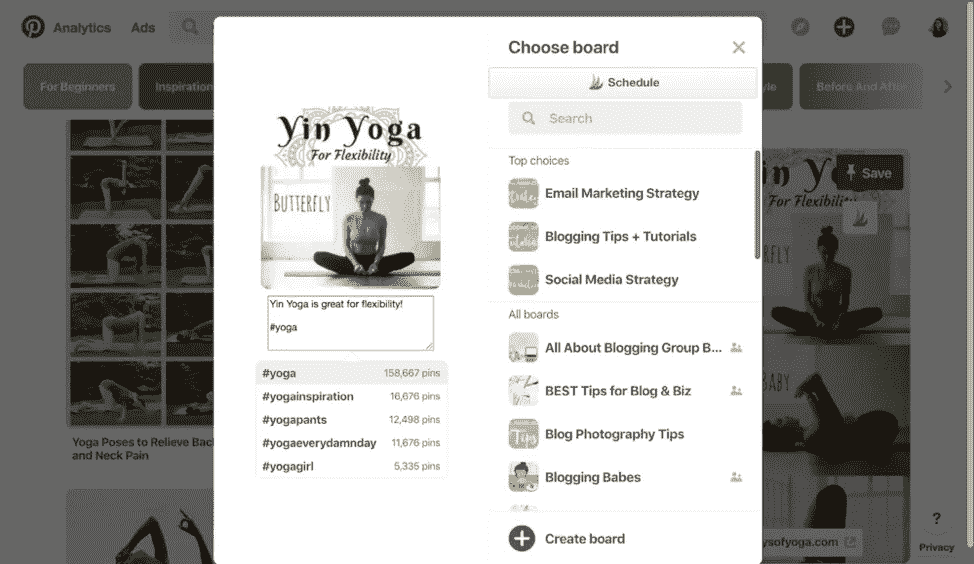
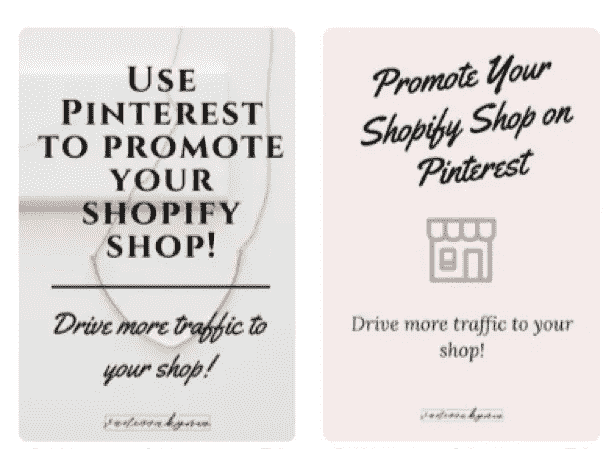
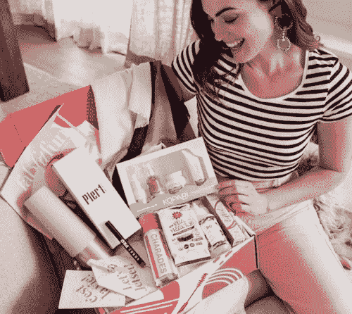

# 2019 年 8 大 Pinterest 营销策略

> 原文：<https://medium.com/swlh/8-pinterest-marketing-strategies-in-2019-e8dc1d0015fd>

## 想知道 Pinterest 如何帮助你发展业务？阅读这篇 Pinterest 营销指南，帮助你了解这个社交媒体平台。

尽管脸书和 Instagram 吸引了很多关注，但很少有营销人员了解 Pinterest 的真正潜力。这是一个社交媒体平台，人们在这里发现新事物并获得灵感。从最新的沙发设计到鸡尾酒礼服，Pinterest 为不同领域的观众提供了一些东西。

每月有超过 2.5 亿人浏览 Pinterest 寻找新的想法。Pinterest 也促使人们进行购买。事实上， [83%的周销者](https://business.pinterest.com/en/how-pinterest-works)承认会根据他们在品牌上看到的别针进行购买。Pinterest 是希望增加销售额和收入的营销人员的金矿。

为了充分利用 Pinterest，你需要一个适合网站算法的营销策略。这里有一些策略，可以帮助你在 2019 年保持 Pinterest 游戏的领先地位。

# 1.发布引人入胜的内容

最近，我们注意到所有主要的社交媒体平台都特别强调参与度。他们的算法不再关乎时间顺序，而是更依赖于观众的参与度。Pinterest 的新[智能订阅算法](/@Pinterest_Engineering/building-a-smarter-home-feed-ad1918fdfbe3)也以类似的方式工作。

该算法侧重于向用户展示最具吸引力的内容。该算法不是在顶部显示最新的帖子，而是挑选最好的帖子。为此，它会根据引脚的质量对其进行排序。

确保算法选择你的帖子的一个方法是让它们吸引人。如果你的帖子为用户提供了价值，并且用户对其进行了回复，那么算法会记录下来。随着你的帖子获得更多的印象和参与，它更有可能显示在其他用户订阅源的顶部。

因此，你需要专注于制作有趣、相关和吸引人的独特内容。好的内容会帮助你获得更多的吸引力。

# 2.定期发布

定期在 [Pinterest](https://shanebarker.com/blog/how-i-make-pinterest-work-for-me/) 上发帖可以帮助你建立一个忠实的粉丝群。你应该争取每天至少发布一次。如果你能创造更多的内容，在 Pinterest 上每天发布 5 次是最理想的。

作为你发帖时间表的一部分，也要寻找在 Pinterest 上发帖的最佳日期。根据 [HubSpot](https://blog.hubspot.com/marketing/best-times-post-pin-tweet-social-media-infographic) ，周六和周日的帖子获得最多的关注。另外，在 Pinterest 上发帖的最佳时间是晚上 8 点到 11 点，尤其是周六。

每当你在 Pinterest 上发帖时，确保你包含了行动号召。HubSpot 透露，如果没有行动号召，80%在高峰时段看到你的 pin 码的人不会与他们互动。

# 3.针对 SEO 进行优化

我看到很多人发布很棒的内容，但从来没有引起注意。他们最常犯的一个错误是在 Pinterest 上使用随机的董事会名称。

例如，用布朗尼的图片来指代“流口水”并不是一个好的广告牌名称。这听起来可能很可爱，但它并没有说太多关于董事会。“流口水”这个词没有上下文，可能不会被搜索到。

就像图钉一样，电路板也是可以搜索的。在搜索时，人们经常在 Pinterest 上使用特定的关键词。所以，如果你想让你的内容排名靠前，添加关键词是很重要的。对于核仁巧克力饼的图片，类似于“核仁巧克力饼食谱”或“甜点食谱”的东西会更合适。

此外，当你描述你的董事会时，关键词也很重要。查找相关关键词的一个简单方法是使用搜索栏。首先，搜索与你的形象相关的广泛话题。之后，你可以查看 Pinterest 给出的关键词建议。这是为你的引脚和电路板找到正确关键词的最简单的方法。

你的 Pinterest 内容如果不是针对 SEO 优化的，就不会被看到。

# 4.使用标签

标签在 Instagram 和 Twitter 上很常见，但在 Pinterest 上，它们还是相当新的。它们是发现流行内容或属于特定利基的内容的好方法。

与其他搜索结果不同，标签按时间顺序显示结果。

*形象经由*[T5【凯特·史考特】](https://static1.squarespace.com/static/5a6b8365b0786974d9573275/t/5af6a7b2352f537697f0e18d/1526114314804/pinterest-hashtags-description.png)

在你的描述中插入标签时，要具体。

你需要寻找的另一件事是特定标签被使用的次数。那些使用次数少于 100 次的不会给你带来很多点击。

最好使用 1000 到 10000 范围内的标签。这样你就可以确保更多的人会注意到你的帖子。

# 5.为同一帖子创建多个大头针

持续不断地推出新的引人入胜的内容可能是一项艰巨的任务。但是，您可以通过为任何帖子创建多个 pin 来延长其寿命。您可以将它们作为两个不同的 pin 分别发布。这样做，你可以吸引不同的观众。

*图片经由* [*凡妮莎·艾克妮斯*](https://i1.wp.com/vanessakynes.com/wp-content/uploads/2018/08/Screen-Shot-2018-08-08-at-9.06.03-PM.png?w=395&ssl=1)

在上面的例子中，相同的文本内容以两种不同的方式呈现。一种设计可能比另一种更受欢迎。

分析每个引脚的受欢迎程度并进行比较，可以帮助您改进设计策略。此外，当有人搜索该内容时，它可以使您获得访问的机会翻倍。

# 6.领先于季节性趋势

人们在假期和季节性活动之前使用 Pinterest 来计划庆祝活动。如果圣诞节即将来临，关于圣诞树装饰和礼物的帖子往往会很受欢迎。人们经常在 Pinterest 上搜索如何让假期变得特别的新想法。

如果你想要更好的参与度和流量，你需要仔细看看你的季节性帖子的时间。一个好的策略是至少提前 30 到 45 天发布你的季节性内容。随着活动越来越近，你的帖子会越来越活跃。

查看最热门的搜索也是一个好主意。Pinterest 每年都会发布一份 100 大趋势的榜单。这个列表可以让你先睹为快，知道人们在寻找什么。

到目前为止，2019 年的趋势表明，Pinterest 上的人们希望优先考虑与家人在一起的优质时间。

2019 年最关注家庭的决议是:

1.  找到更多和我家人一起做的活动
2.  花时间和我的孩子在一起
3.  花时间和我的朋友在一起

基于这些，一些好主意包括家庭活动、育儿建议、游乐园和家庭目的地。了解这些趋势有助于您改进内容、营销活动和产品。

2018 年，美容、健康和健身公司[fabbit fun](https://fabfitfun.com/magazine/fabfitfun-pinterest-box/)利用这些趋势为自己创造了优势。

*图片来自 fabbit fun*

FabFitFun 决定根据 Pinterest 上的流行和趋势在订阅框中展示商品。

关注 Pinterest 上的趋势很重要。

# 7.分析你的数据

分析你在 Pinterest 上的数据可以帮助你了解什么对你有用，什么没用。关注保存的 pin、个人资料点击和观众人口统计数据，以深入了解您的表现。

哪些大头针省的最多？它们为什么会流行起来？哪些板子表现最好？这些是你应该问的一些问题。

看看哪些表现好，多做一些。

# 8.一致性至关重要

Pinterest 是一个高度可视化的平台，允许你向 Pinners 展示你的品牌美学。

创建您的 pin 和个人资料，以便您的品牌标识在所有社交媒体平台上保持一致。在任何地方使用相同的颜色、标志和字体。

此外，确保你把你的标志融入到你所有的别针中。这样，即使不点击链接，消费者也能识别你的品牌。

# 利用 Pinterest 营销为你的公司带来优势

Pinterest 可以帮助你为你的网站带来更多的流量，并大幅增加你的收入。

你的 Pinterest 账户蕴含着巨大的潜力，可以帮助你拓展业务。如果你知道如何正确使用它，你可以收获巨大的成果。

[*原载于 2019 年 3 月 21 日离合器上，作者 Shane Barker。*](https://clutch.co/agencies/social-media-marketing/resources/pinterest-marketing-strategies-2019)

## 这篇文章发表在[《创业](https://medium.com/swlh)》上，这是 Medium 最大的创业刊物，有+436，678 人关注。

## 在这里订阅接收[我们的头条新闻](https://growthsupply.com/the-startup-newsletter/)。

