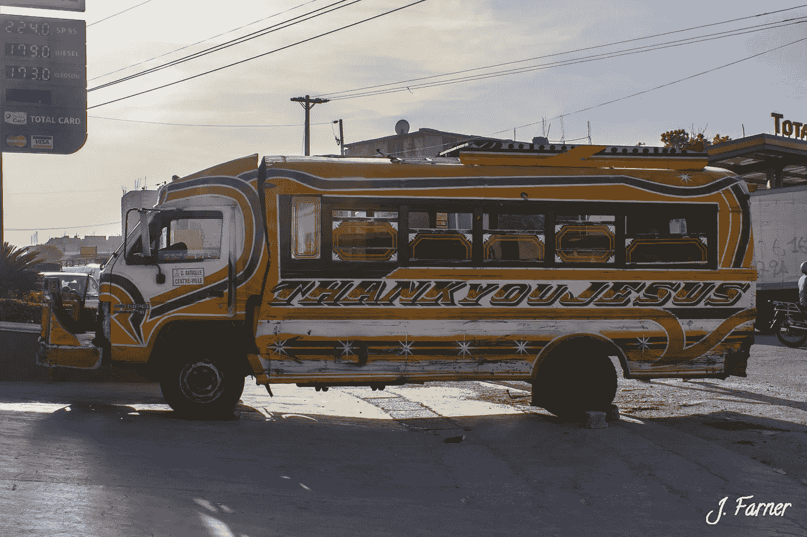

# 我从贫民窟生活中学到的 8 件事

> 原文：<https://medium.com/swlh/8-things-i-learned-from-living-in-a-slum-eea974def918>

The Infamous Tap-Taps. Credited to Myself.

那是 2017 年 10 月，我决定飞往海地。是的，*那个*海地。我以前从未去过加勒比海，而且从迈阿密出发的机票不到 100 美元，所以我想为什么不呢？

我所知道的关于海地的唯一故事就是那些关于地震和极度贫困的故事，这使得这个国家成为整个西半球最穷的国家。