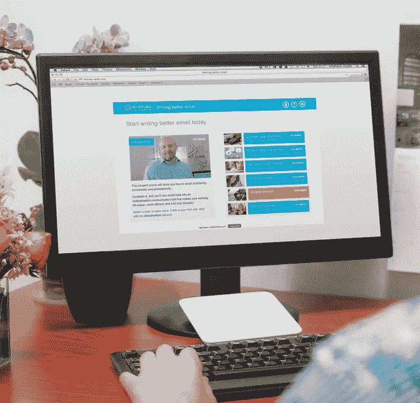
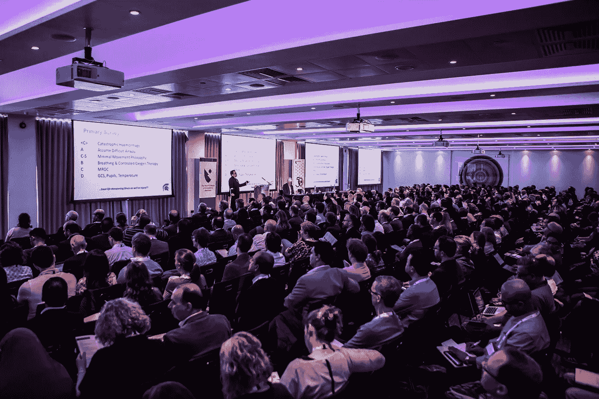
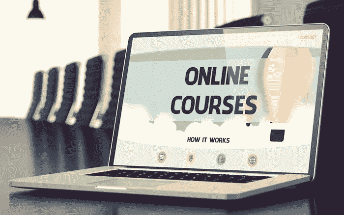

# 工作之外要做的 8 件事

> 原文：<https://medium.com/swlh/8-things-to-do-besides-your-job-db1d4bd4d4e7>

生活不是收集，而是播种和收获！

Photo by [Ishan @seefromthesky](https://unsplash.com/@seefromthesky?utm_source=unsplash&utm_medium=referral&utm_content=creditCopyText) on [Unsplash](https://unsplash.com/search/photos/activities?utm_source=unsplash&utm_medium=referral&utm_content=creditCopyText)

想给你的苦差事增添光彩吗？单调的案头工作，项目经理制定不切实际的时间表，有人给你的产品带来厄运，每天早上找到回到电脑前的动力，这一旅程充满坎坷！那么，你如何开车回家并再次打开你的系统呢？？

这听起来绝对像一个我们从来没有兴趣购买的电视购物广告。因此，简而言之，以下是你可以在工作之余做的一些事情，以提升你的形象，学习一些有价值的简历技能，实现目标，并为你的室温工作添把火

以下是你所能做的，让自己变得不道歉，保持乐观和热情，保持高昂的工作热情！

# 1.写博客

你拥有你所在领域的所有世俗知识，你在网上阅读了大量内容，在你的工作中使用了这些内容，学习了一项新技术，去过那里——做过，在某个主题上有专长，从初学者到大师...有数百万个主题可以用来写博客！

一个博客主要关注*书面内容*，也称为博文。博客作者通常从个人角度来写一个主题，这样他们就可以直接与读者交流。有很多微博网站可以让你的博客成为特色。Medium，Blogger，Wordpress，Tumblr，Weebly，Squarespace 或者做自己的网站。那么如何开始写博客呢？

1.  **决定你的博客名字:**选择一个能代表你的博客的标题
2.  **在线注册您的博客:**注册您的博客并获得托管服务
3.  定制你的博客:选择一个免费的模板，调整并定制它
4.  **写&发表你的第一篇帖子:**让乐趣开始吧！
5.  推广你的博客:让更多的人阅读你的博客
6.  **写博客赚钱:**从几个选项中选择你的博客赚钱

# 2.创建自己的播客

人类是讲故事的动物。相对于他们读到的东西，人类更容易记住他们听到的东西。故事创造了有意义的联系，播客最受观众欢迎。很多人都在谈论数字时代的事物发展有多快，新的趋势每天都会出现，但播客并非如此。40 多年来，播客一直是挖掘受众的传统手段。你想到了演讲，这就是你对播客的想法。这里有一个如何开始你自己的播客的总结。

1.  定义你的定位和演讲嘉宾
2.  决定你的播客主题，名称，格式，长度
3.  收集所需设备(麦克风、录音机、电脑)
4.  安装音频录制和编辑软件
5.  将您的录像上传到托管和流媒体网站
6.  把话传出去！

播客流媒体网站: *Spotify、Castbox、RadioPublic、Podbean、Stitcher、TuneInRadio(适用于 Android 和 iOS)、iTunes*

[如何开始自己的播客？](https://www.format.com/magazine/resources/art/start-your-own-podcast-creative-guide)

# 3.创建您的在线课程/成为讲师

你可能已经从在线课程和认证中学到了。但是你知道你可以设计自己的课程并成为一名讲师吗？那是可能的！你可以成为一名教师，向一群学生开放，分享你的知识。

您可以在 [***Udemy***](https://ufbsupport.udemy.com/hc/en-us/articles/115005523008-How-to-Create-a-Course) 上创建自己的课程。规划你的课程-创建内容-发布你的课程。V *oilà* ！你完了。你现在是在线课程的讲师。PS:成为导师也可以赚钱(明显)xD

# 4.发表论文/海报

当我开始以论文形式发表我的研究时，我想到的第一个问题是- *为什么要发表论文？*随着时间的推移，我找到了答案，我总结为:( 1)发表论文在你的简历上添加一行研究，这将使你的个人资料有一个新的维度;( 2)你在该领域获得了你的名字，并建立了你的学术声誉;( 3)分享知识的可靠来源;( 4)在你的研究领域获得科学知名度和社区认可的好方法。

***如何发表论文？***

1.  找到你感兴趣的领域
2.  找到一本日记
3.  根据指导方针准备你的论文
4.  提交并审核
5.  接受了？分享推广。

此外，如果研究不是你的强项，你可以从评论论文开始，在那里你探索、学习、理解一个概念，并写下你对该主题的观点。其次，海报展示是一个很好的开始方式！每个国家/国际会议都有海报展示，来自世界各地的人来展示他们的工作，而不是必要的广泛研究；更确切地说，这是一个有实质性结果的实用实验。

# 5.写一本书

我不能写书！！作者？？无数的草稿，重写，拒绝，出版社的奉承，说服人，到处寻找出版商…我不能那样做😒

如果我说你可以在亚马逊 Kindle 上出版你的书呢！！！！！

亚马逊有自助出版 [Kindle Direct 平台](https://kdp.amazon.com/en_US/) (KDP)。你提交你的手稿，如果它值得出版，你会收到来自亚马逊的邮件，你的书会在收到确认邮件的 24 小时内在 Amazon.com 和 Kindle 上上线。出版你关于 KDP 的书:

1.  **书籍内容:**上传稿件[开始使用 Kindle 内容创作工具](https://kdp.amazon.com/en_US/help/topic/A3IWA2TQYMZ5J6?ref_=kdp_BS_D_tool)
2.  **图书封面:**创建一个在线图书封面或上传你自己的封面([创建一个伟大的封面](https://kdp.amazon.com/en_US/help/topic/A1DHGMW609HBI8?ref_=kdp_BS_D_cc))
3.  **描述、关键词和类别:**告诉读者[你的书](https://kdp.amazon.com/en_US/help/topic/A2OSMOLQQXKIR2?ref_=kdp_BS_D_ti)并帮助他们[在亚马逊](https://kdp.amazon.com/en_US/help/topic/A2EZES9JAJ6H02?ref_=kdp_BS_D_key)上找到它
4.  **ISBN:** 获得一个免费的 ISBN 来出版你的平装本！！！你也可以把你的书以平装本的形式出售

# 6.参加会议/聚会

我们人类更容易与志同道合的人产生共鸣，如果你能在一个地方遇到所有这些人会更好！在这个 Skype 和聊天的现代世界里，我们经常忘记与社区的面对面交流。在任何时代或革命中，进行口头交流都是至关重要的。

会议或聚会(由旨在联系有共同点的人的社区主办)是与人交往、学习新事物、获取知识的好方法——我们都知道。但我们错过的是与一些人的个人交流，以及与他们的联系，双方在凌晨 2 点的危机中互相帮助。

参加会议和聚会能给你带来在你平常的办公室生活中得不到的机会。成为演讲嘉宾、特约作家、专家讲师、顾问的机会..这些都是我在参加的活动中从与“人”的交流中获得的机会。

要了解参加哪些活动，你只需谷歌一下: [*UX 会议 2019*](https://uxdesign.cc/the-best-ux-design-conferences-2019-events-bcd7b28f722d)*|*[*设计会议 2019*](https://design-conferences-2019.com/)*| L*ikewise…

# 7.举办讲座/会议/研讨会

首先，你可以想象自己将在 Google I/O 扩展活动上发言！😜

随着你在会议、聚会、网络午餐/晚餐上与更多的人接触和互动，你为自己打开了一个机会的海洋，你只需要知道如何利用它。能够在会议上发言可以让演讲者表达他们的观点和影响，并让人们思考他们在自己的业务中正在做什么以及他们可以/应该做什么。此外，它对个人品牌、公司公关、潜在客户的产生、建立信誉和帮助他人复制你都有好处。

# 8.在线认证/课程

在线教育非常适合在职成年人，以平衡教育与工作、家庭和其他承诺，实现教育和职业目标。了解最新的技术趋势阅读**Verge*的文章和观看 YouTube 视频是很好的，但是你如何获得对你公司的使命、愿景和目标很重要的技能呢？在线认证或课程有责任保持时间的灵活性；按照你的进度学习，并在你的工作中加入即时相关的技能*

*希望这有帮助！！给一个👏如果你喜欢这篇文章:)*

**

## *这篇文章发表在[《创业](https://medium.com/swlh)》上，这是 Medium 最大的创业刊物，有+433，678 人关注。*

## *在这里订阅接收[我们的头条新闻](https://growthsupply.com/the-startup-newsletter/)。*

**