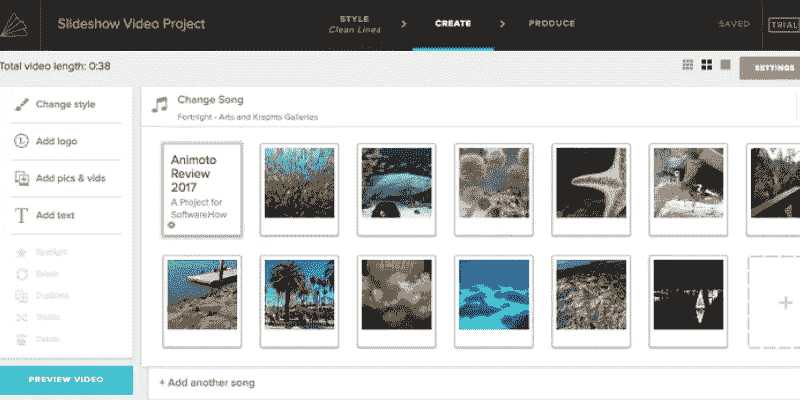

# 2019 年你应该考虑的 10 个最佳数字营销工具

> 原文：<https://medium.com/swlh/9-best-digital-marketing-tools-you-should-consider-in-2019-f173997db78>

我已经在 [**ProofHub**](https://www.proofhub.com/?utm_source=Medium&utm_medium=referal&utm_campaign=CTA&utm_content=9%20Best%20Digital%20Marketing%20Tools%20You%20Should%20Consider%20In%202019) (一个项目管理工具)做了八年的数字营销人员，我和我的团队不断地穿越不断变化和发展的数字景观。在这个行业呆了这么多年，我相信可以肯定地说，数字营销仍然是我们 2019 年战略的核心组成部分。记住这一点，我有一个营销技巧给你们，相信我，你需要知道这一点。

***“如果你没有比你的任何一个顾客更了解产品，你肯定不能成为一个好的营销者。不要再等待你的团队成员向你介绍你的产品；你自己研究吧。”***

很明显，在今天的数字世界里，你必须时刻保持领先。随着人工智能、聊天机器人等的兴起，数字世界每年都在发生变化。这些是许多付费和免费的数字营销工具[来帮助你管理你的数字营销领域的所有细节。在这里，我们通过技术为您剪影，并为您填充 2019 年需要重点关注的内容。所以，事不宜迟，让我们投入到 2019 年为您的企业提供的强大数字营销工具中。](https://www.proofhub.com/articles/saas-tools-for-businesses?utm_source=Medium&utm_medium=referal&utm_campaign=CTA&utm_content=9%20Best%20Digital%20Marketing%20Tools%20You%20Should%20Consider%20In%202019)

## **1。** [**项目管理和高效沟通的证据枢纽**](https://www.proofhub.com/?utm_source=Medium&utm_medium=referal&utm_campaign=CTA&utm_content=9%20Best%20Digital%20Marketing%20Tools%20You%20Should%20Consider%20In%202019)

任何营销团队都面临的一些主要挑战是[项目管理和高效沟通](https://www.proofhub.com/articles/project-management-communication-strategies?utm_source=Medium&utm_medium=referal&utm_campaign=CTA&utm_content=9%20Best%20Digital%20Marketing%20Tools%20You%20Should%20Consider%20In%202019)。ProofHub 可让您管理营销项目的所有活动部分。一个项目管理软件，其功能是始终保持所有任务的最新状态，共享文档，并通过共享日历跟踪即将发生的事件。这是 T2 计划、安排、报告和交付项目所需的一体化解决方案。

## **2。SpyFu 针对竞争对手的关键词研究**

SpyFu 允许营销人员查看竞争对手的关键营销信息。搜索任何领域，看看他们在谷歌上出现的每个地方:他们在 Adwords 上购买的每个关键词，每个有机排名，以及付费和有机搜索的广告。kombat 的反向链接功能是主要的吸引力之一，因为它可以比较多达 3 个竞争对手，并找出你错过的关键词。

## **3。网站健康/技术搜索引擎优化的尖叫青蛙**

一个网站爬虫，允许你抓取网站的 URL 和获取关键元素来分析技术和现场搜索引擎优化。只需选择一个域名，像搜索引擎一样浏览它的页面。你需要这个工具来保持你的网站处于最佳状态，以获得技术搜索引擎优化的高分，包括断开的链接和页面。它对页面搜索引擎优化也很有帮助！

## **4。Hotjar 网站跟踪和了解你的用户**

那么 Hotjar 是什么？这是一个流行的分析和反馈工具，可以直观地显示用户如何参与你的网站。Hotjar 是想要跟踪网站访问者并以热图形式查看数据的营销人员的合适工具。查看访问者的点击、点击和鼠标移动，确定大多数访问者在哪个页面和哪个步骤离开您的站点，并发现访问者放弃您的表单和页面的原因。

## **5。**社交媒体管理 PromoRepublic

[PromoRepublic](https://promorepublic.com/en/?utm_source=refferal&utm_medium=proofhub&utm_campaign=digest) 是一个工具，用于将内容创建和调度组织到五个网络，所有内容都来自一个地方。你可以在图书馆里找到各种各样的帖子创意，或者为 17 个以上的行业挑选现成的可视化模板。用于定制它们的图形编辑器是内置的。创建帖子并将其安排到日历或另存为草稿大约需要 5 分钟。此外，PromoRepublic 允许将客户和团队成员添加到单独的工作区，并实时评论内容创建。

## **6。数字广告的 AdEspresso】**

对于数字营销人员来说，知道如何制作有效的脸书广告比以往任何时候都更加重要。AdEspresso 是专门为脸书做广告的。它分析你的广告的表现，这样你就可以更容易地识别什么是有效的，什么是无效的。浏览收集的一些最好的[脸书广告](https://adespresso.com/ads-examples/)开始吧。

## **7。视觉设计用动画**

如果你正在寻找一个内容参与度的重大提升，Animoto 是视频编辑的最佳选择。他们有一个视频，如果你想重点讲述你的公司故事或教育客户你卖什么，或者只需点击模板类别预览每个模板。添加您的媒体，并发布以在您的社交媒体帐户之间共享您的视频。

> “计划提高您企业的在线效率？让 ProofHub 帮忙。[今天就报名](https://www.proofhub.com/try/?utm_source=Medium&utm_medium=referal&utm_campaign=CTA&utm_content=9%20Best%20Digital%20Marketing%20Tools%20You%20Should%20Consider%20In%202019)！”

## **8。改善链接构建的 pitch box**

毫无疑问，每个营销人员都知道链接是 SEO 的重要组成部分。我们必须在链接建设上投入大量精力，因为它可以帮助用户和机器人浏览网站，并向搜索引擎提供关于网站质量的信息。您可以使用 Pitchbox 进行博客推广、高级搜索、产品评论、竞争对手反向链接、网站导入，并允许您在几秒钟内找到您所在领域的影响者。

## **9。Buzzstream 让你的关系建设自动化**

智能自动化方法，无需手动操作即可跟踪您的联系人。因为网上商务就是建立关系， [BuzzStream](https://www.buzzstream.com/) 帮助你自动建立关系。营销人员使用 BuzzStream 来跟踪各种指标，安排电子邮件，组织和数据库潜在的链接合作伙伴和影响者，并快速将任何潜在客户添加到竞争对手链接项目中。

## 10.MeetEdgar 社交媒体发布

你应该知道这个理想的社交媒体日程安排工具。对吗？我可能不能跳过这一点，因为它对数字营销人员非常重要。Edgar 让我自己的社交媒体营销变得无比简单，因为它可以轻松地在脸书、Twitter、Instagram 和 LinkedIn 上安排和自动化内容！

没有灯的精灵是什么，没有不断发展的营销工具工具包的营销人员又是什么？多年以来，我非常喜欢这些不可思议的工具。我相信工具列表可以增强你的表达能力。如果你有一些喜欢的工具，请在下面的评论中告诉我们。

## **关于作者:**

Vartika Kashyap 在 [ProofHub](https://www.proofhub.com/?utm_source=Medium&utm_medium=referal&utm_campaign=CTA&utm_content=9%20Best%20Digital%20Marketing%20Tools%20You%20Should%20Consider%20In%202019) 运营着一个营销团队，这是一个面向各种规模团队的项目管理软件。她是一位经验丰富的营销专业人士，是数字营销和创业方面的专家。她入选了 LinkedIn 2017 年**&**2018 年**年度最佳声音。在 [LinkedIn](http://www.linkedin.com/in/vartika-kashyap-30653245) 、 [Medium](/@kashyapvartika) 和 [Twitter](http://twitter.com/kashyapvartika) 上与瓦尔蒂卡联系。**

**阅读更多信息:**

1.  **[创业时需要的 9 个网络营销工具](/strategic-content-marketing/9-online-marketing-tools-you-need-when-starting-a-business-100c76f96a2b)**
2.  **[2019 年开发者必备的 10 款工具](/@kashyapvartika/10-must-have-tools-for-developers-in-2019-5902acb504f4)**
3.  **创业公司面临的 6 个常见挑战和应对工具**
4.  **[任何企业家必备的 6 种数字工具](/startupsco/6-digital-tools-that-are-a-must-have-for-any-entrepreneur-f67df141ec4d)**

****

## **这篇文章发表在 [The Startup](https://medium.com/swlh) 上，这是 Medium 最大的创业刊物，拥有+446，678 名读者。**

## **在这里订阅接收[我们的头条新闻](https://growthsupply.com/the-startup-newsletter/)。**

****