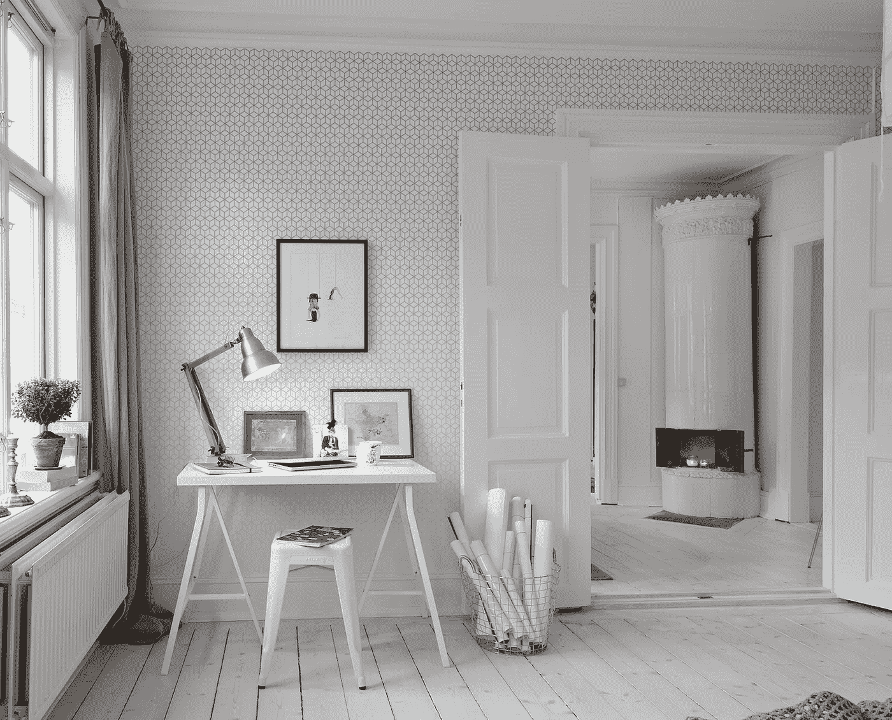

# 你在家里产生最佳想法的 9 个原因

> 原文：<https://medium.com/swlh/9-reasons-why-you-get-your-best-ideas-at-home-a29ea3e8ae48>

Home office. Sweden. Interior design by Alvhem. Photography by Cim EK.

"为什么我在早上刮胡子的时候会有最好的想法？"据说阿尔伯特·爱因斯坦曾想知道。考虑到这种特殊活动通常进行的环境，这位著名的科学家可能会问“为什么我在家里得到我最好的想法？”

许多高水平的创意人员也可能如此。杰出的成就者如查尔斯·达尔文、乔治亚·奥基夫…