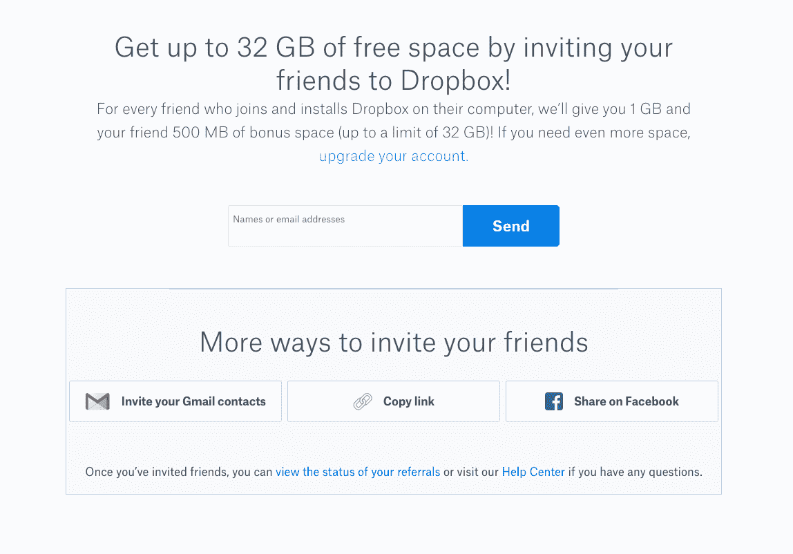
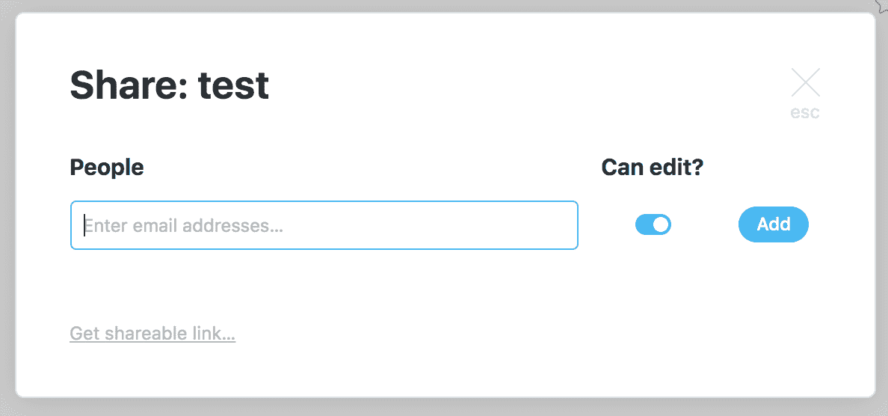
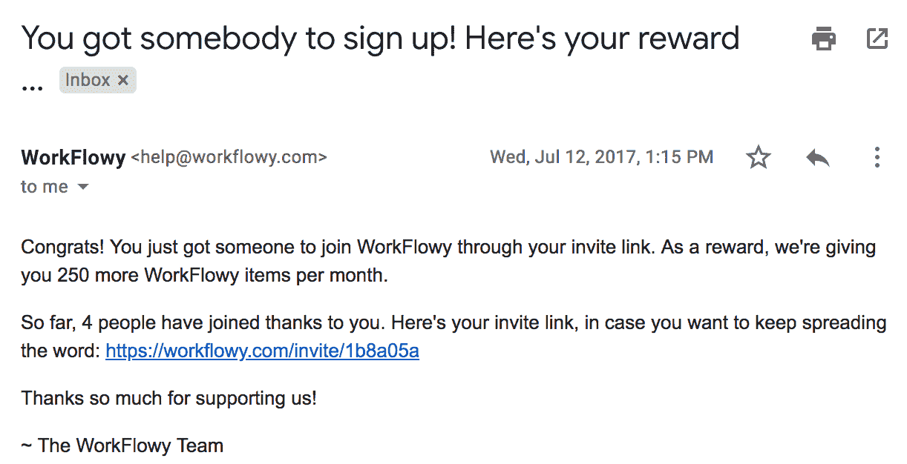
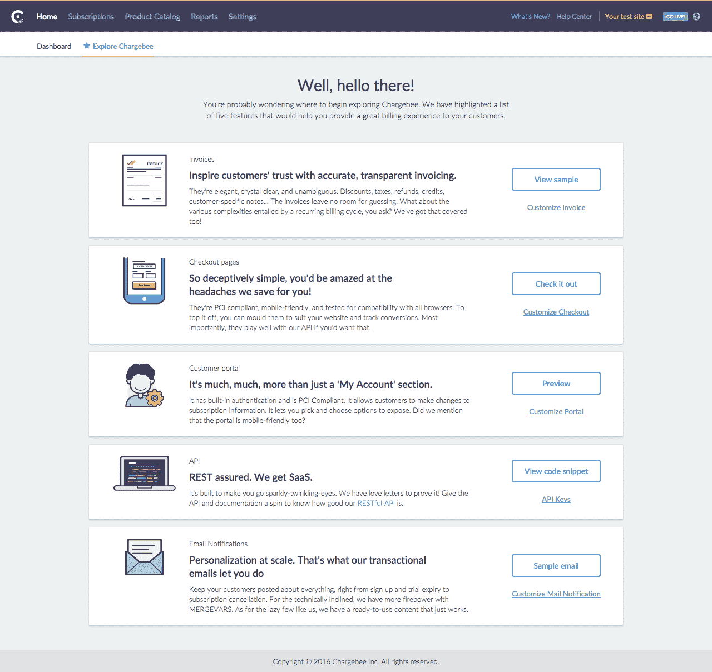
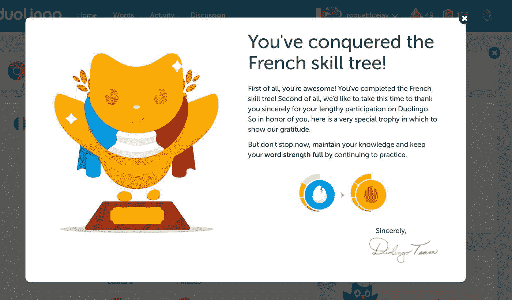
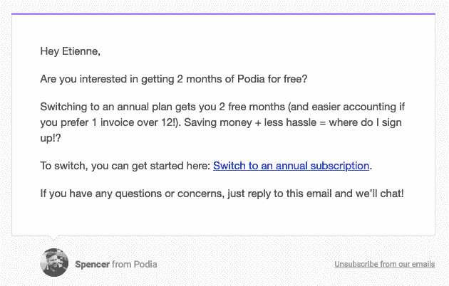
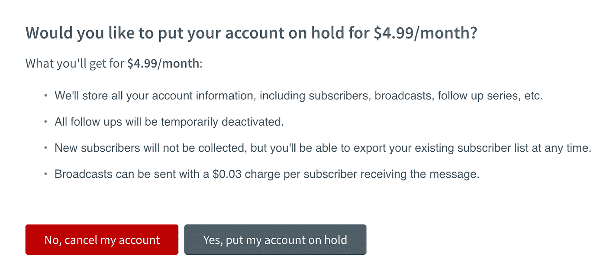
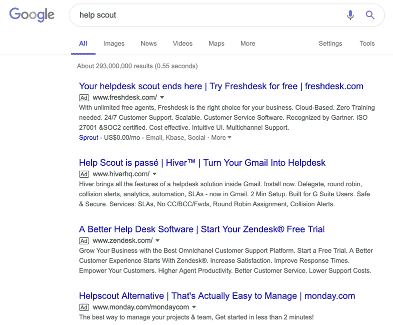
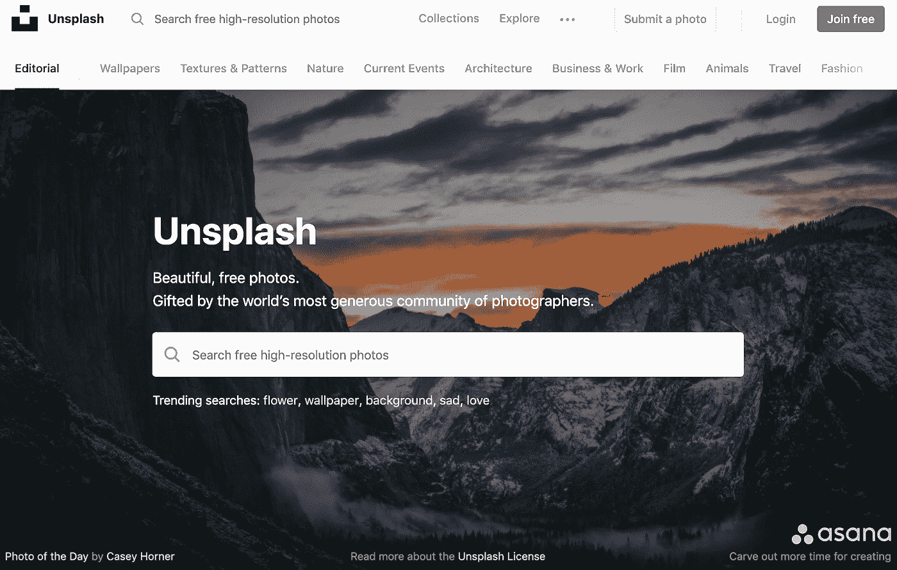
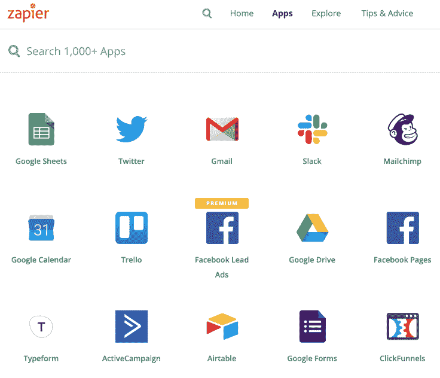

# 我们永远不会实施的 9 个 SaaS 增长技巧，以及我们已经实施的 3 个

> 原文：<https://medium.com/swlh/9-saas-growth-hacks-that-we-will-never-implement-and-the-3-that-we-did-6371be8cbefa>

*点击* *点击*

我已经学会喜欢在我的 Macbook 上截图的甜美声音。

这是我发现的一个小技巧，用来跟踪我在网上偶然发现的任何有趣的想法，或者只是为了确保我不会忘记我在 Slack 上的一次讨论。每隔一段时间，我都会在这些截图中寻找仍然相关和令人兴奋的想法。

虽然这些年来我收集的酷增长黑客想法已经变得相当令人印象深刻，但这里有一个有趣的事实:我们在 [Ahrefs](https://ahrefs.com/) 从未实施过其中的绝大多数。

不要误会我；我非常喜欢这些黑客。只是我们自己不太可能尝试它们——稍后我会解释原因。

让我们从这 9 大诀窍开始:

# 1.双边推荐黑客

这个很有名。Dropbox 用它永久性地增加了 60%的注册人数，并推动了他们的增长。

它是这样运作的:任何注册了 Dropbox 的人都可以推荐一个朋友，以换取更多的免费存储空间。当然，用户渴望成为推荐者，并把他们的朋友联系起来。

裁判也获得了类似的奖励。如果他们使用朋友的推荐链接注册，他们还会收到额外的存储空间。

两种情况下都是双赢。

此外，很容易根据自己的需要进行调整:您可以给予试用延期或折扣，等等。

想自己尝试一下这个技巧吗？[Andrus Purde](http://purde.net/2016/12/referral-program-timing/)的这篇文章很好地阐述了在设计你的推荐项目时，时机作为一个因素的重要性。

# 2.“动力来自”黑客

对讲机最近因为这个黑客事件变得很出名。

这是不言自明的:当你使用 Intercom 的免费计划时，你的聊天框将包括一个强制性的“由 Intercom 提供动力”的消息。

当然，这意味着你和你的品牌现在实际上是对讲机的广告牌。很聪明，不是吗？

过去，Hotmail 使用了一种更强的自动邮件签名方式:“PS:我爱你。在 Hotmail 上获取免费电子邮件。”当人们给他们的朋友发邮件时，他们的朋友看到了这条信息并注册了。([这是完整的故事](https://techcrunch.com/2009/10/18/ps-i-love-you-get-your-free-email-at-hotmail/)——真的很有趣。)

这里有一个更容易识别的执行方式:苹果的“从我的 iPhone 发送”落款。不要告诉我，在有人送你一个这样的东西后，你从未后悔没有加入“苹果狂热分子”!

哦，如果这些“签字”对你的特定产品不起作用，还有另一种方法。

让我们看看[workflow y](https://workflowy.com)——一个基本上可以让你制作高度组织化文档的软件。

Workflowy 所做的是允许您共享对您的文档的公共访问。

当然，一旦你把你的链接发给你的朋友/同事/同事，当他们看到 Workflowy 有多棒时，他们也会想注册的。

我真的知道这行得通！

所以请记住这一点:归根结底,“powered by”黑客是关于共享一个伟大工具的公共访问权，让人们自己注册。

# 3.CCA hack(通用转换活动)

这是 SaaS/创业社区的另一个广为人知的概念。

CCA 黑客需要确定是什么让用户留下来，然后将所有新注册的用户推向这些活动。

这个想法是找到，然后触发，已经被证明转化和保留客户的具体行为。这是提高客户保持率和减少客户流失的绝佳方式。

Chargebee 是这样做的:

我可以引用的另一个著名的例子是 Twitter:他们发现他们需要做的就是让他们的用户关注另外 10 个人。

如你所知，剩下的就是历史了。

想要一些关于 CCA 黑客的提示和技巧吗？这是你的[延伸阅读](https://www.chargebee.com/blog/common-conversion-activities-cca-recommend-it/)。

# 4.游戏化黑客

让人们坚持使用你的 SaaS 有点像是先有鸡还是先有蛋的问题。

一方面，你需要教育用户，帮助他们更好地使用你的产品，让他们从中获得更多的价值，并愿意留下来。

另一方面，如果他们没有获得足够的初始价值，他们可能不会停留足够长的时间来学习如何使用你的产品。

进入游戏化。

游戏娱乐、满足和激励你的用户:当人们得到某样东西的奖励时，我们会本能地想要更多。

通过奖励用户的努力来激励他们留下来了解你的产品。

[Duolingo](https://www.duolingo.com) 是一款成功将全球 2 亿用户的整个学习过程游戏化的应用程序的典范。

他们并不孤单——其他 SaaS 公司也成功地利用这种黑客技术。

# 5.“微移至年度”黑客

这种技巧的精髓在于找到最佳时机，让人们报名参加年度计划，然后要求他们报名。

大多数企业只在注册过程中要求潜在客户“每年一次”，这是一个绝对糟糕的时机，因为这个人甚至还没有测试过你的软件。

与其这样做，不如进行一些分析，找出你的用户发现你产品真正价值的点。

这是促使他们注册年度账单的最佳时机。

就这一点而言，这是一本关于[为什么你应该提供年度账单以及如何最好地做到这一点的好书](https://saasmetrics.co/why-should-you-offer-yearly-billing-to-your-saas-customers/)。

# 6.“暂停”黑客

每天都有人注销账户。

但是他们中的许多人实际上并不想完全退出——他们只是想“选择退出”几个月，同时解决其他正在发生的事情。

为什么不给你的用户这个选项，而不是强迫他们取消订阅？这使得他们更容易回来“恢复”，而不是重新注册。

特别是 Hulu 有一个很棒的订阅取消流程——[点击这里阅读更多](https://blog.recurly.com/things-learned-from-hulus-subscription-cancellation-flow)。

# 7.搭载黑客

Intercom 的另一个著名策略是:借助或利用竞争对手的品牌知名度。

这里的策略是针对你的竞争对手“拥有”的所有关键词进行排名，并利用他们的曝光率，无论是通过 SEO 还是 PPC。

如今许多 SaaS 公司都这么做:他们在竞争对手的名字上竞价广告词，并创建[个性化登陆页面](https://www.intercom.com/blog/convert-your-ad-traffic-with-personalized-landing-pages)，解释为什么他们的服务比竞争对手的好。

看看这些结果就知道了:

在你得到有机结果之前，已经有四个竞争者在使用这种方法了！

# 8.兼职项目黑客

兼职项目黑客最著名的例子是 Unsplash，它最初是 Tumblr 博客和兼职项目，但最终筹集了 725 万美元，并颠覆了摄影行业。

在这里阅读完整的故事。

总结一下:在为人们提供价值的方面建立一些东西。这样，欣赏你的副业项目的人自然会对你的核心业务感兴趣。

诀窍是，这个价值必须与你的主营业务相关，否则产生的所有商誉都不太可能转移过来。

这很难，但实际上是可以做到的。

# 9.集成黑客

你猜对了——这种方法包括通过与其他最好是更大的公司整合来扩大你的客户群。[你可以这样做](https://www.shopify.com.sg/partners/blog/integrated-app)。

Zapier 是一个独特的例子，因为他们的整个商业模式是关于与各种软件的集成。像 Referralcandy 这样的 SaaS 小公司也通过与 Shopify 整合获得了大量新用户。

这种方法的另一个有趣的变体是:收购。

这个想法是获得一个拥有大量用户基础的软件，并将它的用户基础迁移到你的主要产品上。([对 2018 年 SaaS 顶级收购案感兴趣](https://index.co/top/market/saas/acquisitions/2018)？)

# 为什么我们没有实现这些黑客呢？

我刚刚讨论了对其他 SaaS 公司来说非常成功的 9 个增长秘诀。此外，我真诚地相信，我们能够找到一种方法来实现它们，并取得巨大成功。

那么我们为什么不在 Ahrefs 进行测试呢？

嗯……主要原因是我们缺乏资源来很好地执行这些策略。由于我们是一个非常小的团队，我们希望保持小规模和精益，我们没有余地在大多数时候做大规模的实验。

想象一下，从[那里拖走宝贵的开发和设计资源，创造新功能](/swlh/marketing-isnt-really-that-hard-ebd3cfb8e8a7)来游戏化我们的软件，或者要求我们已经捉襟见肘的营销人员通过“捎带”黑客创建多个登陆页面来进行测试。

可能不是个好主意。

作为一个小团队，我们需要优先考虑对我们有最高投资回报率的事情。

# 是什么推动了我们的增长

所以这就是我们所做的。

这是三个我们深信不疑的“成长秘诀”，它们让我们的公司在没有资金的情况下跨越了[4000 万 ARR](https://entrepreneurshandbook.co/how-we-grew-our-8-figure-arr-by-65-two-years-straight-with-a-team-of-30-and-no-vc-8b28146b7960)(整个团队不到 50 人！)

# 1.做出一个实际有用的产品

这个我在之前已经[讲过了，我](/swlh/marketing-isnt-really-that-hard-ebd3cfb8e8a7)[又讲了](/ahrefs-marketing/let-your-customers-do-the-work-7a40f62845dc)，现在还在讲。

迄今为止，拥有一款令人惊叹的产品是最重要的。

增长黑客可能会起作用，但归根结底，它们本质上是“营销噱头”，旨在操纵人们成为顾客。

在 Ahrefs，我们已经发现，通过实际改进我们的核心产品，我们可以获得最佳投资回报。

这意味着倾听客户的意见，添加有用的功能，甚至删除客户不使用的功能。

# 2.教他们如何使用它

就像我之前提到的，如果人们不知道如何使用你的产品并从中获得价值，他们就不会留下来。

出于这个原因，我们专注于创建大量的教育材料——无论是我们博客上的、[我们的 YouTube 频道](https://www.youtube.com/channel/UCWquNQV8Y0_defMKnGKrFOQ)、[我们的学院](https://ahrefs.com/academy)等等。

除此之外，我们还有一个私人的脸书小组来回答用户的问题，当然，还有一个了不起的支持团队，可以全天候提供帮助。

# 3.被发现

SEO 是我们迄今为止第二强有力的客户获取渠道(仅次于口口相传。)

每当人们在谷歌上搜索任何与 SEO 相关的东西或 Ahrefs 可以帮助他们的东西时，我们都会努力做到——在搜索结果中排名靠前，并收集所有的流量。

这为我们带来了很多客户。

注意:不是每个创业公司都可以依赖 SEO 流量，因为人们需要意识到 SEO 工作中存在的问题。如果你的创业公司解决了一个人们不知道存在的问题，你需要依靠其他方法来提高意识。

比如口口相传。当然，不可否认的是，这是由优秀的产品和知识丰富的用户群推动的。

无论如何，你有它！

我们宁愿用我们有限的资源在这三个“核心”策略上加倍努力，而不是用一堆其他增长技巧分散我们的资源。

你呢？

你觉得这 9 条成长秘诀有趣吗？

或者你会像我们一样选择关注“基本面”吗？

下面分享一下你的想法。

//

> 感谢阅读。如果你喜欢这篇文章，请随意鼓掌👏按钮几次(👏👏👏👏)帮别人找:)
> 
> 如需更多深入的营销文章，请访问 [Ahrefs 博客](https://ahrefs.com/blog)。

//