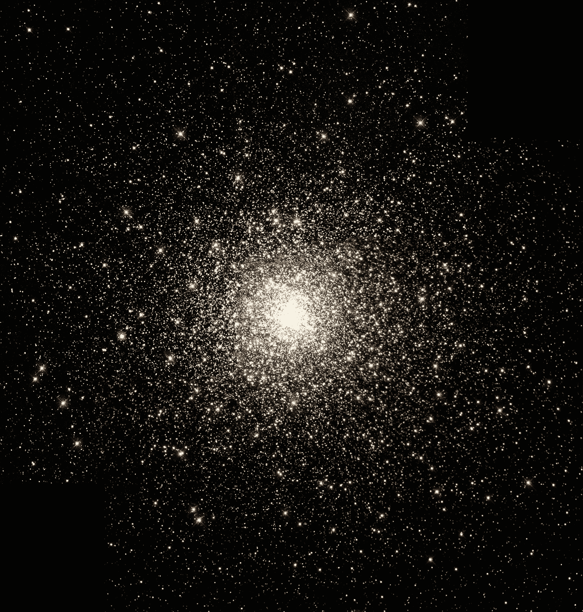

# 帮助我度过悲伤的 9 件独特的事情

> 原文：<https://medium.com/swlh/9-unique-things-that-helped-me-through-my-grief-bce79634bace>

## 你会在最奇怪的事情中找到安慰，但你需要抓住任何让你感到宽慰的事情。

Photo by [NASA](https://unsplash.com/@nasa?utm_source=unsplash&utm_medium=referral&utm_content=creditCopyText) on [Unsplash](https://unsplash.com/?utm_source=unsplash&utm_medium=referral&utm_content=creditCopyText)

悲伤是一种消耗一切、惊天动地的经历。度过每一分钟的每一秒都是困难的。呼吸困难。甚至很难想到第二天，因为…