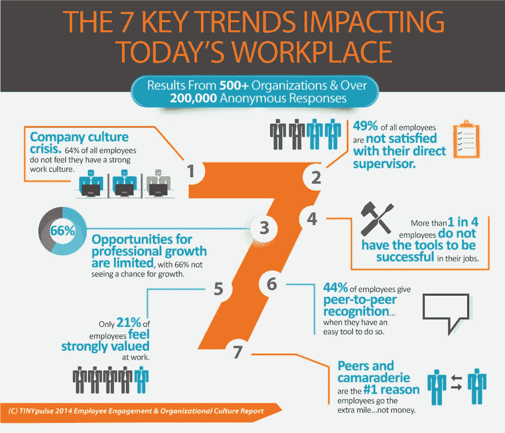

# 2019 年如何激励员工的 9 种方式

> 原文：<https://medium.com/swlh/9-ways-how-to-motivate-employees-in-2019-ab91b26087ab>

## 你不必像疯子一样把钱扔掉

A donkey looking for food… by [George Potter](https://unsplash.com/@georgepotter?utm_source=medium&utm_medium=referral) on [Unsplash](https://unsplash.com?utm_source=medium&utm_medium=referral)

作为一名企业家，你必须激励人们去做他们的工作，把你的生意当成他们的生意。实现这一点并不容易，尤其是当你和不太年轻的人一起工作时…

TinyPulse 对 20 万人进行的一项研究发现，金钱和利益甚至不在激励人们的前五位。当被问及“是什么激励你在你的组织中超越自我，做出更多努力？”近 20%的人回答说，同志情谊和同事激励是人们在工作中最欣赏的东西。

排在第二位的是想做好工作的内在愿望，占 17%。这意味着你在雇人的时候要密切注意。根据《牛津词典》，“内在的”意味着天生的、本质的、天生的或天生的归属。这意味着，当谈到拥有自我激励的人时，为正确的工作雇用正确的人是非常重要的。如果你让一个有创造力的人做大量的数学和 Excel 表格，他可能会讨厌他的工作或者很快递交辞呈。一定要把人放在正确的位置上，让他们的长处在你的公司发挥最大的作用…

排在第三位的是 13%的人感到被鼓励和认可。当谈到认识别人时，你必须公开。人们喜欢在别人面前被认可。这将激活一系列的情绪，使他们总是寻找新的方法来更好地完成工作，以获得一系列新的认可…

Infographic from [https://www.tinypulse.com/2014-employee-engagement-organizational-culture-report](https://www.tinypulse.com/2014-employee-engagement-organizational-culture-report)

金钱和福利实际上排在第七位…这对你意味着什么？这意味着你必须进一步阅读，以发现你应该做些什么来更好地激励你的员工…

> “在你成为领导者之前，成功就是让自己成长。当你成为一名领导者时，成功就是帮助他人成长。”——通用电气前董事长兼首席执行官杰克·韦尔奇

## 2019 年更好地激励员工的 9 个关键方法

现在你必须密切关注…我还建议你做笔记，因为了解这些事情，并在你的业务中实际实施它们，可能会对你的公司发展产生重大影响…

**1。创造良好的工作环境……**

谷歌是第一家雇佣三星级米其林厨师在总部自助餐厅做饭的公司。谷歌还允许员工带狗上班。Twitter 正在屋顶上举行会议，而不是封闭黑暗的会议室。雪佛龙强调健康和保健，不仅给予人们健身房会员资格，还拥有健身房，并为人们提供私人教练，让他们保持健康。雪佛龙还在工作时提供按摩，并关注员工的精神层面。

现在你会说你负担不起我上面提到的任何事情，你也没有必要做。不一定要抄袭别人。你必须设计自己的系统。也许你在野餐时在公园里开会，或者你在工作中组织比赛，或者只是照顾所有需要更新和正常工作的设备。也许你会在某人生日时订一个蛋糕，并在午餐时组织一个 30 分钟的小型聚会。有多种方法可以让你的企业变得更加舒适……你只需要使用谷歌搜索例子并从中获得灵感……

Open workspace Photo by [Shridhar Gupta](https://unsplash.com/@shridhar?utm_source=medium&utm_medium=referral) on [Unsplash](https://unsplash.com?utm_source=medium&utm_medium=referral)

**2。做一个善于交际的人和优秀的管理者**

尊重、诚实、支持和清晰的沟通是任何良好关系的基础，无论这种关系是与供应商、商业伙伴还是员工……你必须知道什么时候该推动人们在职业生涯中前进，什么时候该给他们一些空间。举个例子，如果某人刚刚发现他的母亲得了癌症，要去医院做检查，作为一个人，允许那个人去。这种态度会让你受到员工的喜爱，让他们感到被欣赏。当他们在工作时，他们会更有效率，因为现在他们信任你和你的公司。

作为组织的领导者，你必须学会如何成为一名优秀的教练。如果你以前从未管理过一个团队，去亚马逊上读一些管理书籍可能会有回报。我会从“一分钟经理”开始，然后从那里开始。如果你成为一个值得为之工作的好人，你将在你的团队中建立忠诚度，你将真正成为一名领导者。

**3。奖励做得好的人**

人们可能会为了钱或利益来为你工作，但最终，他们会因为社区、得到的赏识和成长的机会而留在你的组织中。启动一个创新项目可能是一件好事。对加班的员工进行补偿，或者建立一个委员会结构，对出色完成工作的员工进行奖励。

你甚至可以考虑创造一个与利润相关的奖金。比方说，你想实现每周 10.000 美元的利润。你可以建立一个奖金制度，奖励人们完成超过这个数额的一部分。此外，如果你这样做，确保你不要把钱只给销售或营销，因为你公司的每个人都应该分一杯羹。如果人们的工作得到奖励，他们会更愿意做好工作，也会更有动力留在你的组织。

像甲骨文或 Adobe 这样的大公司都有大型系统，让员工能够以一定的价格购买公司的股票。这让人们参与到公司未来的福祉中来。想想如何在你的业务中实现这样的东西。

> “团队合作是朝着共同愿景共同努力的能力。将个人成就导向组织目标的能力。它是让普通人获得非凡成就的燃料。” *—安德鲁·卡内基*

**4。允许人们探索新的增长机会**

提供并营造一个人们可以接触到生长材料的环境。这非常好，尤其是在一个业务迅速扩张的初创公司，人们必须适应才能推动业务向前发展。拥有一个关注成长的组织对人们来说是一个巨大的动力。

如果你有一个员工来找你，说某门课程或某本书会帮助他变得更有效率，一定要让他用你的商业资金来做这件事。你现在能做的最好的事情是授权那个人带着他从书或课程中学到的东西回来，他将在业务中实施什么事情，如果合适的话，允许那个人把他学到的东西教给他的队友。

对人们来说，一个很大的激励就是因为工作出色而得到提升。如果你要开第二家分店，并且有一个证明自己非常擅长管理和库存的人，考虑提拔这个人自己管理第二家分店。这将会吸引其他人去争取更多，对成长机会更加开放。

**5。不要保守赞美的秘密**

谈到反馈，有一个非常简单的规则。负面反馈应该总是在私下进行，正面反馈和表扬应该总是在公开场合进行。这将激励你的员工努力工作，做一些吸引你的表扬和积极反馈的事情。谈到客户关系，当有人付出额外的努力来帮助客户时，一定要给予积极的反馈。这对你来说意味着重复的生意，这在任何组织中都是必不可少的。

> “只有一个老板。顾客。他可以解雇公司里从董事长开始的所有人，只要把钱花在别的地方。”萨姆·沃尔顿

**6。一定要和你的员工分享你的公司号码**

Photo by [Fancycrave](https://unsplash.com/@fancycrave?utm_source=medium&utm_medium=referral) on [Unsplash](https://unsplash.com?utm_source=medium&utm_medium=referral)

是的，当你这样做的时候，会有人嫉妒你。有些人必须下车，他们的名字叫商务。需要留在车上的人会对你的业务投入更多。每天与你的员工分享数字就像不时看看你孩子的记分卡。只是检查你做得好或不好的事情。并不是所有的信息都需要共享，但是销售数字或者新老客户数字是很好的激励因素，主要是对于销售人员和客户关系人员。这证明他们做得很好。如果你教你的员工如何看待这些数字，他们会觉得这些数字很重要，并了解他们做得对的地方和需要改进的地方…

7 .**。不是每个人都必须有固定的时间表**

微处理器改变了我们学习的方式，我们获取信息的方式，我们旅行的方式，以及基本上我们生活的所有领域。这也适用于我们做生意的方式。有些人在家工作更好，有些人需要有人检查他们，需要来到一个物理空间。如果人们愿意，给他们在家工作的机会。这适用于你公司的某些职位，不是每个人都可以在家工作。如果你有一家实体店，就必须有人在那里为顾客服务。这在未来可能会改变，但就目前而言，让一个机器人在一个实体场所销售你的产品仍然非常昂贵。

给人们提供选择工作地点的灵活性，他们会变得更有效率。

**8。在工作中提供健康的食物选择**

一份健康的零食会影响员工的忠诚度吗？你必须找到这个问题的答案。现在有很多公司有各种各样的健康食品选择，只专注于为中小型企业提供食品选择，这样人们就不必在中午去找东西吃了。你必须亲自测试一下。

Seamless 进行的一项调查发现，几乎 57%的受访者表示，健康食品零食让他们在工作中感到更受重视和欣赏。在同一项调查中，38%的人说，有各种各样的食物小吃会让他们推荐他们正在工作的企业，认为这是一个很好的工作单位。

吃零食也有助于人们更有效率，但是有一个问题…如果员工吃得太多，他们会变得很累，因为他们的身体正在消耗能量来消化食物。必须建立良好的平衡。在你的企业中测试一下，并在下面的评论中告诉我你的结果！

**9。倾听员工的心声**

这可能是这个列表中最容易的一点，但也可能是最重要的一点…简单地问人们他们想要什么，确保每年与你的每个员工进行一次 15-30 分钟的聊天，并发现他们的需求是什么。创建一个笔记本，记下他们的想法，如果有很多事情是你的员工想要找到实现它们的方法。这会让你的员工感到自己被倾听和重要。他们再也不想离开你的组织了…

我知道这是一篇很长的文章，如果你正在读这篇文章，我想祝贺你！几乎 50%的人不会花那么多时间来提升自己！干得好！

👉你能帮我做点什么吗？请你帮我点击 *👏* ***”也许还可以在推特或脸书上与你的朋友分享。这将帮助你的朋友和其他像你一样的企业家更好地激励他们的团队。***

## 👉你有 LinkedIn 账户吗？

点击下面的链接，让我们在那里连接。简单地给我发送一个带有单词 Medium 的连接。我想和你谈谈，也许可以帮助你将这些策略运用到你的业务中！👇👇👇

 [## Andrei Rebegea | LinkedIn

### 查看世界上最大的职业社区 LinkedIn 上 Andrei Rebegea 的个人资料。安德烈的学历列在…

linkedin.com](https://linkedin.com/in/andreirebegea/) 

## 这篇文章发表在 [The Startup](https://medium.com/swlh) 上，这是 Medium 最大的创业刊物，拥有+419，678 名读者。

## 在此订阅接收[我们的头条新闻](http://growthsupply.com/the-startup-newsletter/)。

