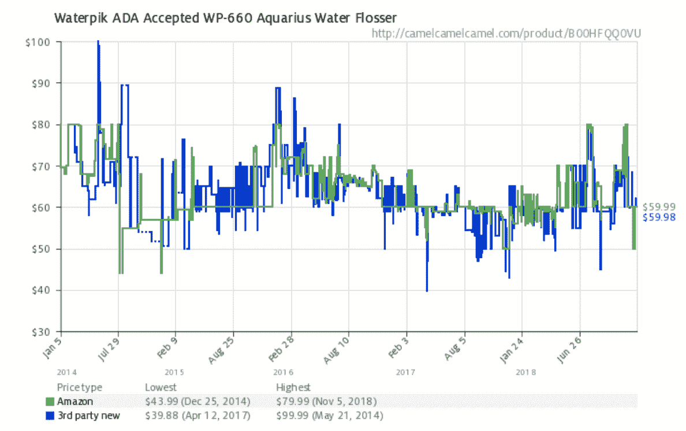

# 非科技公司在数字时代防止死亡的 9 种方法

> 原文：<https://medium.com/swlh/9-ways-non-tech-companies-can-prevent-death-in-the-digital-age-55e72a611c7>

izza Hut 正在[的亚洲餐厅部署机器人服务员](https://www.strategy-business.com/pictures/How-Non-Tech-Companies-Are-Joining-the-Software-Revolution-in-Pictures?gko=3fd21?utm_source=about&utm_medium=blog&utm_campaign=crunchbase-blog&utm_content=non-tech-death)。约翰逊正在使用人工智能帮助父母[定制他们孩子的睡眠护理](http://www.careers.jnj.com/careers/how-artificial-intelligence-is-revolutionizing-medical-technology)。联合利华正试图利用区块链来改善其广告购买。

> 尝试“时髦”技术的传统公司不胜枚举。

但事情是这样的:采用——然后*成功* *实施——*创新技术需要的不仅仅是投资机器人、人工智能和区块链。它需要对那些让科技公司蓬勃发展并主导当今企业格局的概念和流程有一个基本的理解。对于大多数几十年前成立的老派公司来说，这通常意味着改造他们的许多核心流程和基本信念。

这里有一些技术创新的概念和流程，对于更传统、不那么“科技”的公司来说，这些概念和流程尤其具有变革性。

# **1:透明定价**

在许多传统行业——无论是餐厅用品、电视广告还是补充品制造——潜在客户可能需要几周时间才能获得订单的简单报价。你必须与多个不同的代表交谈(通常告诉他们相同的信息)，浏览不透明的垄断供应链，获得多个报价以了解你是否被骗，以及其他痛苦、令人麻木的乏味任务。说这一过程效率低下是轻描淡写。

> 相比之下，在谷歌或脸书上购买广告是多么容易，那里的定价选项是透明和可访问的。现在是白天和黑夜。

但问题是，现在我们作为消费者知道无缝过程是可能的，我们的期望已经改变了。在这一点上，这种无缝流程不仅仅是“有就好”。现在变成了，“如果你没有，我会找别人有。”消费者希望流程简单，能够轻松快速地获得答案。

满足这一需求的公司将拥有明显的优势；而那些没有…嗯，我看它们不会存在太久，除非政府强迫你使用它们或者完全补贴它们(是的，我说的是你，美国邮政服务)。

# **2:动态定价**

这是我们在经济学 101 课上学到的东西。如果对你的产品或服务的需求很高，并且顾客愿意为此支付更多的钱，那么你保持价格不变是没有意义的。

> 这是一个发掘客户最大消费潜力的问题。

优步的飙升定价是一家公司优化做到这一点的一个很好的例子。飙升的价格让优步重新定义了个人运输市场的稀缺经济学。

电子商务是另一个充分利用动态定价的领域。上面是亚马逊上 Waterpik 水牙线器的 3 年价格表。如您所见，价格一直在波动，在最低金额和最高金额之间的波动高达 250%。

一些传统的参与者也使用动态定价，像航空公司、酒店和 T2 MLB T3，但是许多人不这样做，只提供一个固定价格。最终，拥有一个静态的定价模型只是把钱留在桌子上。

# **3:按使用付费的商业模式**

这方面的一个伟大先驱是亚马逊网络服务，这是地球上最成功的云基础设施服务。截至去年，亚马逊的这个部门已经获得了大约 100 亿美元的利润。AWS 的成功有很多原因，完全消除客户的资本支出顾虑是一个主要因素。

现在，在更传统的行业中，也有一些公司在尝试这样做。例如，特拉维斯·卡兰尼克的新 CloudKitchens 正试图在餐饮地产领域做到这一点。Metromile 在汽车保险方面也是这样做的(按英里向客户收取汽车保险费用)。ZipCar、Getaround 和 Turo 在城市汽车使用方面也成功地做到了这一点。

这些公司表明，无论你属于哪个行业，只要有足够的想法(和技术)，都有可能抛弃中间商，调整你的批量定价结构，以获得更高效的产品。

# **4:开发前测试产品特性和需求**

Tuft & Needle 是一家年收入超过 1 亿美元的公司，它不仅仅是创造了一个伟大的产品并心血来潮地开始销售。相反，他们只是在不同的登录页面运行不同的产品概念并有目的地测试后才推出，这些概念导致了转化。Tuft & Needle 的联合创始人 JT·马里诺有一个很棒的播客，讲述了他们发布前旅程的这一部分。

测试一堆“假冒产品”——看起来合法，但实际上并不准备出售——是电子商务初创公司的常见做法。贾斯汀·马雷斯在一篇伟大的[相扑博客文章](https://sumo.com/stories/80-20-business-idea-validation?utm_source=about&utm_medium=blog&utm_campaign=crunchbase-blog&utm_content=non-tech-death)中讲述了他如何在大约两周内以不到 100 美元的价格验证了他的新骨汤创业公司 Kettle & Fire 的想法。

很容易将脸书广告投放到许多不同的概念上，看看什么引起了共鸣，谁引起了共鸣。500 美元的脸书广告和 30 分钟的设置可以为你的公司节省数百万美元。然而，即使有了所有这些简单的开发前测试，今天许多公司仍然在他们有信心销售之前，在产品*上投入大量 R&D 元。*

# **5: A/B 测试品牌**

与测试产品功能和需求类似，许多科技公司也会在大范围实施之前，在小范围内测试大量品牌和设计变化。在 Glu Mobile 和 Dairy Free Games 开发新的游戏概念时，我们经常这样做。

由于开发一款 AAA 游戏的时间表通常需要数年，开发者将会频繁地测试他们的主题、艺术风格、图标、品牌等等。这些测试是用实体模型图形和模拟视频完成的。游戏工作室然后将通过专门的测试工具运行这些资产，如 [Splitmetrics](https://splitmetrics.com/?utm_source=about&utm_medium=blog&utm_campaign=crunchbase-blog&utm_content=non-tech-death) 和 StoreMaven，这些工具将广告点击器带到模拟的应用商店。

> **但即使在游戏之外，这也是科技行业的一种常见做法，在将产品发送给客户之前，对所有产品进行测试。**

电子邮件主题行是最明显的例子。一个更极端的例子是玛丽莎·梅耶在谷歌的设计过程中测试了 41 种不同深浅的蓝色。如果你刚开始做这个， [Optimizely 博客](https://blog.optimizely.com/tag/ab-testing-ideas/?utm_source=about&utm_medium=blog&utm_campaign=crunchbase-blog&utm_content=non-tech-death)有很多关于设计和品牌元素的想法，你可以 A/B 测试一下。

# **6:个性化**

如果你能向客户承诺更个性化或可定制的体验，他们会为你的产品支付更多，转换更快，或使用你的产品更长时间。从长远来看，所有这些都会带来更多的收入。

个性化的一个很好的例子，再次来自手机游戏。如果你看看顶级游戏，如《皇家冲突》、《战争游戏》或《冠军之争》,他们商店中提供的许多交易都是高度个性化的，旨在解决看到报价的特定玩家的即时需求。

由消费科技公司引领的成功个性化的主流例子数不胜数。亚马逊、网飞、潘多拉和 Spotify 都建立了复杂的个性化和推荐算法，在正确的时间为每个用户提供正确的产品、节目或歌曲。

> 非技术人群经常忽视的个性化领域是市场营销和搜索引擎优化。

Zapier 是一家帮助人们实现日常跨应用程序交互自动化的公司，它对数以千计的登录页面进行了个性化处理，使其成为用户搜索查询的超级目标。作为他们的首席执行官， [Wade Foster 解释道:](https://www.groovehq.com/blog/zapier-interview-with-wade-foster?utm_source=about&utm_medium=blog&utm_campaign=crunchbase-blog&utm_content=non-tech-death) : *“我们为你可能联系到的每一个应用对应用的组合建立了登陆页面。所以，如果你在搜索 Groove 和 JIRA，最理想的结果是 Zapier。”*

# **7:对一切进行深入分析，量化哪些有效，哪些无效**

然而，为了做到这些——A/B 测试、个性化产品或提供动态定价——你的公司*必须*运行声音分析。

你必须了解是什么影响了你的用户的行为。你必须能够辨别为什么某些产品卖得好，或者为什么某些活动表现好，而其他的不好。为了有效地做到这一点，您需要投资于您的分析基础架构。不幸的是，大多数公司——甚至是科技公司——都忽视了他们的分析工具，因为它不符合“核心产品”的标准

Zynga 否认了这一点。事实上，他们是引领有效大数据分析的公司之一。有些人甚至说 Zynga 实际上是一家伪装成游戏公司的大数据公司。Zynga 创始人马克·平卡斯(Mark Pincus)在数据上下了大赌注。正如他在[音阶大师播客](https://mastersofscale.com/mark-pincus-how-to-kill-your-bad-ideas-masters-of-scale-podcast/?utm_source=about&utm_medium=blog&utm_campaign=crunchbase-blog&utm_content=non-tech-death)中解释的那样:

*“我们比任何人都更努力，因为我们跟踪每一次点击，并在他们使用谷歌分析的时候进行分析。我们投资了这么多，我们有这么多的人在上面，我们一直被称为愚蠢，人们说，' Zynga 有 50 个人，这家公司用 10 个人做同样的事情。Zynga 有 300 名员工，这家公司也有 20 或 50 名员工……“因为我们想在了解数据方面过度投资。”*

# **8:游戏化**

如果你最近在 Wish.com 上购买了任何东西——该公司今年的收入有望超过 20 亿美元——你可能已经在他们的商店里看到了许多游戏化的元素。你可以转动方向盘，享受每天一次的折扣。每次购买都可以获得奖励积分。几乎所有的事情，从即时报价到你的结账过程，都附带了一些倒计时器。

虽然 Wish 可能将游戏化元素发挥到了极致，但许多市场和评论平台，如易贝、Yelp 和 Airbnb，也向用户提供游戏化元素。这些平台使用游戏化来激励他们希望在其平台上看到的用户行为类型。

**9:开发强制循环**

直到最近，强制循环还是一种隐藏的概念，一种被科技公司偷偷利用的概念。当 EA 成为一个[“战利品盒子”争议的热门话题时，这种情况发生了变化。](https://www.polygon.com/e3/2018/6/9/17444894/ea-play-lootboxes-anthem-star-wars-battlefront-andrew-wilson?utm_source=about&utm_medium=blog&utm_campaign=crunchbase-blog&utm_content=non-tech-death)

虽然完整的强迫心理学对于本文来说太长了，但强迫循环最流行的例子之一是“战利品盒”。从本质上来说，它们就是心理学家所说的“斯金纳盒子”( skinner box )( T1 ):对同样的重复行为给予用户不同回报的东西。

虽然这看起来似乎违背直觉，但每次当某人做某件事时简单地奖励他(并给予相同的奖励)并不是让他继续做那件事的最佳方式。相反，改变奖励本身和获得奖励的可能性更容易上瘾，也更有动力。这就是为什么赌博(和游戏)比可预测的、固定回报的任务(比如支付固定稳定工资的工作)更容易上瘾、更刺激的原因。

像 Birchbox 和 LootCrate 这样的订阅式商务初创公司，是围绕可变奖励的简单强制循环建立的公司的很好例子。他们每月向订户发送一套新颖的商品。一个更老派的例子是口袋妖怪卡，它实际上是一个物理战利品盒，而且非常容易上瘾。如果你对探索如何将强迫循环(和其他游戏概念)应用到现实世界场景感兴趣，我推荐你通读一下简·麦克戈尼格尔的书，[现实被打破](https://amzn.to/2EoFGov?utm_source=about&utm_medium=blog&utm_campaign=crunchbase-blog&utm_content=non-tech-death)。

# **最后的想法**

随着时间的推移，我上面提到的许多技术创新的基础将成为许多传统行业的新标准，无论是制造业、消费品还是房地产。随着消费者的期望转向更容易、更快和更个性化的体验，能够提供这些支柱的公司将成为幸存者。

因此，当谈到采用新技术时，公司在更基本的层面上考虑他们的流程、供应链和战略，而不是仅仅在腐烂的基础上建立时髦的词语，这是至关重要的。

## 这篇文章发表在 [The Startup](https://medium.com/swlh) 上，这是 Medium 最大的创业刊物，拥有+406，714 名读者。

## 订阅接收[我们的头条新闻](http://growthsupply.com/the-startup-newsletter/)。

