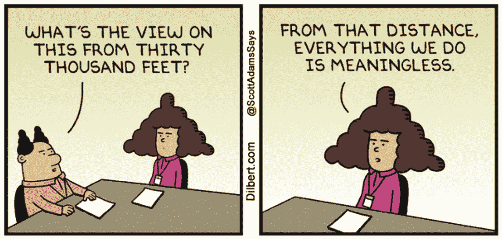
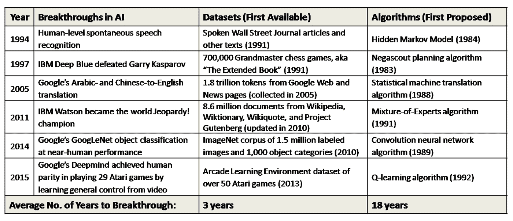
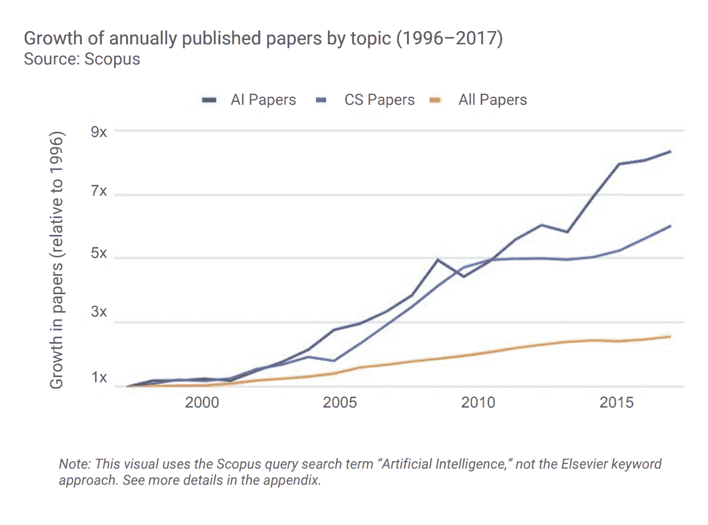
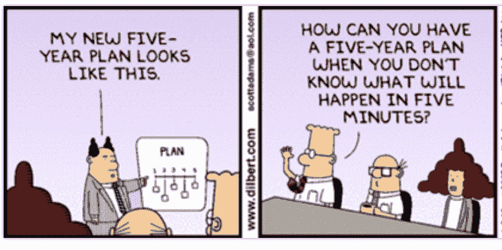
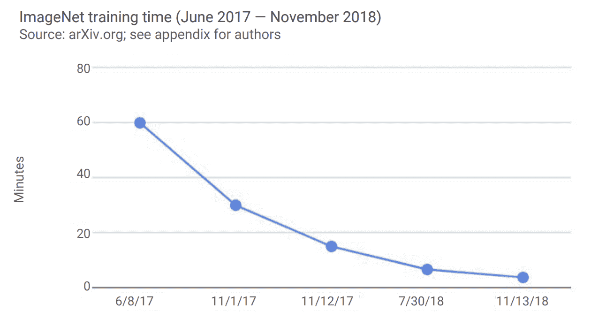
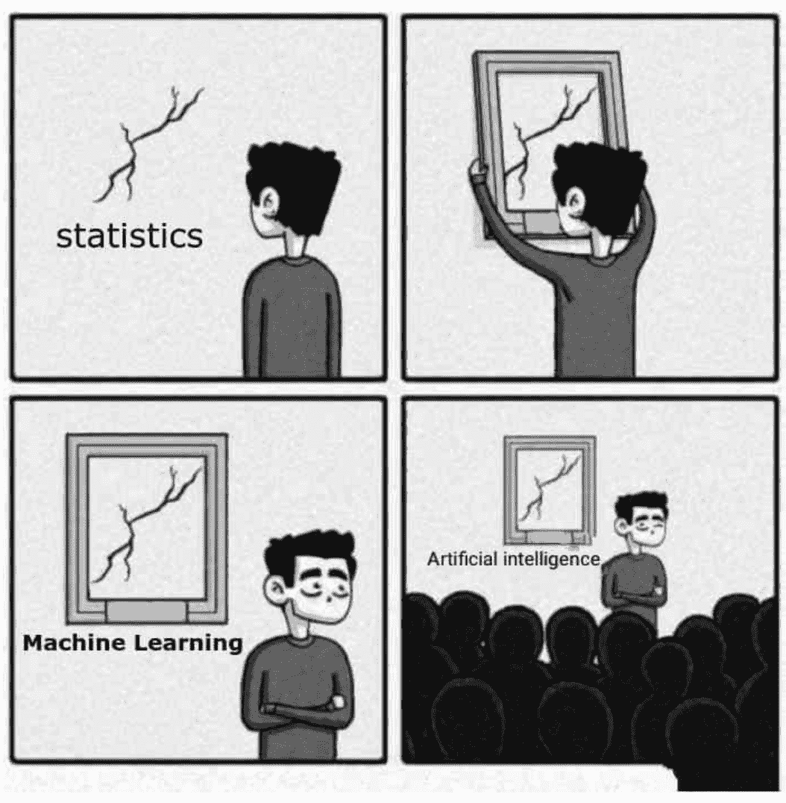

# 评估人工智能任何业务用例的 3 步指南

> 原文：<https://medium.com/swlh/a-3-step-guide-to-assess-any-business-use-case-of-ai-9111b2e233f6>

Image Credits: Greg Rakozy (Unsplash)

如果有人问我，在风险投资公司开始职业生涯时，我学到了什么，我的第一个回答会是，在一个希望应届大学毕业生从事特定领域工作的世界里，作为多面手是一种独特的快乐。

从深层次来看，这是唯一一个让你有机会评估想法和趋势的行业。我称之为“发现机会”。或者站在高处看看未来会发生什么。当你遇到的每一位企业家和你研究的每一份报告都谈到人工智能时，你往往会密切关注它。

当我跳槽到一家风投支持的人工智能计算初创公司(C 轮)时，我带去的正是这种发现机会的技能。对多个行业进行深入研究，确定人工智能应用的用例，并找出市场切入点，是我在风险投资中学到的东西的延伸。我不失时机地运用同样的原则和思维框架。

但是我大错特错了。

在哥伦比亚大学，我参加了围绕 ML 的定量课程，以感受采用人工智能解决方案的实施部分。这是我第一次接触 Python，这种语言被《经济学人》称为世界上最流行的编码语言，也是大多数人工智能/数据科学工作者的通用语言。

> 在过去的 12 个月里，美国人在谷歌上搜索 Python 的次数超过了搜索真人秀明星金·卡戴珊。

一个常用短语([陈词滥调](https://askthemanager.com/2008/11/the-25-most-annoying-business-phrases/#.XCu-kc9KhAY)？)就是从 30000 英尺的高空。建立企业的观点。作为一名对技术业务感兴趣的年轻专业人士，我太沉迷于努力磨练这种技能，以至于没有意识到我的兴趣领域需要一种不同的方法。

然而，通过课程作业、几门 MOOCs、涉及客户交付的项目和大量阅读，获得了对 ML 执行方面的实践，这让我得出结论:评估人工智能领域机会的传统方式充其量是不完整的，最差也是不成熟的。

这是我现在使用的 3 步框架。

# 了解所有数据

> “没有数据，你只是另一个有观点的人。”

W.爱德华兹·戴明被描述为日本的民族英雄，因为他在二战后复兴了日本工业。他的[介绍](https://www8.gsb.columbia.edu/deming/about/history)包含了很多形容词，但是根据他上面的引用，我们必须加上‘先见之明’。

一个涉及逻辑回归和决策树的课程工作项目花费了一个 3 人小组大约 20 多个小时来对多年来公开可用的数据进行分组，找出我们实际上可以对收集的数据集做什么，了解可以帮助我们预测输出的因素，并决定我们将要使用的因素组合。

我们大概花了 20%的时间来建立模型和得出结论。

在 2018 年最后一个季度，我们的项目团队咨询了一家全球市场情报公司和一家纳斯达克上市的广告技术公司。我们正在使用深度学习/数据分析来解决业务流程挑战。

对于一个包含多种类型文章的自动关键词提取项目，我们的理想方法是借鉴 NLP 领域先驱所做的深层关键词提取研究。但是当我们从客户那里收到数据时，我们意识到带注释的数据不足以建立传统的基于深度学习的模型。

我们现在回到表中来研究统计方法/手工注释来解决这个问题。

为了真正理解构建 AI/ML 驱动的解决方案需要什么，您需要使用您的第一个数据集。无论是课程项目还是部署就绪的解决方案，人工智能的主要任务都需要从业者用大量数据训练算法。

与处理算法相比，收集、清理和组织这些数据要花费不成比例的时间。许多行业专业人士表示，推动突破的实际上是数据集，而不是算法。

从竞争分析的角度来看行业中正在实施的解决方案，而不考虑哪些数据集给了某个公司竞争优势，哪些合作关系打开了访问，以及对底层方法的评估可能在您的团队制定路线图时被证明是多余的。

如果你在业务方面，任何有形的建议幻灯片都应该有一个部分详细说明组织获取/处理数据的方法。

# 追踪艺术的状态

作为一名[正在恢复的风险投资行业专业人士](https://hackernoon.com/what-the-media-doesnt-tell-you-about-the-vc-industry-in-india-dc2c993ac933)，我仍然喜欢商业护城河的概念(这个词也在我的博客中不断出现！).当我必须研究人工智能在各行业的应用时，我的第一步是了解当今世界各地的公司是如何使用人工智能的。

但是，你不能看到今天最流行的东西，就把鸡蛋放在那个篮子里。你需要知道明天会发生什么。为了说明这一点，我们跟踪了风险投资增长的子领域。然而，事后看来，这可能不是一个完整的解决方案。这是我传统的“发现机会”倾向发挥了全部力量。

一旦您瞥了一眼它的实现部分，您就会意识到令人眼花缭乱的研究速度和解决业务需求的各种解决方案。以[图像识别](https://techcrunch.com/2016/04/30/why-image-recognition-is-about-to-transform-business/)为例。

Google Vision/Amazon Rekognition/clari fai 之类的云托管 AI/ML 平台使人脸识别、检测对象、文本检测、徽标/地标检测变得更加容易。然后还有其他解决方案，如 OpenCV，它们捆绑了许多算法来实现同样的功能。这些即插即用型平台极大地减少了公司为容易实现的用例雇佣视觉工程师的需求。

但在全球范围内，计算机视觉是一个[热门领域](https://www.bizjournals.com/sanfrancisco/news/2018/11/20/computer-vision-standard-cognition-funding.html)，数十亿美元的风险资金流入该领域，仅中国初创公司商汤科技[就筹集了 12 亿美元](https://www.bloomberg.com/news/articles/2018-05-31/world-s-biggest-ai-startup-raises-1-2-billion-in-mere-months)。不同的业务用例需要不同复杂程度的算法。不同的复杂程度促使公司去突破以前可能的障碍。

没有一个单一的数字可以捕捉机会的大小，就像没有一个单一的算法适合所有方法一样。

这里还有一点。年度业务回顾会议有一个 3-5 年的战略计划。但几个因素促成了人工智能研究的爆炸式增长，我们看到了对艺术状态的定义在不断变化，有时间隔时间短至一年。

尝尝这个。让我们看看底层基础设施，看看进展的“速度”。在一年半的时间里，训练一个网络对著名的 ImageNet 语料库中的图像进行分类所需的时间从一个小时下降到大约 4 分钟。人工智能指数报告提到，由于算法创新和更好的基础设施，这已经成为可能。

现在，想象一下这些进步对云或边缘的训练和推理的其他领域的级联影响。

边注:推荐阅读 [AI 指数报告(2018)](http://cdn.aiindex.org/2018/AI%20Index%202018%20Annual%20Report.pdf) 。它是由来自开放人工智能和斯坦福大学领导的其他大学的专业人士/主题专家撰写的，是一个总结关键事件的权威文本。因此，商业护城河的想法本质上不是长期的，而是随着时代的变化而产生的暂时优势。

从战略角度来看，重要的是要想办法维持它，这通常来自于定量方面的进展(结合硬件-软件工程/数据科学等。这里)。

这让我想到了最后一步。

# 与定量分析师同事交谈

> “没有方法的内容导致幻想；法无内容地空洞诡辩。”

我在一家大型房地产科技公司(B2C)面试产品实习职位(机器学习焦点),在面试快结束时，我有机会向面试官提了一个问题。

“在您的路线图中，您如何整合/评估数据科学团队提出的产品创意？”

“哦！这种情况经常发生。我们通常………”

人们很自然地认为产品愿景是由业务团队设定的。在半导体等行业。如果产品路线图是一成不变的，这可能是真的。但当涉及到人工智能时，这种逻辑是有缺陷的。

在快速变化的领域中，定量人员处于创新的最前沿。在 30000 英尺的高空(无法抗拒！)，我们目前在围绕深度学习/视觉的前沿研究中看到的大多数进展都是由[一位研究人员的不懈努力](https://torontolife.com/tech/ai-superstars-google-facebook-apple-studied-guy/)发起的。

来自谷歌的杰夫·迪恩、来自苹果的约翰·詹南德雷亚、来自开放人工智能的伊利亚·苏茨基弗、来自脸书的扬·勒库恩都曾是多个商业单位的一部分，这些商业单位将价值数十亿美元的产品商业化，但他们都没有上过商学院的课程。

在任何人工智能相关的应用中，工程和商业专业人士之间的界限将是模糊的。人工智能计算公司的研究人员对如何区分特定用例的特定算法有着独特的见解。在执行层面上，是软件主管对理解是否有主要的用例/产品适合感兴趣。

当我在哥伦比亚从事项目工作时，这种从定量团队成员那里寻求建议的观点就灌输给了我。

与来自市场情报公司的数据科学家的通话比与负责项目交付的业务分析师的 3 次会议给了我们更多的见解。我们专注于分类的准确性，而不是提高我们的召回值。当你在业务方面时，这是一个比率的变化，但对于我们团队中的数据科学家来说，这是一个方法的整体变化。

三万英尺。观点(最后一次！)通常从高层看经营策略。等同于训练测试考虑(偏差/差异)，我的经验是，除非您让您的数据科学家/工程师参与策略会议，否则在实施阶段，您很有可能成为不幸意外的接收端。

这可能就是为什么大多数公司都陷入了雇佣人工智能人才的人才大战。不这样做的机会成本是真正的商业威胁。

> “多年来，我们一直难以找到合适的工作。它确实会让事情慢下来。”

随着我对 AI/ML 主题的深入研究，这将有助于我更好地与工程/数据科学团队沟通，我在我的社交媒体订阅上看到了许多与学习 AI/ML 技能相关的广告。

他们大多遵循一个模板，该模板显示了与企业采用人工智能相关的统计数据，以及一门将帮助你获得概念的课程。持续时间从 6 天到 6 个月不等，通常取决于两类目标受众——前者是商务人士，后者是大学生。

我不确定一个 6 天的课程是否有足够的深度来涵盖分类和聚类算法之间的基本区别，或者解释什么构成了统计学 vs ML vs AI。

然而，如果你是一个对这个领域着迷的商务人士，我认为有一个更好的方法来理解它的真正含义。这将有助于你更好地制定战略。

*   尝试在你工作的领域找到一个数据集，并在仔细思考你想要实现的目标后，使用网上提供的无数教程中的一个来构建一个基本模型。
*   现在检查这方面的进展，并思考您的解决方案如何能够保持对竞争对手的持续领先。考虑“速度”而不是“速度”。
*   如果你陷入困境或者需要验证你的想法，只需请求你公司的数据科学家/人工智能工程师参加一次咖啡会议。:)

*我目前正在纽约州的哥伦比亚大学攻读管理学硕士学位。我之前的工作经历包括向一家风险投资支持的人工智能硬件初创公司的首席执行官汇报的多面手角色，一段时间的风险投资和一次失败的创业尝试！*

*请随时给 uday(dot)marepalli【Gmail】留言。*

## 这篇文章发表在 [The Startup](https://medium.com/swlh) 上，这是 Medium 最大的创业刊物，拥有+406，714 名读者。

## 订阅接收[我们的头条新闻](http://growthsupply.com/the-startup-newsletter/)。

