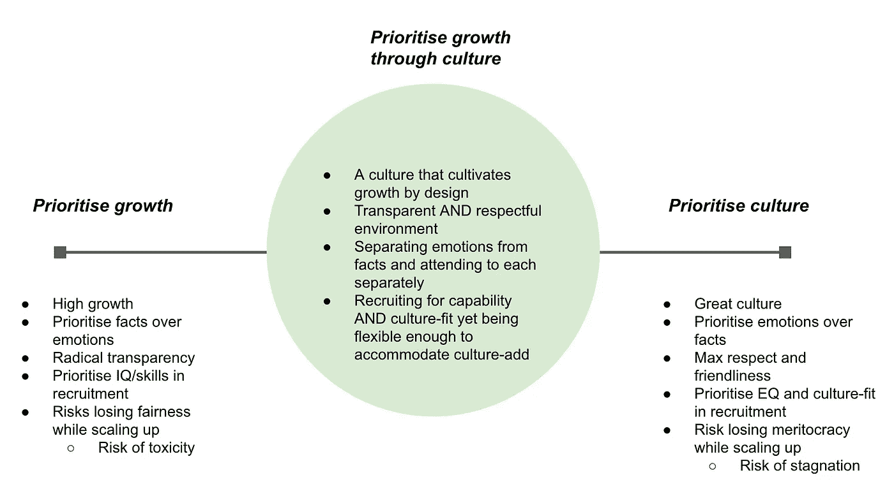

# 创业企业的基本文化——成长坐标系

> 原文：<https://medium.com/swlh/a-basic-culture-growth-coordinate-system-for-startups-1137acaedd51>

## 对精英管理、公平和创新的思考

G 成长和文化是创业生态系统中经常讨论的话题，最近围绕这些话题的任何对话也会触及“多样性”、“包容性”和“公平”等问题，并试图在公司文化之间建立积极或消极的关联…