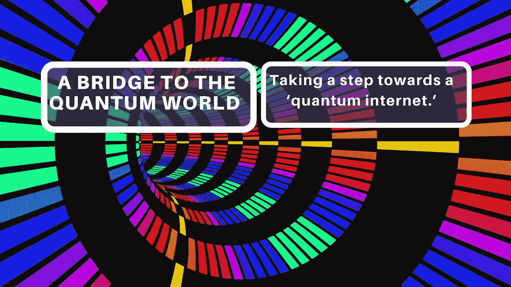

# 通往量子世界的桥梁:向“量子互联网”迈进一步

> 原文：<https://medium.com/swlh/a-bridge-to-the-quantum-world-taking-a-step-towards-a-quantum-internet-c3a8fcc3d7e3>

## 利用机械振荡产生的纠缠——被研究人员描述为“原型量子链接”——是迈向“量子互联网”的一步。

奥地利科技学院(IST 奥地利)的物理学家开发了一种…